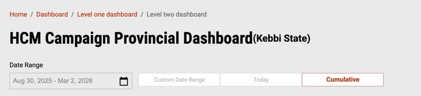
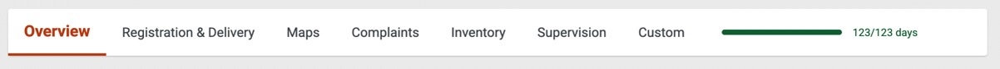
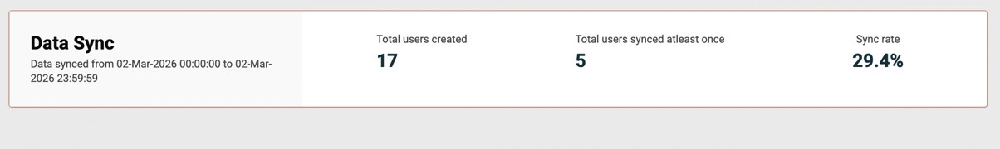
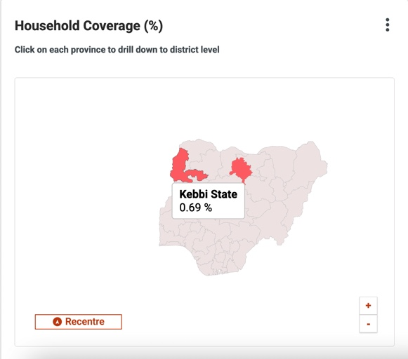
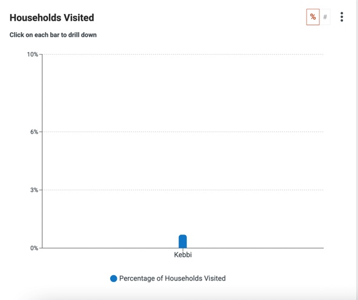
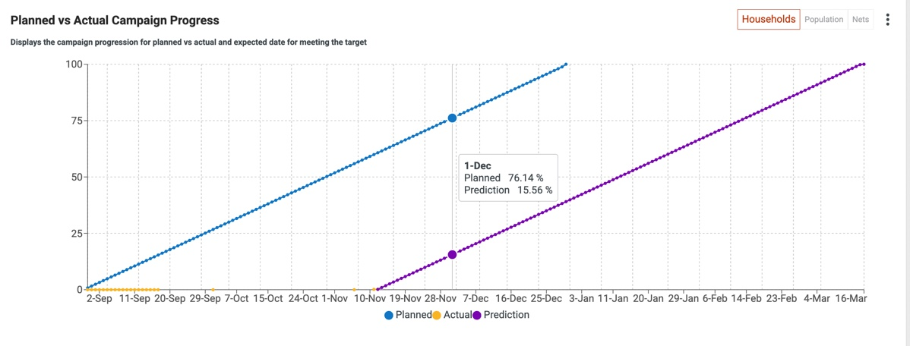

---
metaLinks:
  alternates:
    - >-
      https://app.gitbook.com/s/iVdFjJNtaUlTFjgyyYVV/access/public-health-product-suite/campaign-management-dashboard/user-manual/customise-dashboard-views
---

# Customise Dashboard Views

* **Date Filters:** Each page has filters to view data for a specific date range, today's data, or cumulative data since the campaign's start.

<figure><figcaption></figcaption></figure>

* **Campaign Progress:** A progression line on the top bar displays the number of days since the campaign began.

<figure><figcaption></figcaption></figure>

* **Data Completeness:** The sync rate chart indicates how many users have synced data so far.

<figure><figcaption></figcaption></figure>

* **Drill-Down Charts:** Double-click on any bar to drill down to sub-boundaries, continuing until the lowest level (e.g., a village). To return to the previous view, click the 'x' button.

<figure><figcaption></figcaption></figure>

* **Toggle Chart Views:** Switch between percentage and absolute values by clicking toggle buttons.

<figure><figcaption></figcaption></figure>

* **Prediction Line Chart:** Estimates how many more days are needed to reach target coverage based on current service delivery rates.

<figure><figcaption></figcaption></figure>

* **Sortable Tables:** Summary tables can be sorted by column in ascending/descending order or alphabetically.
* **Download Options:** Each chart can be downloaded as a PDF or JPG by clicking the kebab button. Charts can also be shared via WhatsApp or email. Tabular charts can be downloaded as Excel files.
* **Brush Component:** Use the brush component below the bar charts to expand or contract the view to see all represented boundaries.
* **Heat Maps:** Monitor campaign progression by boundary through interactive, drill-down heat maps.
* **Geocoordinate maps:** To view the household-level service delivery data.
