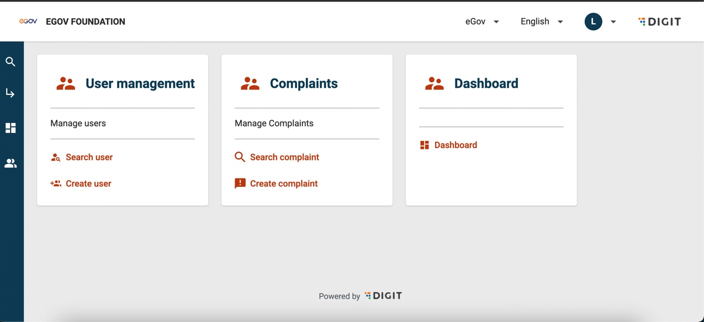
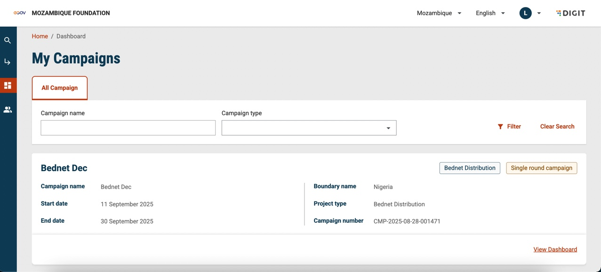
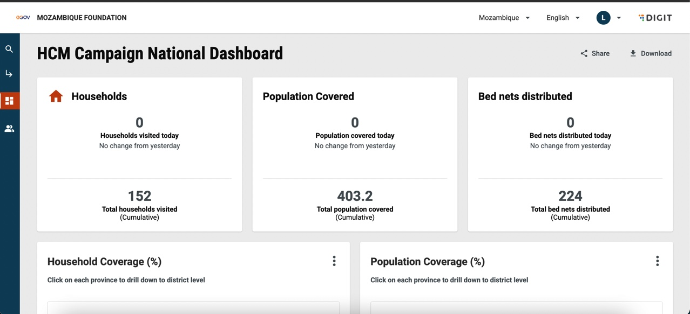
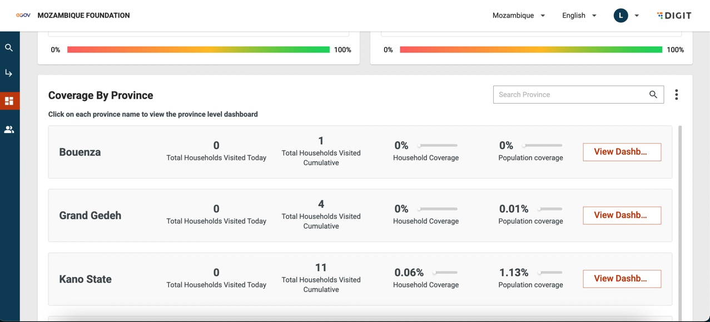
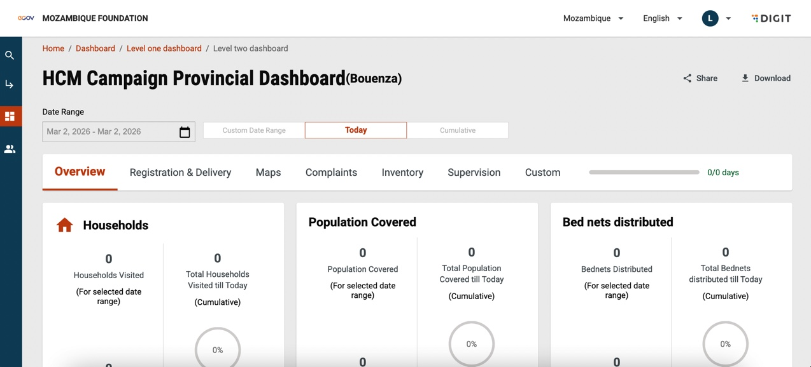

---
metaLinks:
  alternates:
    - >-
      https://app.gitbook.com/s/iVdFjJNtaUlTFjgyyYVV/access/public-health-product-suite/campaign-management-dashboard/user-manual/using-dashboard
---

# Using Dashboard

Click on the Dashboard card on the homepage.

<figure><figcaption></figcaption></figure>

This opens the My Campaigns list. You can access the view of campaigns based on the search filters provided on the screen. &#x20;

<figure><figcaption></figcaption></figure>

Click on the View Dashboard button for the specific campaign to view the dashboard.

<figure><figcaption></figcaption></figure>

Click on the three dots icon on each image card to download or share the dashboard image.

<figure><figcaption></figcaption></figure>

Scroll down the page and click on the **View Dashboard** button to access the province-wise dashboard view.

<figure><figcaption></figcaption></figure>

Click on the respective tabs to access specific information dashboards for the selected province. Use the Date Range filters to refine the dashboard views.&#x20;

