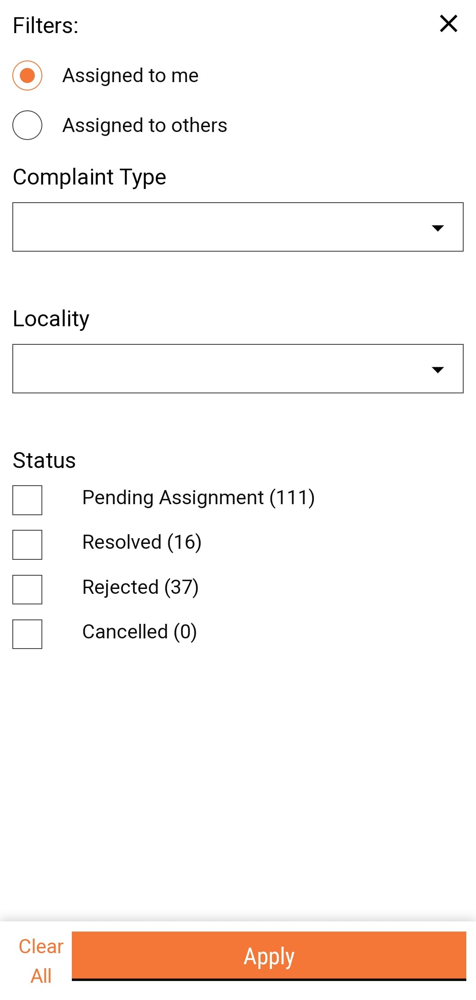
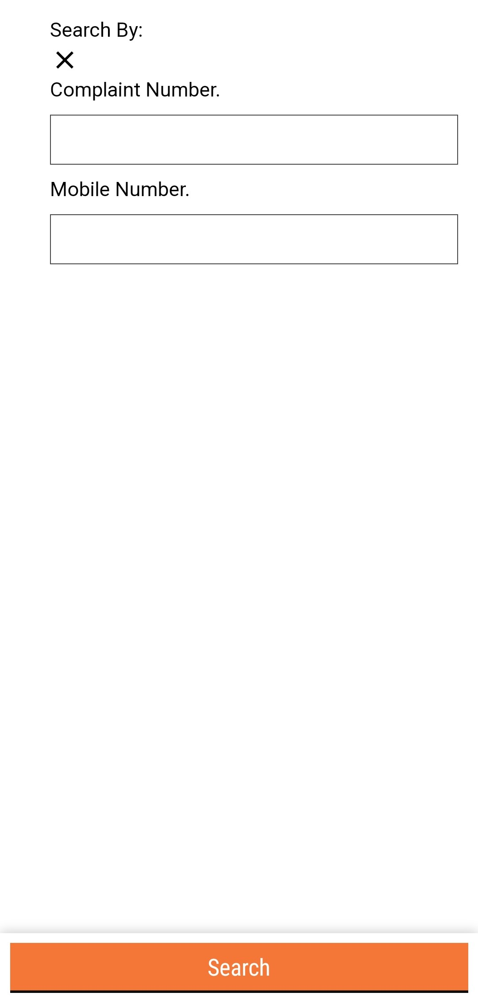

---
metaLinks:
  alternates:
    - >-
      https://app.gitbook.com/s/iVdFjJNtaUlTFjgyyYVV/access/public-health-product-suite/health-campaign-management-hcm/complaints-management/access-complaints-inbox
---

# Access Complaints Inbox

## Steps

* Log in to the HCM app/console.
* Navigate to the **Complaints** module.
* The **Complaints Inbox** lists all complaints with current status and details. Use the filters to fetch relevant complaint details.


{% column width="50%" %}




 



A summary screen is displayed when the user clicks on the **Open** button on the complaints card.
