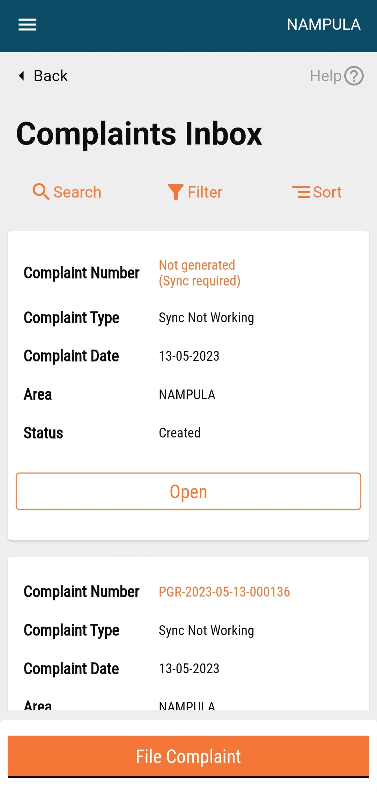
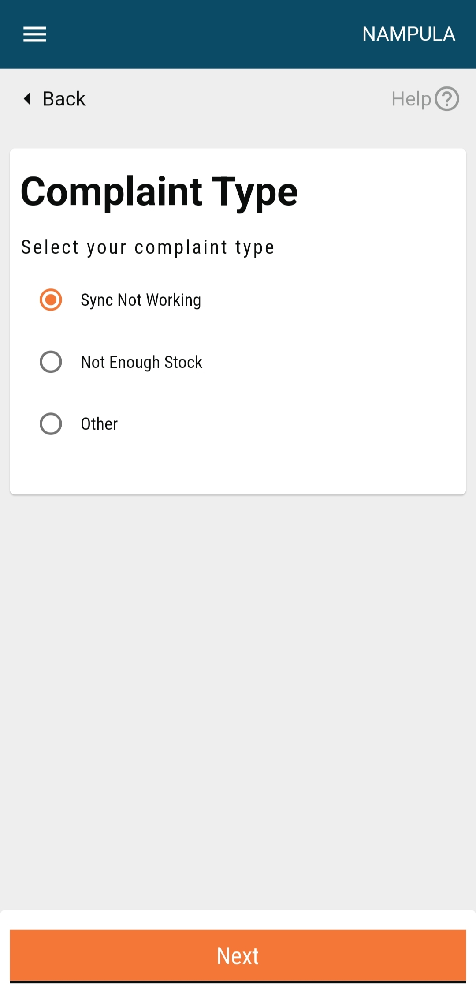
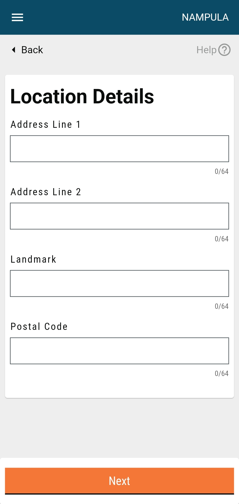
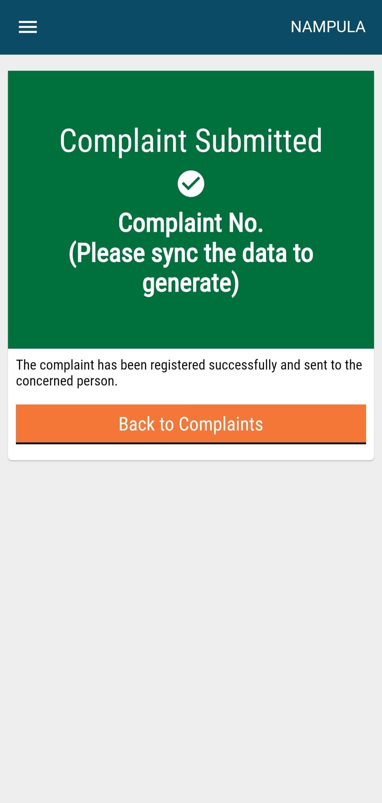

# Raise Complaints

## Steps

Navigate to **Complaints > My Complaints**. The user can:

* **File a complaint**
* **View previously logged complaints**

* Click on the **File Complaint** button.
* Select the applicable **Complaint Type**.








<figure><figcaption></figcaption></figure>



* Select the **Administrative Area.**
* Select the option **Myself** or **Another User** in case you are registering a complaint on behalf of someone else. Enter the **Complainant's Contact Number**.
* Enter the **Supervisor's Name**, **Contact Number** and **Complaint Description**.
* Click on the **Submit** button to file the complaint.
* Enter the **Location Details**.











The complaint is submitted. Note down the Complaint No. for future reference.
