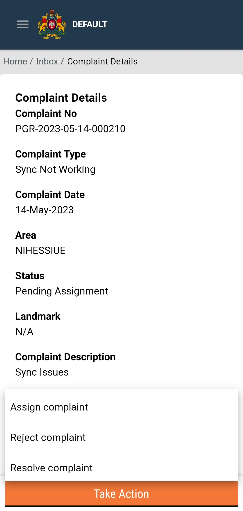
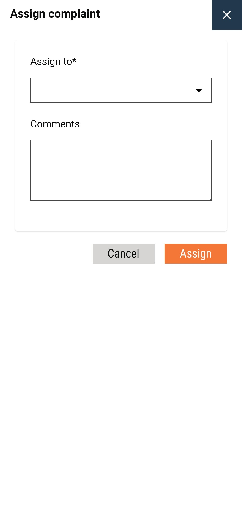
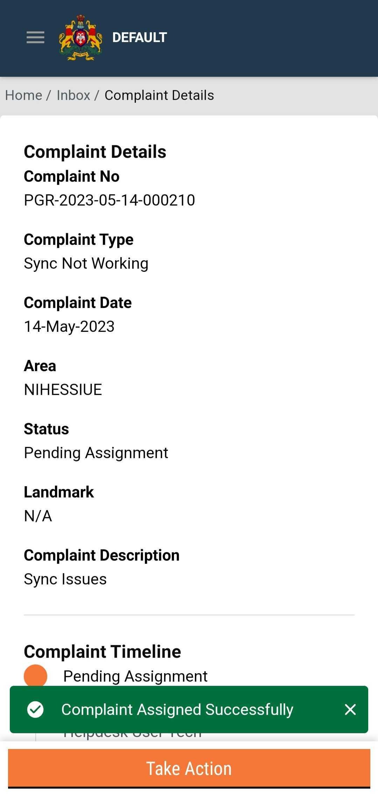

# Resolve Complaints

## Steps

The Supervisor and Helpdesk user can:

* View and track complaints
* File a new complaint
* Resolve a complaint
* Reject a complaint
* Assign to other roles

Click on the **Take Action** button. This opens a pop-up displaying all possible actions that the user can take that include:

* Assign Complaint
* Reject Complaint
* Resolve Complaint

### Assign Complaint

Re-route the complaint to the assigned role or department if further handling is needed.

* Select the employee to **Assign to.** Enter any **Comments** for clarity on the required action for the assigned employee. Click on the **Assign** button.







### 



### Reject Complaint

Close the complaint with a reason if invalid.

.png>)

### Resolve Complaint

* Click **Resolve**.
* Provide brief resolution notes explaining how the issue was addressed.
* Submit the form.
* The complaint status updates to **RESOLVED** and is moved out of the general queue.

.png>)
