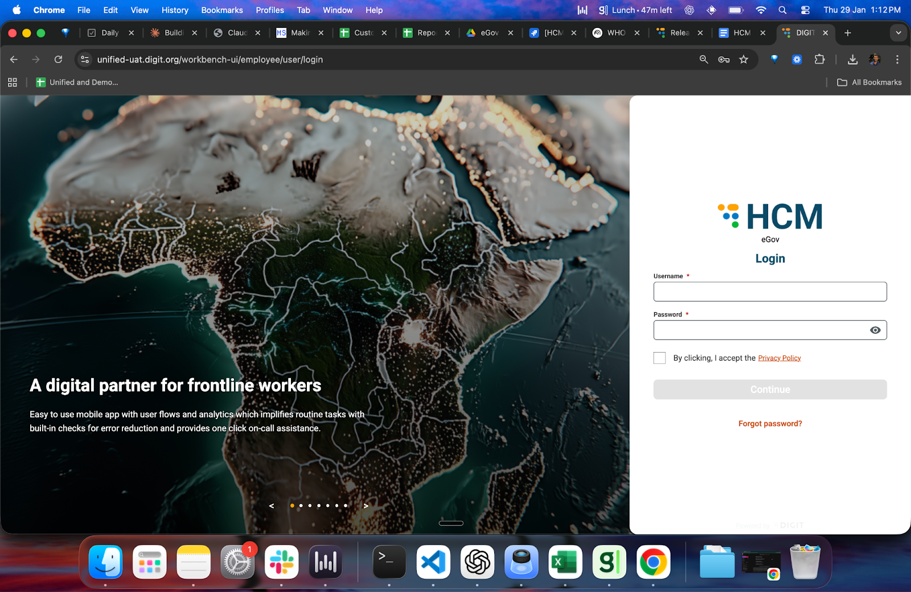

# Login

## Overview

This page explains how to log in to the HCM Console. Program teams use the Console to configure, manage, and run health campaigns.

**Who Can Log In**

* Campaign Managers
* ICT4D team members

## Steps

### Step 1: Open the Console

1. Open a web browser (Chrome, Firefox, Edge, etc.).
2. Enter the HCM Console URL provided by your implementation team.

#### Step 2: Enter Your Credentials

1. On the login screen, enter your **username** and **password**.
2. These credentials are shared with you by the implementation team.
3. Click **Login**.

<figure><figcaption></figcaption></figure>

#### Step 3: Access Campaigns

Once logged in, you will land on the dashboard. From here, you can:

* Select **Create Campaign** to set up a new campaign, or
* Select **My Campaigns** to view and manage existing campaigns.

<figure><figcaption></figcaption></figure>

You are now ready to start configuring and managing campaigns.
