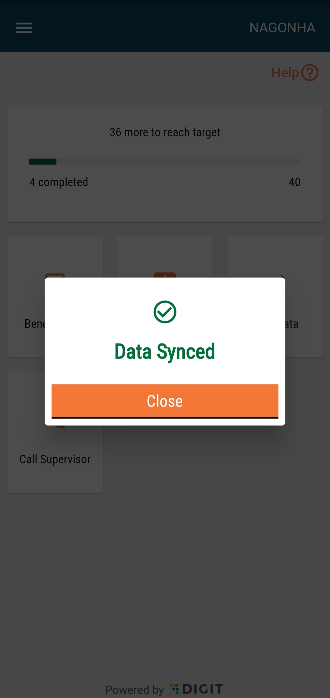

# Sync

## Overview

The Sync action allows users to sync the data that is recorded in the system so that it reaches the server and the data is secured.

## Steps

* Click on the **Sync Data** button on the home screen to initiate a manual sync process.

<figure><figcaption></figcaption></figure>


**Note:** Before going into the field, the user needs to log into the application every day, which will initiate an automatic sync process. The "Sync Data" button on the home screen allows the user to sync data as per user convenience. At the bottom of the screen, there is a card that shows the message “Data unsynced” along with the number of records unsynced.

When the user clicks on the ‘Sync’ button, the sync action starts along with an overlay showing “Sync in Progress” over the home page. The user cannot perform any other action until the sync is complete or there is an error.


<figure><figcaption></figcaption></figure>

* The data synced pop-up appears once the sync is complete. Click on the **Close** button to navigate to the home screen.

<figure><figcaption></figcaption></figure>

* In case of any sync error, a pop-up stating **Sync Failed** is displayed on the screen.
* Click on the **Retry** button to retry syncing the data.&#x20;
* Click on the **Close** button to navigate back to the home screen.

<figure><figcaption></figcaption></figure>

