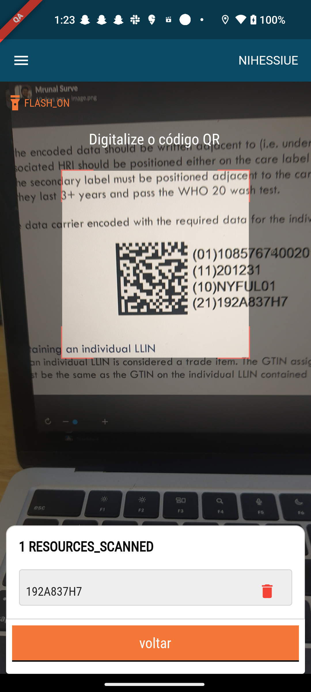

# Scan Bales

## Steps

Scan the resource code to track the resources delivered:

1. Package utilised to parse the barcode: [https://pub.dev/packages/gs1\_barcode\_parser](https://pub.dev/packages/gs1_barcode_parser).&#x20;
2. Package utilised  to QR code scanner:   [https://pub.dev/packages/qr\_code\_scanner](https://pub.dev/packages/qr_code_scanner)
3. GS1 - standards :   [https://www.gs1.org/docs/barcodes/GS1\_DataMatrix\_Guideline.pdf](https://www.gs1.org/docs/barcodes/GS1_DataMatrix_Guideline.pdf)&#x20;
4. Package utilised for barcode scanning-

[https://pub.dev/packages/google\_mlkit\_barcode\_scanning](https://pub.dev/packages/google_mlkit_barcode_scanning)

```
google_mlkit_barcode_scanning
```

<div align="left"><figure><figcaption></figcaption></figure></div>


Given a field value formatted with the GS1 data matrix standard and a string key from the GS1 application identifiers. The function should look up and return the value linked to the provided key.

A well-formatted value would look like:

]d20108470006991541211008199619525610DXB200517220228

