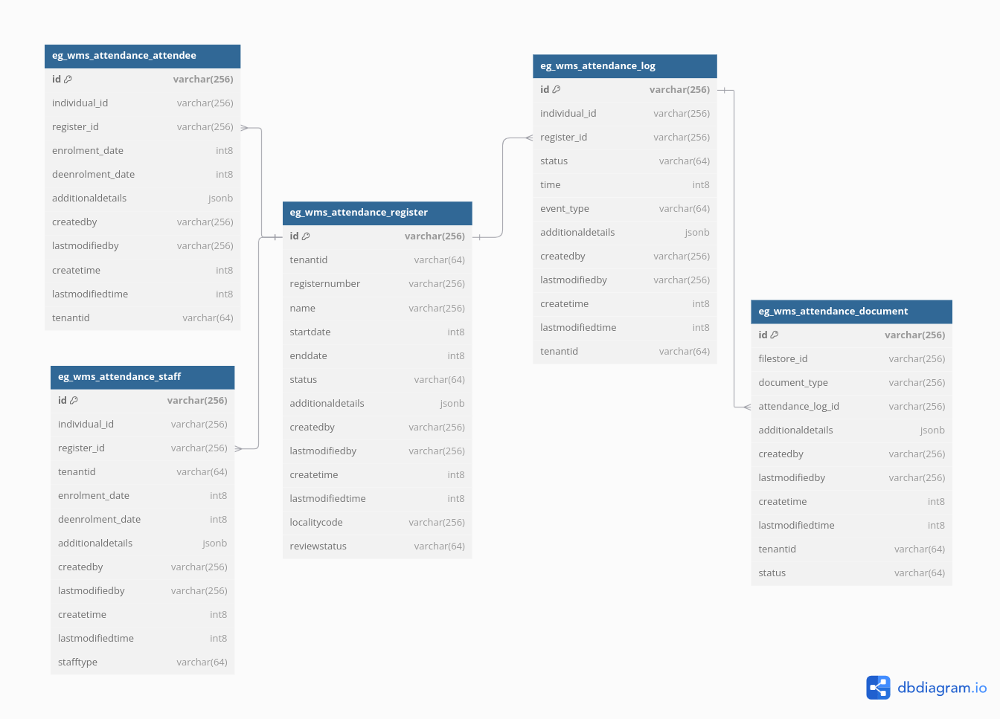

# Attendance - Sample

### Overview

This document provides a structured technical guide for configuring the Attendance Service in the DIGIT Health platform. It details the configuration file structure, supported parameters, step-by-step setup instructions, and best practices.

The Attendance Service in DIGIT Health is responsible for recording, managing, and tracking the attendance of healthcare workers and other personnel. Properly configuring this service ensures accurate data capture and integration with related modules (such as payroll, reporting, and HR).

***

## Pre-requisites

* DIGIT backbone services
* Idgen
* Persister
* Project Service
* Boundary Service

## Functionalities

* Allows creation/updation/search of an attendance register
* Allows mapping of staff and attendees to a register and enforces permissions.
* Log entry and exit timestamps in epoch time for a referenced entity
* Staff members can be added or removed from the Attendance Register, with roles (Editor, Approver, Owner) defining permissions: Editors modify records, Approvers validate records, and Owners have full administrative control.

## Setup&#x20;



### Clone or download the code from the GitHub repository

The source code for the Attendance module is located in the [Git repository here](https://github.com/egovernments/DIGIT-Works/tree/master/backend/attendance). Clone or download the code from this repository before proceeding.



### Add the Lombok extension/plugin&#x20;

The Attendance module is a Spring Boot application that uses Lombok, a Java library that helps reduce boilerplate code. Add the Lombok extension/plugin to open and build the project in your IDE (like IntelliJ or Eclipse).



### Setup Lombok in IDEs

Install the Lombok plugin directly from the IntelliJ plugins marketplace.&#x20;

* Download the Lombok jar file.
*   Add the following line to your `eclipse.ini` file (replace `lombok.jar` with the correct path to your Lombok jar):

    ```
    -javaagent:lombok.jar
    ```



### Run application

Once Lombok is set up and the application is running (using your IDE or command line), you can start making API requests to the Attendance service’s endpoints.



### Generate IDs

When you send API requests, the system generates the required IDs automatically as part of its normal operation.



***

### 3. Configuration File Structure

The attendance service is configured through property files and environment variables, typically found at:

```
/configs/services/attendance/attendanceServiceConfig.json
```

**Sample Structure:**

```json
{
  "attendanceType": "IN_OUT",
  "locationHierarchy": ["District", "PHC", "Subcenter"],
  "workingHours": {
    "start": "09:00",
    "end": "17:00"
  },
  "allowedRoles": ["HEALTH_WORKER", "SUPERVISOR"],
  "geoFencing": {
    "enabled": true,
    "radius": 100
  },
  "absenceReasons": [
    "Sick Leave",
    "Casual Leave",
    "On Duty",
    "Training"
  ],
  "notifications": {
    "absentAlert": true,
    "lateEntryAlert": true
  }
}
```

***

### 4. Parameters and Descriptions

| Parameter           | Type   | Description                                                 | Example                    |
| ------------------- | ------ | ----------------------------------------------------------- | -------------------------- |
| `attendanceType`    | String | Mode of attendance marking (`IN_OUT`, `SINGLE_PUNCH`, etc.) | `"IN_OUT"`                 |
| `locationHierarchy` | Array  | Administrative units where attendance is captured           | `["District", "PHC"]`      |
| `workingHours`      | Object | Defines official working hours (`start`, `end`)             | `{ "start": "09:00", ...}` |
| `allowedRoles`      | Array  | Roles permitted to mark attendance                          | `["HEALTH_WORKER"]`        |
| `geoFencing`        | Object | Enable/disable geo-fencing and set radius in meters         | `{ "enabled": true, ...}`  |
| `absenceReasons`    | Array  | Pre-defined list of valid absence reasons                   | `["Sick Leave", ...]`      |
| `notifications`     | Object | Triggers for absence/late alerts                            | `{ "absentAlert": true }`  |

***

### 5. Setup and Configuration Steps

1. **Locate Configuration File:**\
   Go to the attendance service configuration path (see Configuration File Structure).
2. **Define Attendance Parameters:**
   * Set `attendanceType` as per organisational policy.
   * Specify the `locationHierarchy` for relevant administrative levels.
   * Configure `workingHours` according to official timings.
3. **Role and Access Setup:**
   * List all roles in `allowedRoles` permitted to mark attendance.
4. **Geo-Fencing (Optional):**
   * To restrict attendance marking within a physical radius, enable `geoFencing` and set the `radius` (in meters).
5. **Absence Reasons:**
   * Customise the `absenceReasons` list as per HR policies.
6. **Notifications:**
   * Enable or disable `absentAlert` and `lateEntryAlert` as required.
7. **Save and Deploy:**
   * Save the updated configuration.
   * Restart or redeploy the attendance service if necessary.

***

### 6. Best Practices

* **Backup:** Always backup the existing configuration before making changes.
* **Validation:** Validate JSON/YAML for syntax errors before deployment.
* **Security:** Restrict access to configuration files to authorised personnel only.
* **Testing:** Test attendance flows in a staging environment before deploying to production.

***

### 7. Troubleshooting

| Issue                              | Solution                                                  |
| ---------------------------------- | --------------------------------------------------------- |
| Attendance not recorded            | Verify `allowedRoles` and user permissions                |
| Geo-fencing blocking valid entries | Check `geoFencing.radius` and device location accuracy    |
| Absence reasons not visible        | Ensure `absenceReasons` list is populated and valid       |
| Notifications not triggered        | Confirm `notifications` settings and notification service |

***

## Configuration Details

To configure the attendance service using the provided `attendance-service-persister.yaml`, follow the steps given below.

### 1. Prepare the Environment

* Ensure you have access to the `egovernments/configs` repository.
* Identify the environment (development, QA, production) where you are applying the configuration.
* Locate the `attendance-service-persister.yml` file under `health/egov-persister/`.

### 2. Understand the Service Map Structure

The configuration file defines how attendance-related data is persisted by mapping incoming Kafka topics to database queries. Each mapping includes:

* The topic to listen to (e.g., `save-attendance-health`)
* The database table and fields to update
* JSON paths to extract data from incoming messages

### 3. Update and Deploy the Configuration

#### a. Update the YML File (if needed)

If you have custom requirements (e.g., additional fields, different table names, or topics), modify the relevant sections in the YML file:

* **serviceName**: Ensure it matches your service (`attendance-service`)
* **mappings**: Add or update mappings as needed for your use case

#### b. Place the File in the Correct Directory

Ensure the updated `attendance-service-persister.yml` is present in the appropriate directory:

```
health/egov-persister/attendance-service-persister.yml
```

#### c. Push Changes (if modifying)

If you made changes, commit and push them to the repository:

```bash
git add health/egov-persister/attendance-service-persister.yml
git commit -m "Configured attendance service persister"
git push
```

### 4. Configure the Persister Service

* Make sure the [egov-persister service](https://github.com/egovernments/egov-persister) is deployed in your environment.
* The persister will automatically pick up the configuration files for each module (like attendance).

### 5. Kafka Topic Configuration

* Ensure the relevant services are publishing messages to the Kafka topics defined in the config (e.g., `save-attendance-health`, `update-attendance-health`).
* Topics include:
  * `save-attendance-health`
  * `save-attendee-health`
  * `save-staff-health`
  * `save-attendance-log-health`
  * `update-attendance-log-health`
  * `update-attendance-health`
  * `update-attendee-health`
  * `update-staff-health`

### 6. Database Preparation

* Verify that the required tables exist in your database:
  * `health.eg_wms_attendance_register`
  * `health.eg_wms_attendance_staff`
  * `health.eg_wms_attendance_attendee`
  * `health.eg_wms_attendance_log`
  * `health.eg_wms_attendance_document`
* Ensure the columns match the fields defined in the queries inside the YML.

### 7. Test the Configuration

* Produce a sample message to one of the configured Kafka topics.
* Check if the data is being persisted in the correct database table.
* Inspect logs of the persister service for errors.

### 8. Monitor and Maintain

* Monitor the persister logs for mapping or persistence errors.
* Update the YML configuration whenever the data model or requirements change.

***

**Summary Table of Important Elements**

| Message Topic                | Target Table                         | Mapping Name         |
| ---------------------------- | ------------------------------------ | -------------------- |
| save-attendance-health       | eg\_wms\_attendance\_register, staff | attendance           |
| save-attendee-health         | eg\_wms\_attendance\_attendee        | attendee             |
| save-staff-health            | eg\_wms\_attendance\_staff           | staff registration   |
| save-attendance-log-health   | eg\_wms\_attendance\_log, document   | Attendance Log       |
| update-attendance-log-health | eg\_wms\_attendance\_log, document   | Attendance Log (upd) |
| update-attendance-health     | eg\_wms\_attendance\_register        | update Attendance    |
| update-attendee-health       | eg\_wms\_attendance\_attendee        | update Attendee      |
| update-staff-health          | eg\_wms\_attendance\_staff           | update staff         |

## Database Schema

<figure><figcaption></figcaption></figure>

## Postman Collections

[Link](https://api.postman.com/collections/28428162-42a38d4b-9af6-41cc-86ee-ce99fc40d95d?access_key=PMAT-01HM8EYY8H24BERS02TQ5M2HB9)
