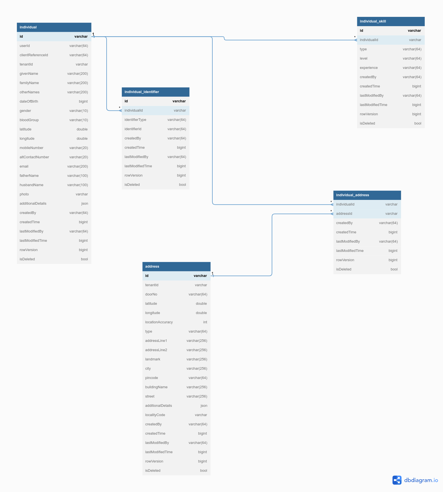

---
metaLinks:
  alternates:
    - >-
      https://app.gitbook.com/s/iVdFjJNtaUlTFjgyyYVV/deploy/configuration/hcm-service-configuration/individual-registry
---

# Individual Registry

## Overview

The individual registry provides APIs to create citizens or users to the DIGIT platform. This document provides the configuration details for setting up individuals.

## **Pre-requisites**

* Knowledge of Java/J2EE (preferably Java 8 version).
* Knowledge of Spring Boot and spring-boot microservices.
* Knowledge of Git or any version control system.
* Knowledge of RESTful web services.
* Knowledge of the Lombok library is helpful.
* Knowledge of eGov-mdms service, eGov-persister, eGov-idgen, eGov-indexer, and eGov-user will be helpful.

## **Functionalities**

1. Provides APIs to create, update, and delete individuals.
2. Provides APIs to bulk create, update, and delete individuals.
3. Inactivates the status of individuals post-deletion.
4. Provides a search API for individuals by name, individual ID, unique ID, and date of birth.&#x20;

## **Setup**&#x20;



### Clone or download the code from the GitHub repository

The source code for the Individual module is located in the [Git repository here](https://github.com/egovernments/health-campaign-services/tree/v1.1.0/health-services/individual). Clone or download the code from this repository before proceeding.



### Add the Lombok extension/plugin&#x20;

The Individual module is a Spring Boot application that uses Lombok, a Java library. Add the Lombok extension/plugin to open and build the project in your IDE (like IntelliJ or Eclipse).



### Setup Lombok in IDEs

Install the Lombok plugin directly from the IntelliJ plugins marketplace.&#x20;

* Download the Lombok jar file.
*   Add the following line to your `eclipse.ini` file (replace `lombok.jar` with the correct path to your Lombok jar):

    ```
    -javaagent:lombok.jar
    ```



### Run application

Once Lombok is set up and the application is running (using your IDE or command line), you can start making API requests to the Individual service’s endpoints.



### Generate IDs

When you send API requests, the system generates the required IDs automatically as part of its normal operation.



## **API Details** <a href="#api-information" id="api-information"></a>

The complete API specifications for the Individual Service are documented in the Swagger YAML file:

* **Swagger API YAML:**-[individual.yaml](https://github.com/egovernments/health-campaign-services/blob/v1.1.0/docs/health-api-specs/contracts/registries/individual.yml)

This YAML file contains:

* API endpoints and methods
* Request/response payloads
* Data models and schema references
* Error codes and descriptions

#### Available API Endpoints

<table><thead><tr><th width="278.01171875">Endpoint</th><th width="106.453125">Method</th><th>Description</th></tr></thead><tbody><tr><td><code>/individual/v1/_create</code></td><td>POST</td><td>Create/Add a new Individual</td></tr><tr><td><code>/individual/v1/bulk/_create</code></td><td>POST</td><td>Create/Add Individuals in bulk</td></tr><tr><td><code>/individual/v1/_update</code></td><td>POST</td><td>Update an existing Individual</td></tr><tr><td><code>/individual/v1/bulk/_update</code></td><td>POST</td><td>Update existing Individuals in bulk</td></tr><tr><td><code>/individual/v1/_delete</code></td><td>POST</td><td>Soft delete an Individual and nested details</td></tr><tr><td><code>/individual/v1/bulk/_delete</code></td><td>POST</td><td>Soft delete Individuals in bulk</td></tr><tr><td><code>/individual/v1/_search</code></td><td>POST</td><td>Search for Individuals</td></tr></tbody></table>

**Properties format:**

Kafka topics persister configs for eGov persister

```
individual.consumer.bulk.create.topic=individual-consumer-bulk-create-topic
individual.consumer.bulk.update.topic=individual-consumer-bulk-update-topic
individual.consumer.bulk.delete.topic=individual-consumer-bulk-delete-topic
individual.producer.save.topic=save-individual-topic
individual.producer.update.topic=update-individual-topic
individual.producer.delete.topic=delete-individual-topic
```

**External Service URLs**

Below are the URLs for external services that the Individual Service interacts with:

| Service              | Property Key           | URL                                                              |
| -------------------- | ---------------------- | ---------------------------------------------------------------- |
| eGov MDMS            | egov.mdms.host         | [https://unified-dev.digit.org/](https://unified-dev.digit.org/) |
| eGov ID Generation   | egov.idgen.host        | [https://unified-dev.digit.org/](https://unified-dev.digit.org/) |
| Localization Service | egov.localization.host | [https://unified-dev.digit.org/](https://unified-dev.digit.org/) |
| Project Service      | egov.project.host      | [http://unified-dev.digit.org](http://unified-dev.digit.org/)    |

## **Configuration Details**

Follow the details outlined below to configure and enable Individual API actions and access control using MDMS, role-action mapping, persister, and indexer configurations.

### **MDMS Configurations**

#### Define Action URLs

Add new actions in the MDMS actions configuration (e.g., `action-test.json`). Each action represents an API endpoint you wish to secure and manage: [**action-test.json**](https://github.com/egovernments/health-campaign-mdms/blob/DEV/data/default/ACCESSCONTROL-ACTIONS-TEST/actions-test.json)

```
{
      "id": 1549,
      "name": "Individual Create",
      "url": "/individual/v1/_create",
      "displayName": "Individual Create",
      "orderNumber": 0,
      "parentModule": "",
      "enabled": false,
      "serviceCode": "individual",
      "code": "null",
      "path": ""
    },
    {
      "id": 1550,
      "name": "Individual Update",
      "url": "/individual/v1/_update",
      "displayName": "Individual Update",
      "orderNumber": 0,
      "parentModule": "",
      "enabled": false,
      "serviceCode": "individual",
      "code": "null",
      "path": ""
    },
    {
      "id": 1551,
      "name": "Individual Search",
      "url": "/individual/v1/_search",
      "displayName": "Individual Search",
      "orderNumber": 0,
      "parentModule": "",
      "enabled": false,
      "serviceCode": "individual",
      "code": "null",
      "path": ""
    },
    {
      "id": 1561,
      "name": "Individual Bulk Create",
      "url": "/individual/v1/bulk/_create",
      "displayName": "Individual Bulk Create",
      "orderNumber": 0,
      "parentModule": "",
      "enabled": false,
      "serviceCode": "individual",
      "code": "null",
      "path": ""
    },
    {
      "id": 1562,
      "name": "Individual Bulk Update",
      "url": "/individual/v1/bulk/_update",
      "displayName": "Individual Bulk Update",
      "orderNumber": 0,
      "parentModule": "",
      "enabled": false,
      "serviceCode": "individual",
      "code": "null",
      "path": ""
    },
    {
      "id": 1563,
      "name": "Individual Delete",
      "url": "/individual/v1/_delete",
      "displayName": "Individual Delete",
      "orderNumber": 0,
      "parentModule": "",
      "enabled": false,
      "serviceCode": "individual",
      "code": "null",
      "path": ""
    },
    {
      "id": 1564,
      "name": "Individual Bulk Delete",
      "url": "/individual/v1/bulk/_delete",
      "displayName": "Individual Bulk Delete",
      "orderNumber": 0,
      "parentModule": "",
      "enabled": false,
      "serviceCode": "individual",
      "code": "null",
      "path": ""
    }
```

### **Role-Action Mapping**

#### Assign Actions to Roles

Configure which user roles can access which API actions in `roleaction.json`. Map each action ID to the required roles: [**roleaction.json**](https://github.com/egovernments/health-campaign-mdms/blob/DEV/data/default/ACCESSCONTROL-ROLEACTIONS/roleactions.json)**.** Refer example below:

```
{
    "rolecode": "SYSTEM_ADMINISTRATOR",
    "actionid": 1549,
    "actioncode": "",
    "tenantId": "default"
},
{
    "rolecode": "REGISTRAR",
    "actionid": 1549,
    "actioncode": "",
    "tenantId": "default"
},
{
    "rolecode": "DISTRIBUTOR",
    "actionid": 1549,
    "actioncode": "",
    "tenantId": "default"
},
{
    "rolecode": "SYSTEM_ADMINISTRATOR",
    "actionid": 1550,
    "actioncode": "",
    "tenantId": "default"
},
{
    "rolecode": "REGISTRAR",
    "actionid": 1550,
    "actioncode": "",
    "tenantId": "default"
},
{
    "rolecode": "DISTRIBUTOR",
    "actionid": 1550,
    "actioncode": "",
    "tenantId": "default"
},
{
    "rolecode": "SYSTEM_ADMINISTRATOR",
    "actionid": 1551,
    "actioncode": "",
    "tenantId": "default"
},
{
    "rolecode": "REGISTRAR",
    "actionid": 1551,
    "actioncode": "",
    "tenantId": "default"
},
{
    "rolecode": "DISTRIBUTOR",
    "actionid": 1551,
    "actioncode": "",
    "tenantId": "default"
},
{
    "rolecode": "SYSTEM_ADMINISTRATOR",
    "actionid": 1561,
    "actioncode": "",
    "tenantId": "default"
},
{
    "rolecode": "REGISTRAR",
    "actionid": 1561,
    "actioncode": "",
    "tenantId": "default"
},
{
    "rolecode": "DISTRIBUTOR",
    "actionid": 1561,
    "actioncode": "",
    "tenantId": "default"
},
{
    "rolecode": "SYSTEM_ADMINISTRATOR",
    "actionid": 1562,
    "actioncode": "",
    "tenantId": "default"
},
{
    "rolecode": "REGISTRAR",
    "actionid": 1562,
    "actioncode": "",
    "tenantId": "default"
},
{
    "rolecode": "DISTRIBUTOR",
    "actionid": 1562,
    "actioncode": "",
    "tenantId": "default"
},
{
    "rolecode": "SYSTEM_ADMINISTRATOR",
    "actionid": 1563,
    "actioncode": "",
    "tenantId": "default"
},
{
    "rolecode": "REGISTRAR",
    "actionid": 1563,
    "actioncode": "",
    "tenantId": "default"
},
{
    "rolecode": "DISTRIBUTOR",
    "actionid": 1563,
    "actioncode": "",
    "tenantId": "default"
},
{
    "rolecode": "SYSTEM_ADMINISTRATOR",
    "actionid": 1564,
    "actioncode": "",
    "tenantId": "default"
},
{
    "rolecode": "REGISTRAR",
    "actionid": 1564,
    "actioncode": "",
    "tenantId": "default"
},
{
    "rolecode": "DISTRIBUTOR",
    "actionid": 1564,
    "actioncode": "",
    "tenantId": "default"
},
```

## **Persister Configuration**

Configure the persister service for the Individual module. This is typically done by adding/updating a YAML file (e.g., `individual-persister.yml`) - [Individual Persister Yaml](https://github.com/egovernments/health-campaign-config/blob/v1.1.0/egov-persister/individual-persister.yml)\
This YAML maps API operations to database persistence logic (topics, queries, etc.).

## Indexer Configuration

Configure the indexer for the Individual module (e.g., `individual-indexer.yml`) - [Individual Indexer Yaml](https://github.com/egovernments/health-campaign-config/blob/v1.1.0/egov-indexer/individual-indexer.yml)\
This will ensure individual data is indexed and searchable as per business requirements.

## Database Schema

<figure><figcaption></figcaption></figure>

## Postman Collection

[Click here to access](https://www.postman.com/sreejith-kanjarla-759135/hcm-collection/folder/zrhhudq/individual) the Postman collection.
