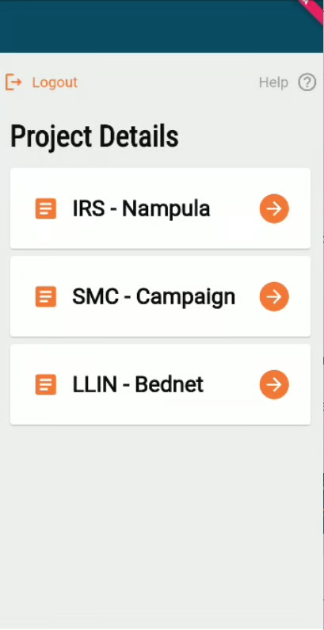

# Project Selection

## Overview

Once a user logs into the HCM app, the project selection screen displays all the projects assigned to the user.

***

### 📋 1. Workflow Details

* **Project Screen**: Displays a list of projects assigned to the user. The user selects the project from the list to view.

<div align="left"><figure><figcaption></figcaption></figure></div>

<div align="left"><figure><figcaption></figcaption></figure></div>

* **Data Sync**: App fetches and syncs data for the selected project only.
* Sync occurs automatically at each login, so a stable internet is required at the start of the day before fieldwork.
* A “Sync in Progress” window appears on the screen, and the user cannot perform any other action until the process is complete..

***

### ⚙️ 2. Technical Implementation

#### 2.1 UI Components

* **DigitProjectCell**: Used to display each project row in the list.
* **DigitElevatedButton**: Use the “Continue” button to confirm the selection.
* **Toast Notifications**: Used to display success/error messages via DigitToastHelper.

#### 2.2 Code References

* Project selection screen: [https://github.com/egovernments/health-campaign-field-worker-app/blob/master/apps/health\_campaign\_field\_worker\_app/lib/pages/project\_selection.dart](https://github.com/egovernments/health-campaign-field-worker-app/blob/master/apps/health_campaign_field_worker_app/lib/pages/project_selection.dart)
* UI components imported from:\
  `digit_components/lib/widgets/digit_project_cell.dart`,\
  `.../digit_elevated_button.dart`,\
  `.../atoms/digit_toast_helper.dart`&#x20;

***

### 🔄 3. API Role Action Mapping

| Action                 | Endpoint                         | Purpose                                                                        |
| ---------------------- | -------------------------------- | ------------------------------------------------------------------------------ |
| Fetch user projects    | `POST /project/staff/v1/_search` | Fetches projects linked to the logged-in staff (using staffId).                |
| Fetch project metadata | `POST /project/v1/_search`       | Retrieves detailed project info such as `tenantId`, `name`, and `projectType`. |

* **Auth**: Requires `RequestInfo.authToken`.
*   **Payload Example (staff search)**:

    ```json
    {
      "RequestInfo": { "authToken": "string" },
      "ProjectStaff": { "staffId": "string" }
    }
    ```
*   **Payload Example (project metadata)**:

    ```json
    {
      "RequestInfo": { "authToken": "string" },
      "Project": [
        { "tenantId": "tenantA", "name": "string", "projectType": "string" }
      ]
    }
    ```
* **Role mapping**: Projects returned here determine what app screens and data the user can access post-selection.
