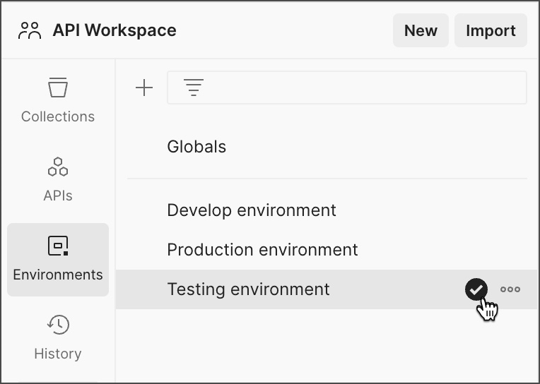

# Setup Project Data

## Overview

This step involves the execution of the Postman collection for the minimum setup data required to run a campaign from the field worker app.

## Steps



### Restart Spring Cloud Gateway

* Execute the below command to restart the Spring Cloud Gateway.
* Check if all the services are up and running by using the following command:

```
kubectl get pods -n egov
```

*   If all the services are running with Ready 1/1, restart the Spring Cloud Gateway service using the command given below:

    ```
    kubectl delete pods {gateway-pod-name} -n egov
    ```



### Load project data


All file examples in this document refer to the default branches in the health campaign DevOps and configuration repositories for example purposes. Once you have forked or cloned these repositories, refer to the forked or cloned repositories.&#x20;


Create an environment variable file and add the following variables in Postman:

* Click on **New > Environment** and add the following variables:

<div align="left"><figure><figcaption></figcaption></figure></div>

* **URL -** domain\_name provided in infra-as-code/terraform/sample-aws/input.yaml
  * Example: https://{**domain\_name**}
* **tenantId** - mz
* **apiUserName** and **apiPassword** - newly created superuser credentials
* **startDate** and **endDate** in epoch format - [`epoch converter`](https://www.epochconverter.com/)&#x20;
*   **boundaryCode** -  use the default value (**VFTw0jbRf1y**) if Master data is unchanged <br>

    <div align="left"><figure><figcaption></figcaption></figure></div>
* Import the seed data script



### Seed data in the Postman script



* This collection includes all the scripts to create users, projects, staff, and product variants.
* Import the HCM setup script in Postman - [import guide](https://learning.postman.com/docs/getting-started/importing-and-exporting/importing-data/)
* Choose the new environment created in the environment tab.



* Click on the imported HCM setup collection, and click run.&#x20;

<div align="left"><figure><figcaption></figcaption></figure></div>

<div align="left"><figure><figcaption></figcaption></figure></div>



### Load localisation


**Localisation is required to load and show data in different available languages. You can add localisation for English, French, and Portuguese languages by following the instructions given below. If only one specific language is required, download that language-specific collection and run it.**&#x20;


*   Prepare to set up

    * Create a port forward to the localisation pod by executing the following command:

    ```shell
    kubectl port-forward svc/egov-localization -n egov 8080:8080
    ```

    * Replace the **URL** variable in the Postman Environment with http://localhost:8080

    #### **All Languages (English, French, Portuguese)**

    * Define locale code for localeEnglish, localeFrench, and localePortuguese in the environment file.
      * localeEnglish - en\_MZ
      * localeFrench - fr\_MZ
      * localePortuguese - pt\_MZ
* Download the file below for all localisations - English, French, and Portuguese. Data has to be loaded at once:



* Import the downloaded file into Postman, select all language localisation collections, and click on run. See the screenshot below for reference:

<figure><figcaption></figcaption></figure>

<figure><figcaption></figcaption></figure>



Instructions for the installation of HCM in English

* **To add localisations specific to the English language only, download the file given below:**

Import the downloaded file into Postman, select the English collection, and click on run. See the screenshot below for reference:

<figure><figcaption></figcaption></figure>

<figure><figcaption></figcaption></figure>



Instructions for the installation of HCM in French

* **To add localisations specific to the French language only, download the file given below:**

Import the downloaded file into Postman, select the French collection, and click on run. See the screenshot below for reference:

<figure><figcaption></figcaption></figure>

<figure><figcaption></figcaption></figure>



Instructions for the installation of HCM in Portuguese:

* **To add localisations specific to the Portuguese language only, download the file given below:**

Import the downloaded file into Postman, select the Portuguese collection, and click on run. See the screenshot below for reference:

<figure><figcaption></figcaption></figure>

<figure><figcaption></figcaption></figure>





