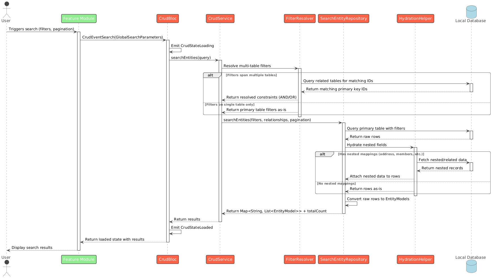

# DIGIT CRUD Bloc

## Overview

This package provides the core logic and services for managing entity-based data flows in a modular and extensible way. It supports dynamic entity mapping, relationship traversal, nested field resolution, and repository-driven CRUD operations.

Link to the Pub Package:&#x20;



## Key Concepts

#### Relationship Graph

* Maintains bidirectional relationship mappings between entity models.
* Enables efficient traversal and lookup across related entities.

#### Nested Model Mappings

* Allows mapping nested fields from complex models (e.g., mapping `Individual.address.locality.code`).
* Enables powerful filtering and selection in search queries.

## Core Features

#### `CrudService`

A centralised service that orchestrates:

* Entity creation, update, and deletion
* Relationship-based queries
* Repository resolution per entity type

**Constructor Params**

* `relationshipMap`: List of `RelationshipMapping` objects defining entity links.
* `nestedModelMappings`: List of `NestedModelMapping` for deep field resolution.
* Repositories for each supported entity: `Household`, `Individual`, `HouseholdMember`, `ProjectBeneficiary`, `Task`.

**Public Methods**

* `init()`: Initialises relationship graph and nested mapping lookup.
* `searchEntities(query)`: Performs a global search using filters, pagination, and nested field resolution.
* `createEntities(entities)`: Creates a list of entities using their mapped repository.
* `updateEntities(entities)`: Updates a list of entities.
* `deleteEntities(entities)`: Deletes a list of entities.

#### Modular Helpers

* `QueryBuilder`: SQL and filter utilities for query construction and argument building.
* `HydrationHelper`: Handles hydration of nested model data.
* `RelationshipGraphHelper`: Finds relationship paths between models for advanced queries.

## Required Setup

Before using any CRUD features, you **must** initialise the singleton with all required dependencies:

```
CrudBlocSingleton.instance.setData(
  crudService: myCrudService,
  dynamicEntityModelListener: myListener,
);
```

## CRUD Operations

The `CrudService` supports full **CRUD operations** for all supported entity types. Internally, it resolves the appropriate repository based on the entity's runtime type.

#### 1. **Create**

Registers new entities to local storage.

```
await crudService.createEntities(entities);
```

Internally calls repository.create(entity) for each entity. Suitable for bulk registration of household, members, tasks, etc.

#### 2. **Read (Search)**

Performs global or scoped search on entities using relationships and nested fields.

```
final searchParams = GlobalSearchParameters(
  filters: [
    SearchFilter(
      root: 'household',
      field: 'clientReferenceId',
      operator: 'equals',
      value: 'HOUSEHOLD-1234',
    ),
  ],
  primaryModel: 'household',
  select: [
    'individual',
    'household',
    'householdMember',
    'projectBeneficiary',
    'task',
  ],
  pagination: PaginationParams(limit: 10, offset: 0),
);

// Perform the global search
final (results, totalCount) =
    await crudService.searchEntities(query: searchParams);
```

Uses SearchEntityRepository. Supports filters, pagination, relationship traversal, and nested field lookup.

#### 3. **Update**

Updates existing entities in the local repository.

```
await crudService.updateEntities(updatedEntities);
```

Calls repository.update(entity) for each provided entity. Supports batch updates for any entity type.

#### 4. **Delete**

Deletes entities from the local repository.

```
await crudService.deleteEntities(entitiesToDelete);
```

Calls repository.delete(entity) for each entity.

Sequence Diagram:\
Search Flow:

<figure><figcaption></figcaption></figure>

Create / Update / Delete Flow:

<figure><figcaption></figcaption></figure>
