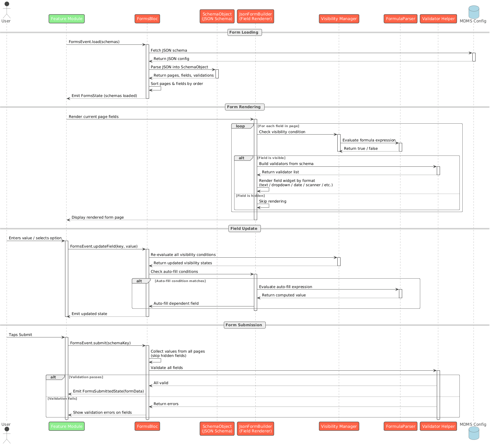

# DIGIT Form Engine

## Overview

A dynamic form rendering engine for Flutter, built on top of the `digit_ui_components` package. It allows you to define flexible, multi-page forms using a JSON schema. The engine renders fields and pages based on configuration, with automatic validation, navigation, and summary generation.

Link to the Pub Package:&#x20;



## Features

* Render multi-page forms from JSON schema fetched via MDMS
* Support for 14+ field types — text, dropdown, radio, checkbox, date, DOB, numeric, GPS coordinates, QR/barcode scanner, locality search, and more
* Built-in validation — required, min/max length, min/max value, regex pattern, cross-field comparison
* Conditional field visibility — show or hide fields based on formula expressions at runtime
* Auto-fill fields based on conditions (e.g., auto-calculate age from date of birth)
* Conditional navigation — route to different pages based on field values
* Multi-entity tab view — capture same fields for multiple selected entities (e.g., multiple products)
* Summary page generation with edit support
* Custom widget integration — plug in your own widgets using BaseReactiveFieldWrapper
* QR code and GS1 barcode scanning with validation
* Screenshot protection on sensitive pages
* Multi-language localization support


Supported Field Types:

<table><thead><tr><th width="374">Format</th><th>Description</th></tr></thead><tbody><tr><td>text</td><td>Plain text input</td></tr><tr><td>textArea</td><td>Multi-line text input</td></tr><tr><td>numeric</td><td>Number input with min/max constraints</td></tr><tr><td>dropdown</td><td>Single or multi-select dropdown</td></tr><tr><td>radio</td><td>Radio button group</td></tr><tr><td>checkbox</td><td>Boolean checkbox</td></tr><tr><td>date</td><td>Date picker with range support</td></tr><tr><td>dob</td><td>Date of birth picker with age calculation</td></tr><tr><td>mobileNumber</td><td>Phone number with format validation</td></tr><tr><td>latLng</td><td>GPS coordinates (latitude, longitude, accuracy)</td></tr><tr><td>locality</td><td>boundary</td></tr><tr><td>scanner</td><td>QR code and GS1 barcode scanner</td></tr><tr><td>idPopulator</td><td>Auto-generated ID field</td></tr><tr><td>custom</td><td>Plug in any custom widget</td></tr></tbody></table>

Supported Validations:

| Type                  | Description                          |
| --------------------- | ------------------------------------ |
| required              | Field must not be empty              |
| minLength / maxLength | String length constraints            |
| min / max             | Numeric value constraints            |
| pattern               | Regex pattern matching               |
| notEqualTo            | Must not equal another field's value |
| scanLimit             | Max number of scans allowed          |
| isGS1                 | Validate GS1 barcode format          |

**Sequence Diagram**

<figure><figcaption></figcaption></figure>

## Installation

Add this to your package's `pubspec.yaml` file:

```
dependencies:
  digit_forms_engine: ^1.0.0
```

Then run:

```
flutter pub get
```
