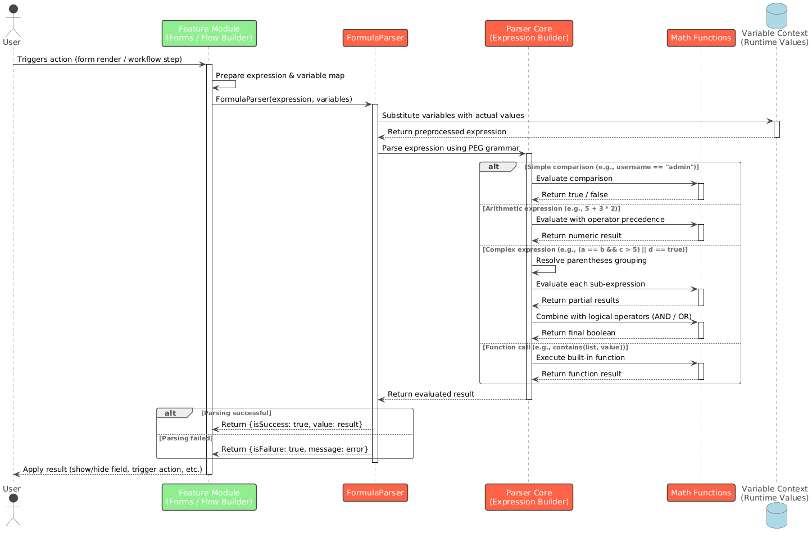

# DIGIT Formula Parser

## Overview

A Dart package for parsing and evaluating mathematical and logical expressions. It supports string comparisons, numeric operations, boolean logic, and complex nested expressions.

Link to the Pub Package: <br>



## Getting Started

The formula parser takes a string expression as input, parses it into an evaluatable structure, and returns the result. Expressions can combine comparisons, arithmetic, and logical operators freely.

```
final result = FormulaParser.evaluate('"apple"=="apple" || (corrent==corrent && 3!=5)');

```

### Supported Operators

#### Comparison Operators

| Operator | Description              | Example  |
| -------- | ------------------------ | -------- |
| `==`     | Equal to                 | `5 == 5` |
| `!=`     | Not equal to             | `3 != 5` |
| `<`      | Less than                | `3 < 5`  |
| `>`      | Greater than             | `7 > 3`  |
| `<=`     | Less than or equal to    | `5 <= 5` |
| `>=`     | Greater than or equal to | `7 >= 3` |

#### Logical Operators

| Operator | Description | Example                                |
| -------- | ----------- | -------------------------------------- |
| `&&`     | Logical AND | `"hello"=="hello" && 5>3`              |
| `\|\|`   | Logical OR  | `"hello"=="world" \|\| "test"=="test"` |

#### Mathematical Operators

| Operator | Description    | Example  |
| -------- | -------------- | -------- |
| `+`      | Addition       | `3 + 2`  |
| `-`      | Subtraction    | `5 - 1`  |
| `*`      | Multiplication | `4 * 3`  |
| `/`      | Division       | `10 / 2` |
| `^`      | Power          | `2 ^ 3`  |

### Expression Types

#### String Comparisons

Strings can be **quoted** or **unquoted**. Quoted strings are wrapped in double quotes and can contain spaces and special characters. Unquoted strings are treated as literal values.

```
// Quoted strings
"hello" == "hello"           → true
"apple" < "banana"           → true
"hello world" == "hello world" → true

// Unquoted strings
apple == apple               → true
TestUser == TestUser         → true
test@123 == test@123         → true
```

#### Numeric Comparisons

Supports integers, decimals, and negative numbers.

```
5 == 5                       → true
3.14 < 3.15                  → true
-5 < 5                       → true
999999999 > 999999998        → true
```

#### Mixed Type Comparisons

Quoted strings containing numeric values can be compared with numbers directly.

```
"123" == 123                 → true
"hello" == world             → false
```

#### Boolean Literals

Boolean values `true` and `false` are supported and are case-insensitive.

```
true                         → true
FALSE                        → false
True                         → true
```

### Combining Expressions

#### Logical Operators

Use `&&` (AND) and `||` (OR) to combine multiple comparisons into a single expression.

```
"hello" == "hello" && 5 > 3              → true
"hello" == "world" || "test" == "test"   → true
"test" != "other" && "a" < "b"          → true
```

#### Parentheses

Use parentheses to control evaluation order and group sub-expressions.

```
(corrent == corrent)                                          → true
(user_name == user_name && 10 > 5)                           → true
((user_name == user_name && 10 > 5) || (admin == admin && 3 < 2)) → true
```

#### Complex Expressions

All expression types can be freely combined for advanced logic.

```
"rachana" == "rachana" || (corrent == corrent && 3 != 5)
→ true

((user_name == user_name && 10 > 5) || (admin == admin && 3 < 2)) && "test" == "test"
→ true

("user" == "admin" && 5 > 3) || ("guest" == "guest" && 10 < 5) || ("test" == "test")
→ true
```

### Error Handling

The parser returns detailed error messages for the following scenarios:

| Error Type              | Description                                        |
| ----------------------- | -------------------------------------------------- |
| Invalid expression      | The input string cannot be parsed as an expression |
| Reserved word conflicts | Expression contains words reserved by the parser   |
| Parsing failures        | Structural issues like unmatched parentheses       |
| Type mismatches         | Incompatible types used in a comparison            |

### Performance

The parser is optimised for:

* **Simple expressions** — fast tokenisation and direct evaluation
* **Complex nested expressions** — efficient recursive descent parsing
* **String processing** — memory-efficient handling of quoted and unquoted strings
* **Logical evaluation** — short-circuit evaluation for `&&` and `||` operators

***

### Test Coverage

The package includes **62 test cases** covering:

* String comparisons (quoted and unquoted)
* Numeric comparisons (integers, decimals, negatives)
* Mixed type comparisons
* Logical operators and operator precedence
* Parentheses grouping and nesting
* Boolean literals
* Complex combined expressions
* Edge cases and error scenarios
* Performance benchmarks

**Sequence Diagram:**

<figure><figcaption></figcaption></figure>


