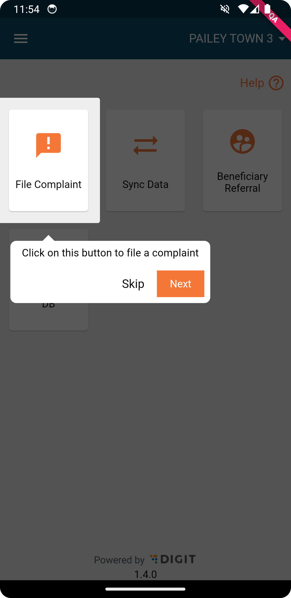
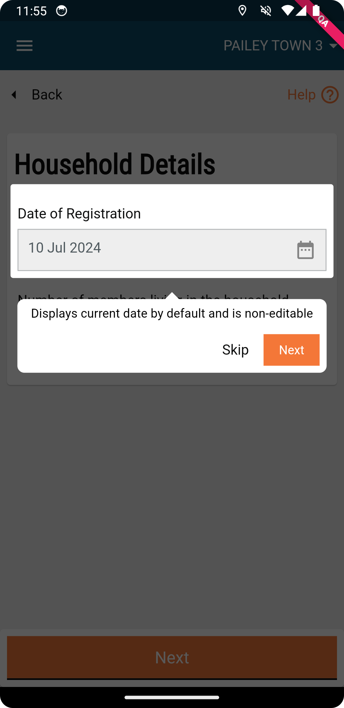

---
metaLinks:
  alternates:
    - >-
      https://app.gitbook.com/s/iVdFjJNtaUlTFjgyyYVV/design/architecture/field-app-architecture/ui-packages/digit-showcase-package
---

# DIGIT Showcase Package

Link to the Pub Package:



The showcase widget is a wrapper widget that provides a way to highlight or showcase a widget. It is useful for highlighting a widget in a list of widgets or providing functionality to provide visual help to understand the widget's functionality.

## Features&#x20;

* Provides a showcase or highlight of the wrapped widget:



## Getting Started

To use the digit\_showcase package, add the following dependency to your pubspec.yaml file:

```
dependencies:
  digit_showcase: ^latest
```

Wrap the top layer of your widget tree with the showcase widget:

```dart
ShowcaseWidget(
enableAutoScroll: true,
builder: Builder(
builder: (context) {}
);
```

Provide localisation for the showcase widget:

```dart
final date = ShowcaseItemBuilder(
    messageLocalizationKey: i18.showcase_date.date,
  );
```

Now use **.buildWith** to build the showcase widget:

```dart
date.buildWith(child: Text('Date'));
```
