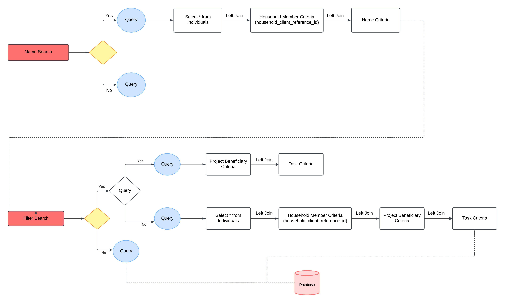

---
metaLinks:
  alternates:
    - >-
      https://app.gitbook.com/s/iVdFjJNtaUlTFjgyyYVV/design/architecture/field-app-architecture/ui-packages/registration-and-delivery-package/communal-living-facilities
---

# Communal Living Facilities

Community Living Facilities (CLFs) are defined as permanent structures where a group of individuals resides or gathers for extended periods. These facilities often play a critical role in public health campaigns due to their concentrated populations.&#x20;

The CLF functionality is integrated into the Registration and Delivery Package, enabling campaign workers to efficiently administer interventions (e.g., vaccines or bed nets) to non-household-based populations in fixed post locations such as schools, refugee camps etc.

### Key Features:

1. Search and Registration
   1. Search CLFs by name or proximity.
   2. Register and update individual or aggregated beneficiaries within a CLF.
   3. Support for down-sync of data when appropriate bandwidth is available.
   4. Search beneficiaries associated with a CLF by name or filter.
2. Campaign Mode:
   1. Fixed posts: Delivery at predefined CLFs with beneficiary enumeration.
3. User Interface:
   1. Separate navigation flow for CLFs, alongside the household-based delivery flow.
   2. Intuitive filters and search functionality for easy navigation of CLFs.

## Roles

* COMMUNITY\_CREATOR

## Household Type Assignment Based on Home Card Selection

When a user selects a specific home card, the household type is automatically set based on the card choice:

* If the beneficiary home card is selected, the household type is set to 'FAMILY"'
* If the Institution home card is selected, the household type is set to 'COMMUNITY'.

Based on this selection, queries are mapped to ensure that only relevant data is shown to the user. For example:

* If 'FAMILY' is set, only households associated with family members are displayed.
* If 'COMMUNITY' is set, only CLFs (institutions such as schools) tied to community-based household types are shown during the institution card selection process.

This approach ensures that users see data relevant to the type of household they are interacting with.

## Query Builder in Beneficiary View Screen

To view beneficiaries/individuals associated with a CLF, we need to map the query using the household\_client\_reference\_id, which connects the individual table with the household\_member table. This ensures accurate retrieval of individuals linked to specific CLFs.

The query logic ensures proper association and retrieval of relevant data for the project context. 

<figure><figcaption></figcaption></figure>
