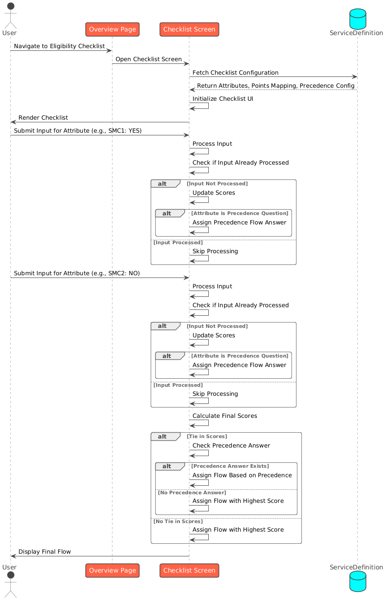

# Eligibility Checklist

## Checklist Configuration:

### Attributes:

* Each checklist consists of multiple attributes, where each attribute represents a specific question or input field.&#x20;
* Attributes may have associated codes (e.g., SMC1, SMC1.YES.SM1).

### Points Mapping:

Each possible response to an attribute (for example: YES, NO, NOT\_SELECTED) is mapped to specific points for different flows.

#### Precedence Questions:

* Some attributes are designated as precedence attributes.&#x20;
* Precedence attributes determine the priority flow when multiple flows are eligible.

#### Flow Types:

Common flow types include:

* TO\_ADMINISTER&#x20;
* BENEFICIARY\_REFUSED&#x20;
* BENEFICIARY\_REFERRED

#### Checklist Configuration Process:

* Define the checklist attributes and associate them with codes.&#x20;
* Map each possible response of an attribute to flow points.&#x20;
* Identify precedence attributes and configure precedence mapping.&#x20;
* Define precedence flow logic (e.g., YES maps to TO\_ADMINISTER, NO maps to BENEFICIARY\_REFUSED).

### Example:

```json
"ServiceDefinition": {
        "tenantId": "mz",
        "code": "SMC Campaign.ELIGIBILITY.DISTRIBUTOR",
        "isActive": true,
        "additionalFields": {
            "schema": "ServiceDefinition",
            "version": 1,
            "fields": [
                {
                    "key": "precedenceFlow",
                    "value": "SMC1.YES.SM1"
                },
                {
                    "key": "flow",
                    "value": [
                        {
                            "type": "TO_ADMINISTER",
                            "minScore": 5
                        },
                        {
                            "type": "BENEFICIARY_REFUSED",
                            "minScore": 3
                        },
                        {
                            "type": "BENEFICIARY_REFERRED",
                            "minScore": 7
                        }
                    ]
                }
            ]
        },
        "attributes": [
            {
                "tenantId": "mz",
                "code": "SMC1",
                "dataType": "SingleValueList",
                "values": [
                    "YES",
                    "NO",
                    "NOT_SELECTED"
                ],
                "isActive": true,
                "required": true,
                "order": 1,
                "additionalFields": {
                    "schema": "ServiceAttribute",
                    "version": 1,
                    "fields": [
                        {
                            "key": "pointsMapping",
                            "value": {
                                "YES": {
                                    "TO_ADMINISTER": 0,
                                    "BENEFICIARY_REFUSED": 0,
                                    "BENEFICIARY_REFERRED": 10
                                },
                                "NO": {
                                    "TO_ADMINISTER": 2,
                                    "BENEFICIARY_REFUSED": 0,
                                    "BENEFICIARY_REFERRED": 0
                                }
                            }
                        },
                        {
                            "key": "helpText",
                            "value": "SMC1.HELP"
                        }
                    ]
                }
            },
            {
                "tenantId": "mz",
                "code": "SMC1.YES.SM1",
                "dataType": "SingleValueList",
                "values": [
                    "YES",
                    "NO",
                    "NOT_SELECTED"
                ],
                "isActive": true,
                "required": true,
                "order": 2,
                "additionalFields": {
                    "schema": "ServiceAttribute",
                    "version": 1,
                    "fields": [
                        {
                            "key": "pointsMapping",
                            "value": {
                                "YES": {
                                    "TO_ADMINISTER": 0,
                                    "BENEFICIARY_REFUSED": 0,
                                    "BENEFICIARY_REFERRED": 10
                                },
                                "NO": {
                                    "TO_ADMINISTER": 2,
                                    "BENEFICIARY_REFUSED": 0,
                                    "BENEFICIARY_REFERRED": 0
                                }
                            }
                        },
                        {
                            "key": "helpText",
                            "value": "SMC1.YES.HELP"
                        }
                    ]
                }
            },
            {
                "tenantId": "mz",
                "code": "SMC2",
                "dataType": "SingleValueList",
                "values": [
                    "YES",
                    "NO",
                    "NOT_SELECTED"
                ],
                "isActive": true,
                "required": true,
                "order": 3,
                "additionalFields": {
                    "schema": "ServiceAttribute",
                    "version": 1,
                    "fields": [
                        {
                            "key": "pointsMapping",
                            "value": {
                                "YES": {
                                    "TO_ADMINISTER": 0,
                                    "BENEFICIARY_REFUSED": 0,
                                    "BENEFICIARY_REFERRED": 10
                                },
                                "NO": {
                                    "TO_ADMINISTER": 2,
                                    "BENEFICIARY_REFUSED": 0,
                                    "BENEFICIARY_REFERRED": 0
                                }
                            }
                        },
                        {
                            "key": "helpText",
                            "value": "SMC2.HELP"
                        }
                    ]
                }
            },
            {
                "tenantId": "mz",
                "code": "SMC3",
                "dataType": "SingleValueList",
                "values": [
                    "YES",
                    "NO",
                    "NOT_SELECTED"
                ],
                "isActive": true,
                "required": true,
                "order": 4,
                "additionalFields": {
                    "schema": "ServiceAttribute",
                    "version": 1,
                    "fields": [
                        {
                            "key": "pointsMapping",
                            "value": {
                                "YES": {
                                    "TO_ADMINISTER": 0,
                                    "BENEFICIARY_REFUSED": 0,
                                    "BENEFICIARY_REFERRED": 10
                                },
                                "NO": {
                                    "TO_ADMINISTER": 8,
                                    "BENEFICIARY_REFUSED": 0,
                                    "BENEFICIARY_REFERRED": 0
                                }
                            }
                        },
                        {
                            "key": "helpText",
                            "value": "SMC3.HELP"
                        }
                    ]
                }
            }
        ]
    }
```

### Processing Inputs:

For each attribute in the checklist:

* Retrieve the user input.
* Generate a unique key (e.g., SMC1\_YES) to avoid duplicate processing.
* Check if the input has already been processed to prevent double counting.

### Update Scores:

For each response:

* Retrieve the corresponding flow points from the mapping of the points.
* Update the scores for each flow type by adding the mapped points.

### Handle Precedence:

* If the attribute is a precedence attribute and an input is provided
  * Record the precedence flow answer.
* Skip precedence attributes if no input is provided.

### Final Flow Assignment:

* Calculate the total scores for all flows based on user inputs.
* If there is a tie in scores between flows:
  * Check for precedence answers and assign the flow based on the precedence mapping.
  * If no precedence answer exists, assign the flow with the highest score.
* If no tie exists, directly assign the flow with the highest score.

<figure><figcaption></figcaption></figure>
