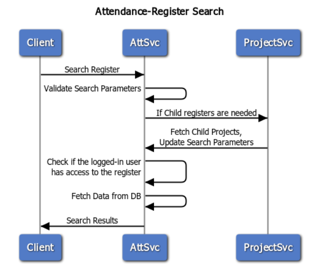

# Attendance

## Overview

The Attendance Service is a comprehensive back-end solution designed to support health campaigns by providing efficient and transparent attendance management. It facilitates the streamlined tracking of health campaign workers, volunteers, and contractors, ensuring accurate participation records and enabling informed decision-making.

Note: Deletion of attendees from the system is not recommended, even in cases where participation in the campaign has ceased. Attendance records should instead reflect the status of absent for all days following the departure. This practice ensures the integrity of attendance data, preserves historical records, and supports accurate reporting and auditing processes.

Key functionalities include:

* Maintaining attendance registers.
* Enrolling and managing individuals.
* Creating, updating, and searching attendance logs.
* Managing staff permissions for attendance-related operations.

## API Specifications

**Base Path:** /health-attendance/

### API Contract Link

[https://editor.swagger.io/?url=https://raw.githubusercontent.com/egovernments/DIGIT-Works/f525b183782a353812f7e2432a2989a86c498810/backend/attendance/Attendance-Service-1.0.0.yaml](attendance.md#api-contract-link)

## Data Model

### DB Schema Diagram

<figure><figcaption>
Attendance with Offline Enablement of Logs
</figcaption></figure>

## Web Sequence Diagrams

#### Attendance Register



<figure><figcaption></figcaption></figure>



<figure><figcaption></figcaption></figure>



<figure><figcaption></figcaption></figure>



#### Staff



<figure><figcaption></figcaption></figure>



<figure><figcaption></figcaption></figure>



#### Attendee



<figure><figcaption></figcaption></figure>



<figure><figcaption></figcaption></figure>



#### Attendance Log



<figure><figcaption></figcaption></figure>



<figure><figcaption></figcaption></figure>



<figure><figcaption></figcaption></figure>


