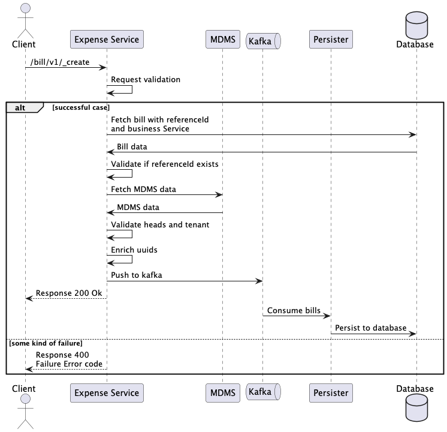
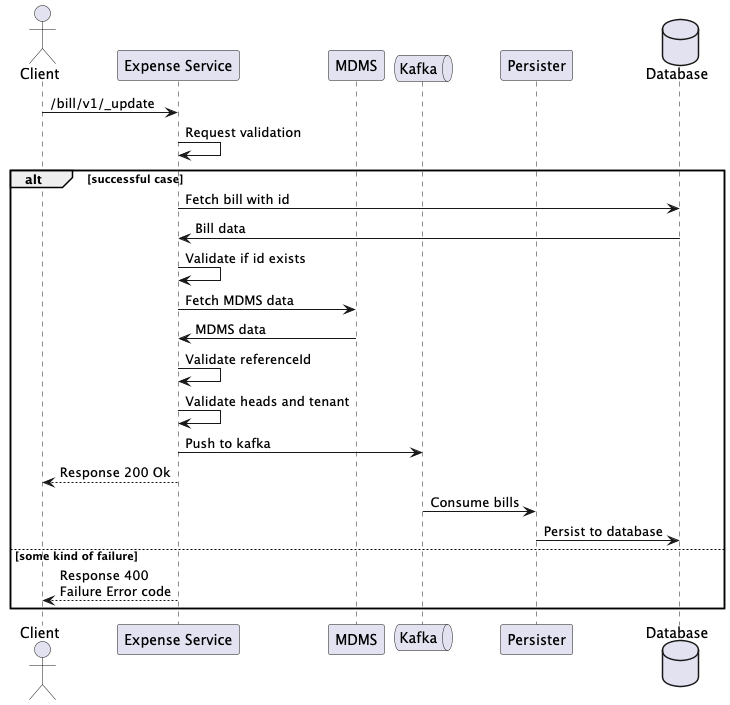
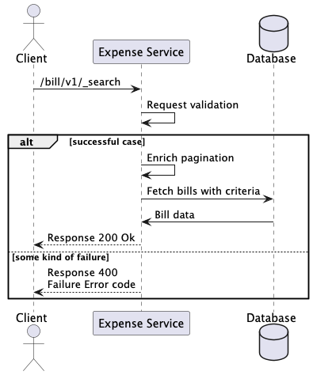

# Expense

## Overview 

The Expense service allows users to capture the details for expense bills and payments.

## API Specifications 

**Base path**: `/health-expense/bill/`

#### API Contract Link 

The API specification is available [here](https://github.com/egovernments/DIGIT-Specs/blob/c7e5b6efefbfb351fd123788a7f762673223952d/Domain%20Services/Health/Expense-v1.1.0.yml). To view it in the Swagger editor, click below.

[Swagger Editor](https://editor.swagger.io/?url=https://raw.githubusercontent.com/egovernments/DIGIT-Specs/c7e5b6efefbfb351fd123788a7f762673223952d/Domain%20Services/Health/Expense-v1.1.0.yml)

## Data Model 

#### DB Schema Diagram 

<figure><figcaption></figcaption></figure>

## Web Sequence Diagrams 



<figure><figcaption></figcaption></figure>



<figure><figcaption></figcaption></figure>



<figure><figcaption></figcaption></figure>



#### Persister 

Persister configuration: [Expense persister](https://github.com/egovernments/configs/blob/HCM-v1.8/health/egov-persister/expense-bill-payment-persister.yml)

### Related Topics 

* [Functional specifications - Expense](https://works.digit.org/specifications/functional-specifications/expenditure-billing)
* [Expense service configuration](../../../../deploy/configuration/hcm-service-configuration/expense-service.md)
