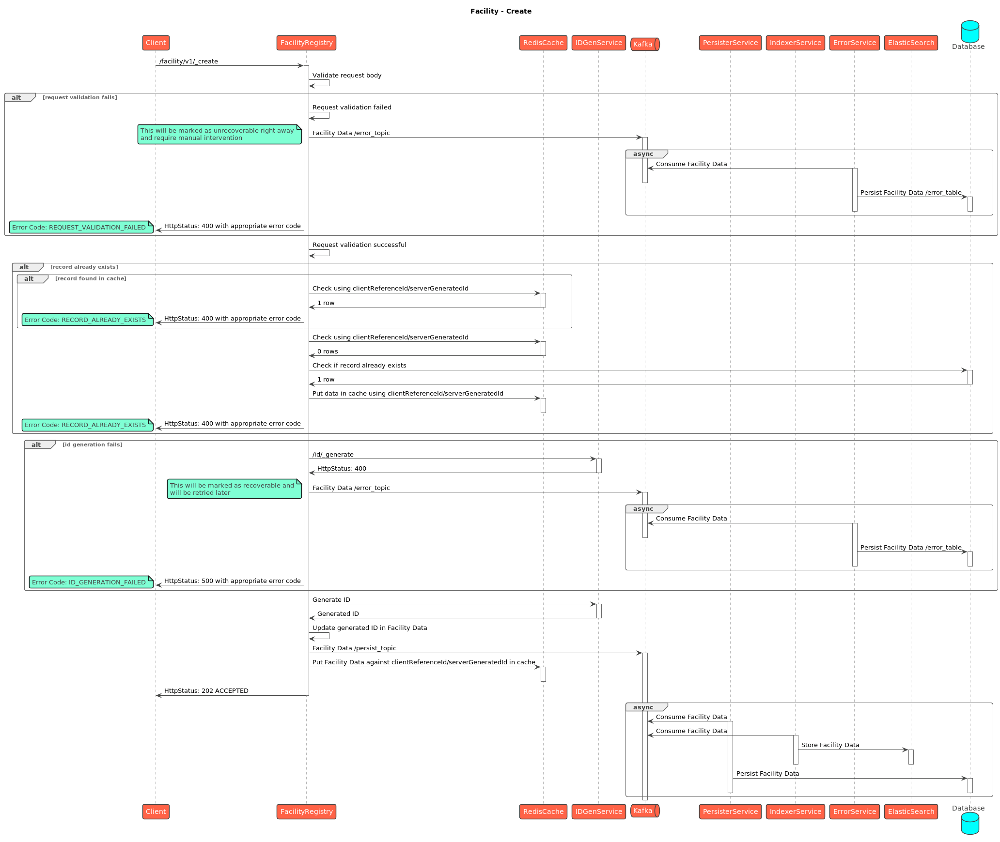
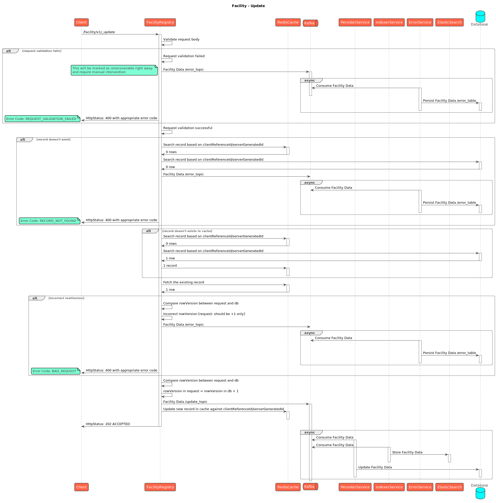
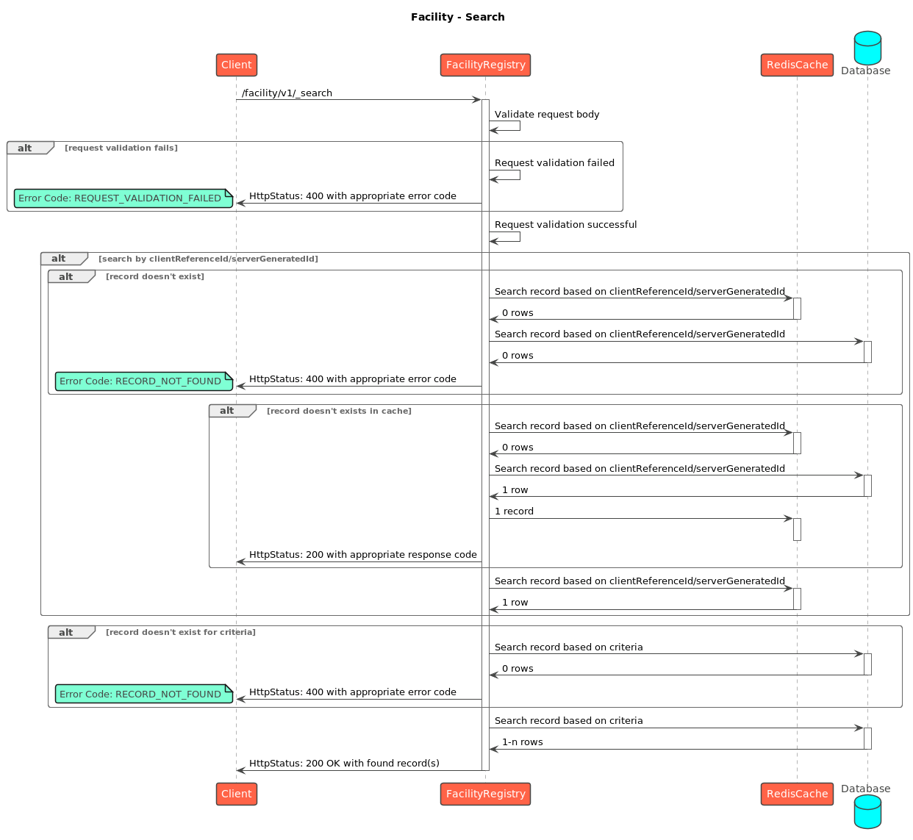

# Facility

## Overview

The **Facility Registry** manages facility-related data within the HCM system. It supports the key operations of **creating**, **updating**, **deleting**, and **searching** for facilities, along with their bulk counterparts.

## API Spec



## Sequence Diagrams

<figure><figcaption>
Facility - Create
</figcaption></figure>

<figure><figcaption>
Facility - Update
</figcaption></figure>

<figure><figcaption>
Facility - Search
</figcaption></figure>
