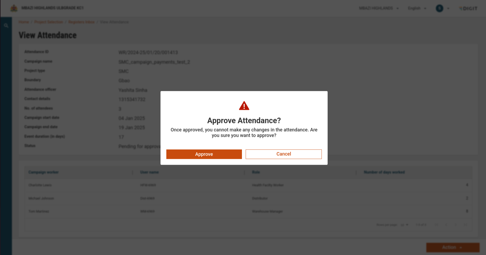

# View Attendance: Edit & Approve

## Overview

Clicking on any register ID from the inbox displays detailed information about the attendance register. The screen includes information such as campaign details, attendance officer details, and attendee information. Users can perform two primary actions: **Edit** and **Approve**.

## **Interface Elements**

* Campaign Details: Displays the campaign name, ID, and dates.
* Attendance Officer Details: Name, ID, and contact information.
* Attendee Information: Includes register ID, attendee names, and attendance data.
* Action Buttons:
  * Edit Attendance: Allows editing attendance details.
  * Approve Attendance: Approve the attendance register.

<figure><figcaption></figcaption></figure>

<table><thead><tr><th width="179.3203125">Element</th><th>Description</th></tr></thead><tbody><tr><td>Register Details</td><td>Displays Attendance ID, Campaign Name, Project Type, Boundary, and other metadata.</td></tr><tr><td>Attendee Table</td><td>Lists attendee details, including Name, ID, Designation, and Hours Worked.</td></tr><tr><td>Action Button</td><td>Enables editing or approving attendance (if conditions are met).</td></tr><tr><td>Validation Message</td><td>Informs users if the campaign is ongoing and actions are disabled.</td></tr></tbody></table>

## **Validations & Conditions**

1. **Campaign Status**:
   * If the campaign is ongoing, the **Edit** and **Approve** buttons are disabled, and only a "Back" button is shown.
   * Administrators can override this behaviour through MDMS (configurable settings).
2. **Approved Registers**:
   * If the register is already approved, the action buttons are disabled, and a "Back" button is displayed.
3. **Role-Based Permissions**:
   * Only authorised supervisors can access the Edit/Approve features.

## **Action Flows**

1. #### Edit Attendance Flow

<figure><figcaption></figcaption></figure>

**a. Step 1: Pop-Up Confirmation**

* Message: "Editing attendance will affect the number of days for attendees. Do you want to proceed?"
* Buttons:
  * Cancel: Close the pop-up.
  * Proceed: Navigate to the Edit Attendance screen.

**b. Step 2: Edit Attendance Screen**

<figure><figcaption></figcaption></figure>

<table><thead><tr><th width="205.6796875">Columns</th><th width="160.01953125">Editable</th><th>description</th></tr></thead><tbody><tr><td>Campaign Worker</td><td>NO</td><td>Name of attendee</td></tr><tr><td>User Name</td><td>NO</td><td>Username of attendee</td></tr><tr><td>Role</td><td>NO</td><td>Role of attendee</td></tr><tr><td>Number of Days</td><td>YES</td><td>number of days worked by the attendee</td></tr></tbody></table>

* **Validation**:
  * The number of days worked must be a positive integer and must not exceed the event duration.
* **Submit Button Behaviour**:
  * Initially disabled until changes are made.
  * Upon submission:
    * Displays a success message: _"Attendance updated successfully!"_
    * Displays an error message if the update fails.

2. **Approve Attendance Flow**
   1. **Step 1: Add Comment**
      * **Message**:\
        &#xNAN;_"Please add a comment before approving."_
      * **Input Field**: Allows users to enter comments (mandatory).
      * **Buttons**:
        * **Cancel**: Closes the pop-up and returns to the view screen.
        * **Submit**: Proceeds to the final warning.

<figure><figcaption></figcaption></figure>

2. **Step 2: Confirmation Pop-Up**
   * **Message**:\
     &#xNAN;_"Do you want to approve this attendance register?"_
   * **Buttons**:
     * **Cancel**: Closes the pop-up and remains on the view screen.
     * **Proceed**: Opens a **Comment Entry Pop-Up**.

<figure><figcaption></figcaption></figure>

2. **Step 4: Success Page**
   * **Message**:\
     &#xNAN;_"Attendance approved"_
   * **Action**: view another register or go back home.

<figure><figcaption></figcaption></figure>

<table><thead><tr><th width="290.40234375">EndPoint</th><th>Description</th></tr></thead><tbody><tr><td><code>health-attendance/v1/_search</code></td><td>fetch the registers details</td></tr><tr><td><code>health-individual/v1/_search</code></td><td>fetch the attendee and staff details</td></tr><tr><td><code>/health-muster-roll/v1/_update</code></td><td>to update the attendee attendance and approve registers</td></tr><tr><td><code>/health-muster-roll/v1/_estimate</code></td><td>to fetch estimate data of registers</td></tr><tr><td><code>/health-muster-roll/v1/_search</code></td><td>fetch the muster role data for regiter</td></tr></tbody></table>
