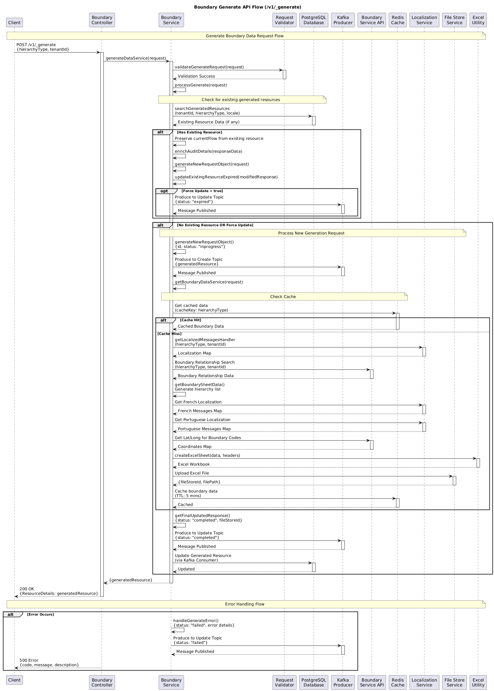
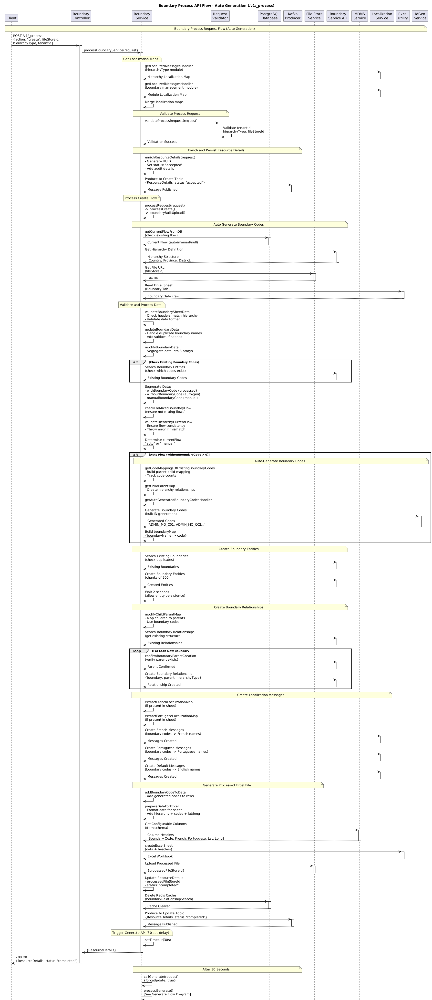

# Boundary Management - Boundary Manager

### Overview

This service is used to generate boundary service codes—either automatically or manually—based on the hierarchy. Users populate the generated Excel sheet with boundary details and process it to obtain the corresponding boundary codes.

### **Dependencies**

* Boundary
* Localisation

### API Specification

```
Base Path: /boundary-management/
```

### Data Model

DB Schema Diagram



```
TABLE eg_bm_generated_template
(
    id character varying(128) NOT NULL,
    filestoreid character varying(128),
    status character varying(128),
    tenantid character varying(128),
    hierarchytype character varying(128),
    locale VARCHAR(50),
    createdby character varying(128),
    createdtime bigint,
    lastmodifiedby character varying(128),
    lastmodifiedtime bigint,
    additionaldetails jsonb,
    referenceid character varying(128),
    CONSTRAINT eg_bm_generated_template_pkey PRIMARY KEY (id)
)
```



```
TABLE eg_bm_processed_template
(
    id character varying(128) NOT NULL,
    status character varying(128) NOT NULL,
    tenantid character varying(128) NOT NULL,
    hierarchytype character varying(128),
    filestoreid character varying(128) NOT NULL,
    processedfilestoreid character varying(128),
    action character varying(128) NOT NULL,
    createdby character varying(128) NOT NULL,
    createdtime bigint NOT NULL,
    lastmodifiedby character varying(128),
    lastmodifiedtime bigint,
    additionaldetails jsonb,
    referenceid character varying(128),
    CONSTRAINT eg_bm_processed_template_pkey PRIMARY KEY (id)
)
```



### Web Sequence Diagrams



```
/boundary-management/v1/_generate
```

<figure><figcaption></figcaption></figure>



```
boundary-management/v1/_process
```

<figure><figcaption></figcaption></figure>



```
boundary-management/v1/_process
```

<figure><figcaption></figcaption></figure>


