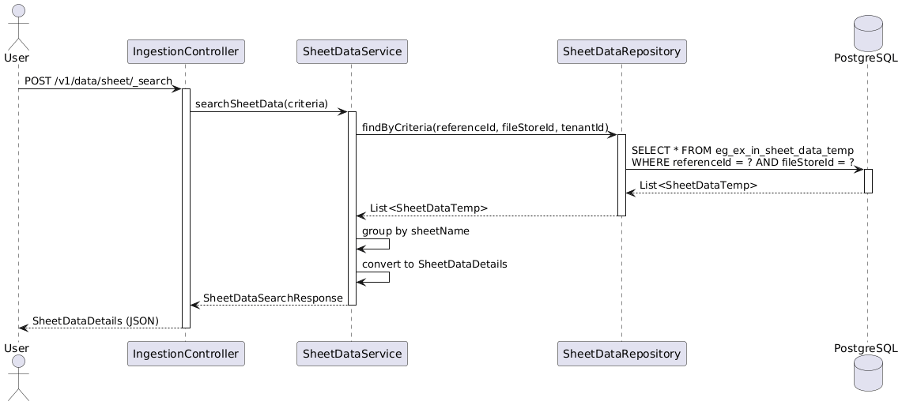

# Excel Ingestion

### Overview

The service generates localized Excel templates with built-in validations such as dropdowns and hierarchy checks, and it processes uploaded Excel data asynchronously.

### &#x20;**Dependencies**

* Access Control
* Boundary
* Facility
* File Store
* Individual
* Localisation
* MDMS
* Project Factory

### API Specification

```
Base Path: /excel-ingestion/
```

API Contract :&#x20;

### Data Model

DB Schema Diagram



```
TABLE eg_ex_in_generated_files (
    id                VARCHAR(100)  PRIMARY KEY,
    referenceId       VARCHAR(100)  NOT NULL,
    referenceType     VARCHAR(100),      
    tenantId          VARCHAR(100)  NOT NULL,
    type              VARCHAR(50)   NOT NULL,
    hierarchyType     VARCHAR(100),
    fileStoreId       VARCHAR(200),
    status            VARCHAR(20)   NOT NULL,
    additionalDetails JSONB,
    locale            VARCHAR(64),
    createdBy         VARCHAR(100),
    lastModifiedBy    VARCHAR(100),
    createdTime       BIGINT,
    lastModifiedTime  BIGINT
)
```



```
TABLE eg_ex_in_excel_processing (
    id                    VARCHAR(100)  PRIMARY KEY,
    referenceId           VARCHAR(100)  NOT NULL,
    referenceType         VARCHAR(100),             
    tenantId              VARCHAR(100)  NOT NULL,
    type                  VARCHAR(50)   NOT NULL,
    hierarchyType         VARCHAR(100)  NOT NULL,
    fileStoreId           VARCHAR(200)  NOT NULL,
    processedFileStoreId  VARCHAR(200),
    processedStatus       VARCHAR(200),          
    status                VARCHAR(20)   NOT NULL,
    additionalDetails     JSONB,
    createdBy             VARCHAR(100),
    lastModifiedBy        VARCHAR(100),
    createdTime           BIGINT,
    lastModifiedTime      BIGINT
)
```



```
TABLE eg_ex_in_sheet_data_temp (
    referenceId         VARCHAR(100)    NOT NULL,
    tenantId            VARCHAR(100)    NOT NULL,
    fileStoreId         VARCHAR(100)    NOT NULL,
    sheetName           VARCHAR(100)    NOT NULL,
    rowNumber           INTEGER         NOT NULL,
    rowJson             JSONB           NOT NULL,
    createdBy           VARCHAR(100)    NOT NULL,
    createdTime         BIGINT          NOT NULL,
    deleteTime          BIGINT          NOT NULL DEFAULT (EXTRACT(EPOCH FROM NOW()) * 1000 + 86400000),
    PRIMARY KEY (referenceId, fileStoreId, sheetName, rowNumber)
)
```



### Web Sequence Diagrams



```
/excel-ingestion/v1/data/generate/_init
```

<figure><figcaption></figcaption></figure>



```
/excel-ingestion/v1/data/process/_validation
```

<figure><figcaption></figcaption></figure>



```
/excel-ingestion/v1/data/process/_create
```

<figure><figcaption></figcaption></figure>



```
/excel-ingestion/v1/data/sheet/_search
```

<figure><figcaption></figcaption></figure>


