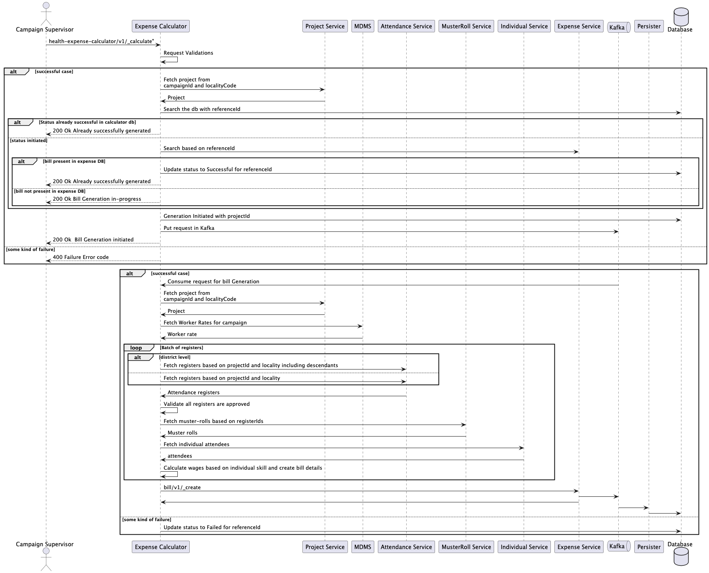
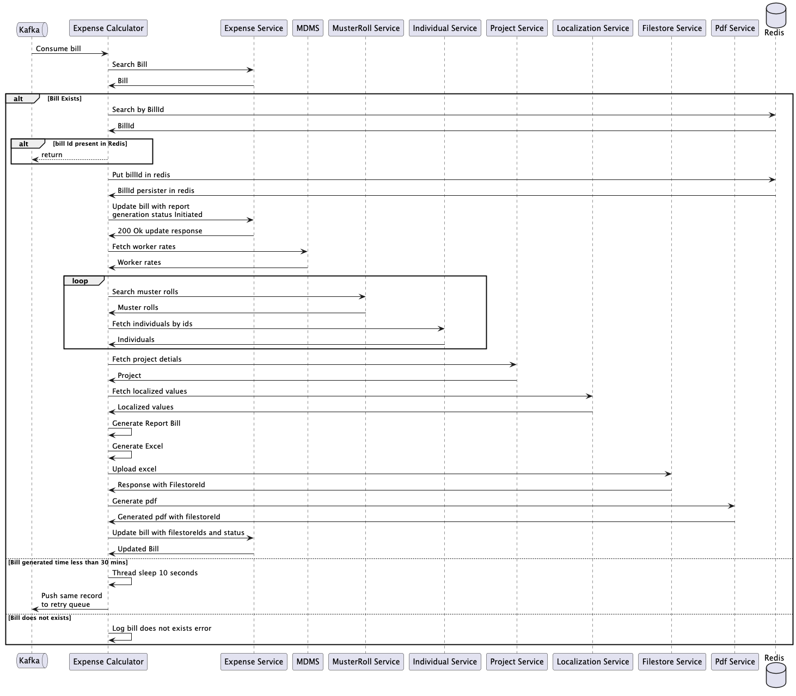

---
metaLinks:
  alternates:
    - >-
      https://app.gitbook.com/s/iVdFjJNtaUlTFjgyyYVV/design/architecture/low-level-design/services/expense-calculator
---

# Expense Calculator

## Overview

The expense calculator is an implementation-specific service that works in tandem with the expense service. This service holds all the specific business logic for computing expenses and calls the billing service with the correct payload to create a bill. Once the bill is generated, Excel and PDF are generated by the calculator service.

There are three types of bills in HCM:

* Wage bill - generated from an approved muster roll and to be paid to wage seekers on completion of work

## API Specifications 

**Base path**: `/health-expense-calculator/v1/`

The API specification is available [here](https://github.com/egovernments/DIGIT-Specs/blob/c7e5b6efefbfb351fd123788a7f762673223952d/Domain%20Services/Health/Health-Expense-calculator-v1.0.0.yml). To view it in the Swagger editor, click below.

[Swagger Editor](https://editor.swagger.io/?url=https://raw.githubusercontent.com/egovernments/DIGIT-Specs/c7e5b6efefbfb351fd123788a7f762673223952d/Domain%20Services/Health/Health-Expense-calculator-v1.0.0.yml)

## Dependencies 

* DIGIT backbone services
* Persister
* MDMS
* Attendance
* Muster roll
* Project
* Individual
* Expense
* Localization
* PdfService
* Filestore

#### Master Data

* Worker rates

## Sequence Diagrams

<figure><figcaption>
Bill generation
</figcaption></figure>

<figure><figcaption>
Excel/PDF generation
</figcaption></figure>

## DB Diagram

<figure><figcaption></figcaption></figure>

### MDMS data



## Related Topics

* [Expense calculator configuration](../../../../deploy/configuration/hcm-service-configuration/expense-calculator.md)
