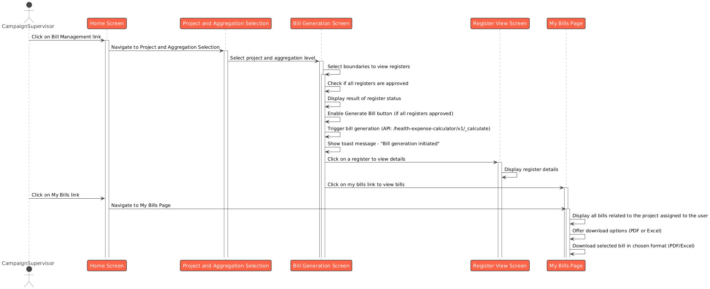

# Generate Bill

## Overview

The **Campaign Supervisor Flow** is designed to streamline the management of attendance registers and bill generation processes for supervisors overseeing specific projects and boundaries. This flow ensures efficient selection, filtering, and approval of registers and simplifies the generation and tracking of bills. It focuses on clear workflows, actionable feedback, and validation mechanisms to enhance usability and accuracy.

## **Features**

* **Project and Bill Aggregation Selection**: Supervisors select a project and boundary aggregation level to narrow down the scope for attendance registers and billing.
* **Registers Filtering and Bill Generation**: Enables supervisors to filter registers based on boundaries, view attendance data, and generate bills only when all registers are approved.
* **Bill Management (My Bills)**: Provides a centralised view of all generated bills, with tools for searching, filtering, and downloading them in preferred formats.

<table><thead><tr><th width="223.68359375">Role</th><th>Responsibility</th></tr></thead><tbody><tr><td>CAMPAIGN_SUPERVISOR</td><td>aggregate the bill generation, based on district, province or country and download it for further processing</td></tr></tbody></table>

This structured approach empowers supervisors to manage attendance registers and related billing tasks with ease while adhering to necessary validations and role-based permissions.

## **Sequence Diagram**

<figure><figcaption></figcaption></figure>
