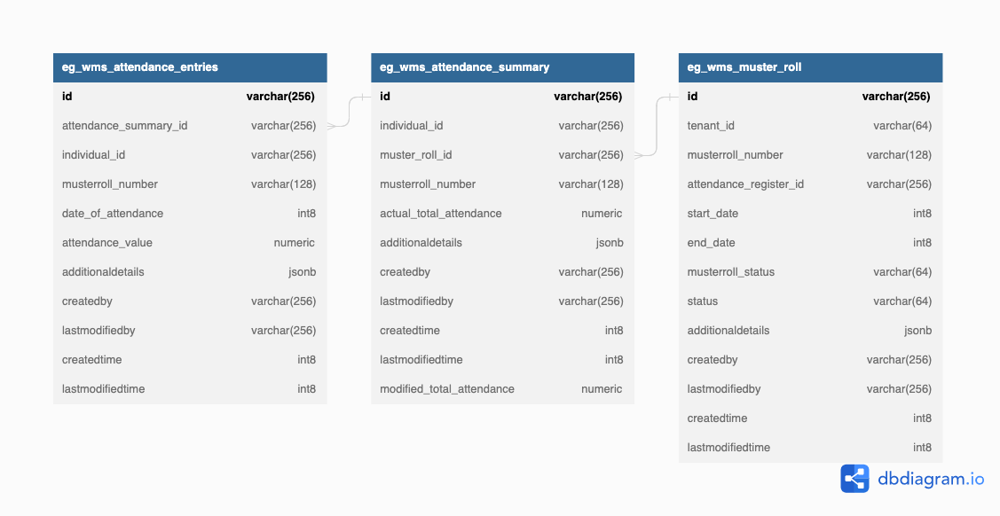
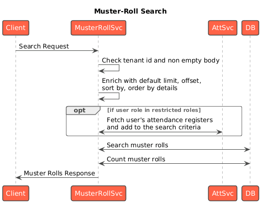

---
metaLinks:
  alternates:
    - >-
      https://app.gitbook.com/s/iVdFjJNtaUlTFjgyyYVV/design/architecture/low-level-design/services/muster-roll
---

# Muster Roll

### Overview

The Muster Roll service aggregates attendance logs from the attendance service based on some rules and presents an attendance aggregate for a time period (week or month) per individual. This can then be used to compute payments or other semantics.

### Dependencies 

* [DIGIT backbone services](https://core.digit.org/platform/core-services)
* [Idgen](https://core.digit.org/platform/core-services/id-generation-service)
* [Persister](https://core.digit.org/platform/core-services/persister-service)
* [Indexer](https://core.digit.org/platform/core-services/indexer-service)
* [Workflow](https://core.digit.org/platform/core-services/workflow-service)
* [User](https://core.digit.org/platform/core-services/user-services)
* [Attendance](../registries/attendance.md)

### Code 

[Module code](https://github.com/egovernments/DIGIT-Works/tree/master/backend/muster-roll)

[Helm charts](https://github.com/egovernments/DIGIT-DevOps/tree/digit-works/deploy-as-code/helm/charts/digit-works/backend/muster-roll)

### API Specifications 

**Base Path:** /health-muster-roll

#### API Contract Link 



### Data Model 

#### DB Schema Diagram 

<figure><figcaption></figcaption></figure>

Web Sequence Diagrams



<figure><figcaption></figcaption></figure>



<figure><figcaption></figcaption></figure>



<figure><figcaption></figcaption></figure>



#### Master Data







### Related Topics

* [Muster Roll service configuration](../../../../deploy/configuration/hcm-service-configuration/muster-roll.md)
