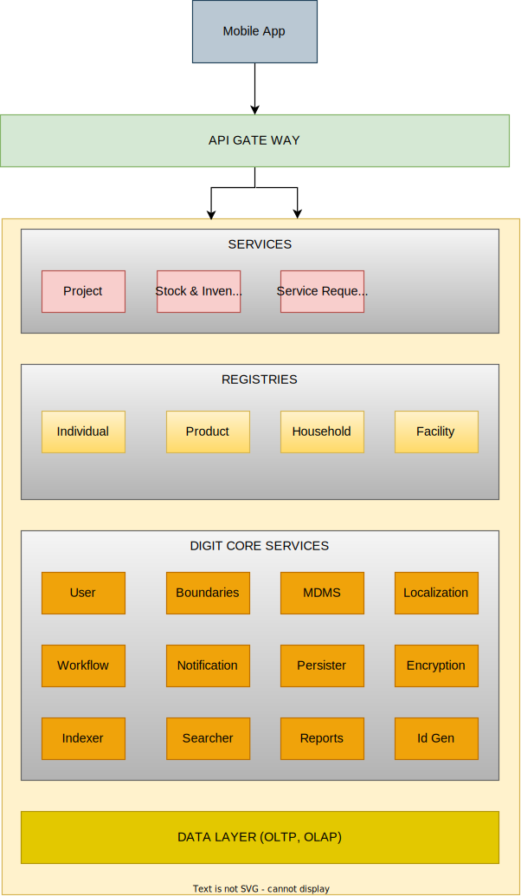

# Architecture

DIGIT is India’s largest open-source platform for digital governance. Health Services are built on top of DIGIT.  It is built on OpenAPI (OAS 2.0) and provides API-based access to a variety of services enabling governments to provide health campaign services with relevant new services and also integrating the existing system into the platform and run seamlessly on any commercial/on-prem cloud infrastructure with scale and speed.

### Key Architecture Highlights 

* Health DIGIT is a microservices-based platform that is built to scale. Microservices are small, autonomous and developer-friendly services that work together.
* Decentralized control between teams, so that its developers strive to produce useful tools that can then be used by others to solve the same problems.
* MicroServices have smart endpoints that process info and apply logic. They receive requests, process them, and generate a response accordingly.
* Parallelism in development: Microservices architectures are mainly business-centric.
* A big software or system can be broken down into multiple small components or services. These components can be designed, developed & deployed independently without compromising the integrity of the application.

<figure><figcaption></figcaption></figure>

### Multi-layer Architecture

Health DIGIT follows Multi layer or n-tiered distributed architecture pattern. As seen in the illustration above there are different horizontal layers with some set of components eg. Services, Registries and DIGIT Core Services. Every layer consists of a set of microservices. Each layer of the layered architecture pattern has a specific role and responsibility within the application.

* Layered architecture increases flexibility, maintainability, and scalability
* Multiple applications can reuse the components
* Parallelism
* Different components of the application can be independently deployed, maintained, and updated, on different time schedules
* Layered architecture also makes it possible to configure different levels of security to different components
* Layered architecture also helps users test the components independent of each other
