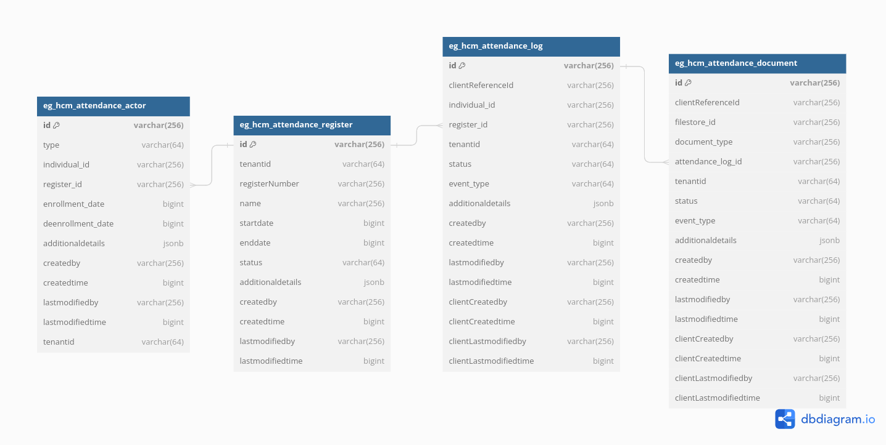

# Attendance

## Overview

Attendance service allows users to maintain attendance registers, enrol individuals, create, update or search attendance logs and manage staff permissions.

## API Specifications

**Base Path:** /health-attendance/

### API Contract Link



## Data Model

### DB Schema Diagram

<figure><figcaption>
Attendance with Offline Enablement of Logs
</figcaption></figure>

## Web Sequence Diagram

###

