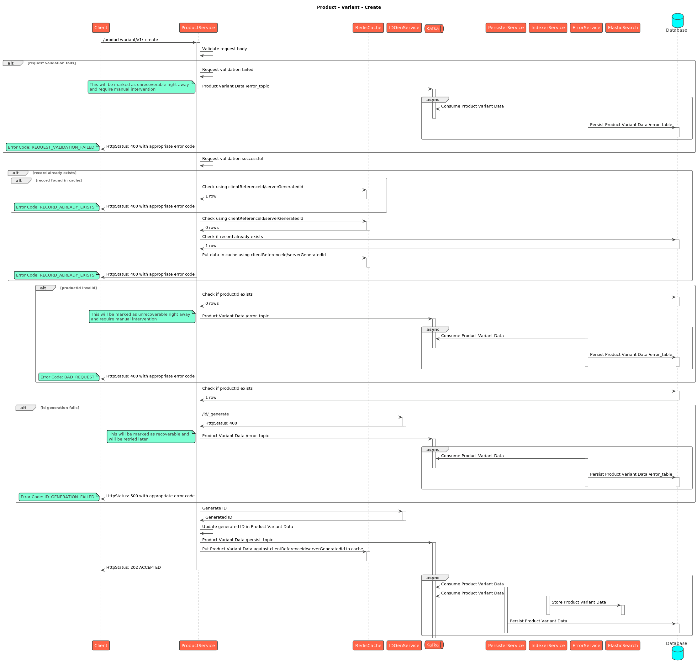
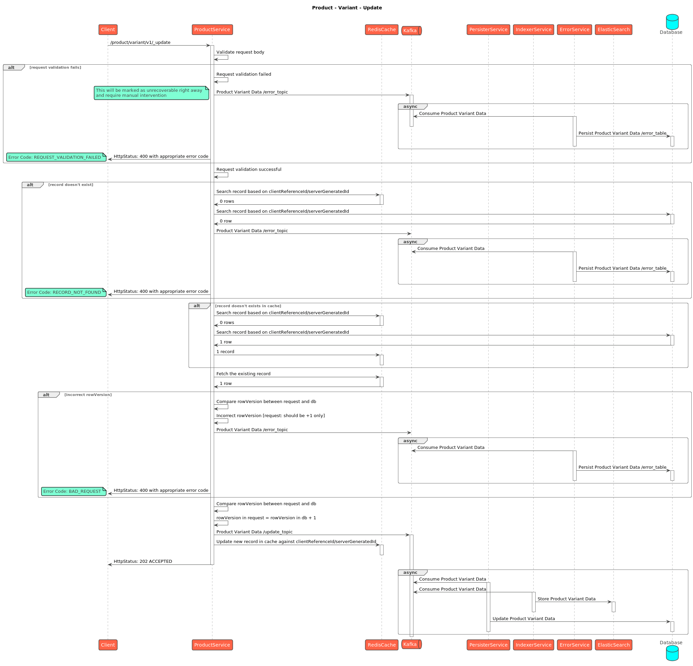

# Stock

## API Spec



## Sequence Diagrams



<figure><figcaption>
Stock - Create
</figcaption></figure>

<figure><figcaption>
Stock - Update
</figcaption></figure>

<figure><figcaption>
Stock - Search
</figcaption></figure>



<figure><figcaption>
Product Variant - Create
</figcaption></figure>

<figure><figcaption>
Product Variant - Update
</figcaption></figure>

<figure><figcaption>
Product Variant - Search
</figcaption></figure>


