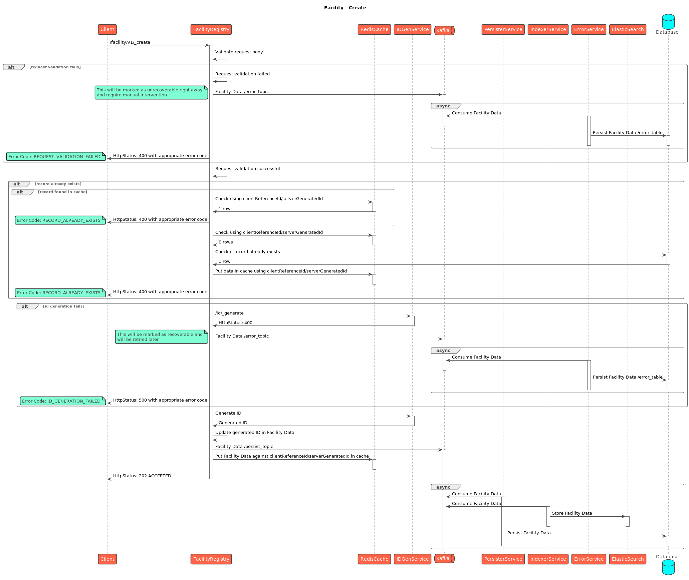
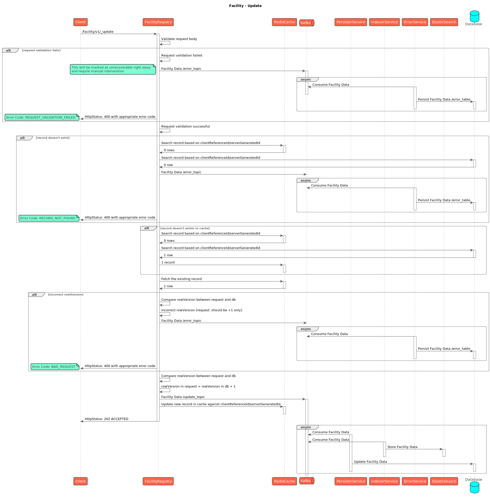
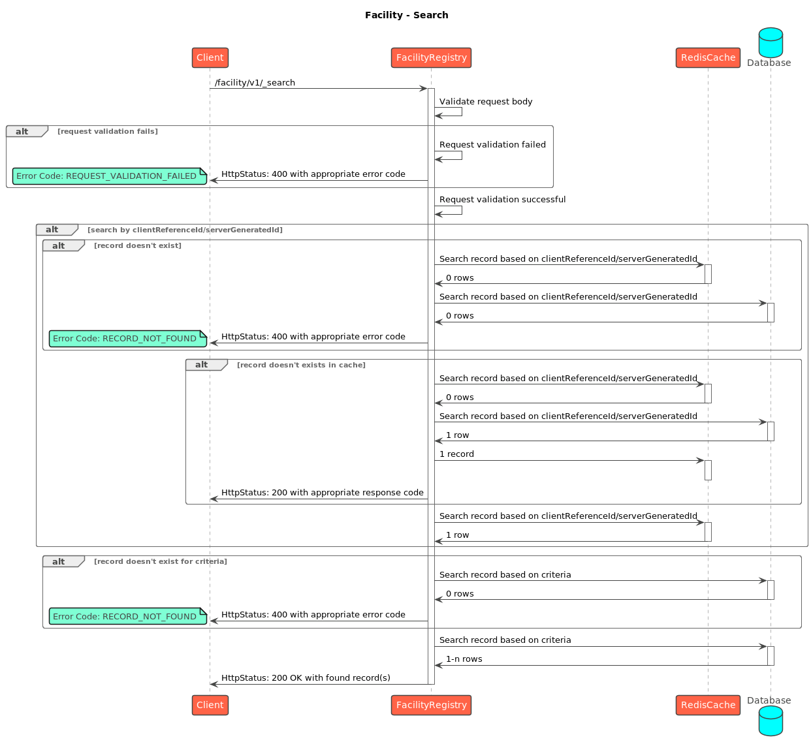

# Facility

## API Spec


Facility Spec


## Sequence Diagrams

<figure><figcaption>
Facility - Create
</figcaption></figure>

<figure><figcaption>
Facility - Update
</figcaption></figure>

<figure><figcaption>
Facility - Search
</figcaption></figure>
