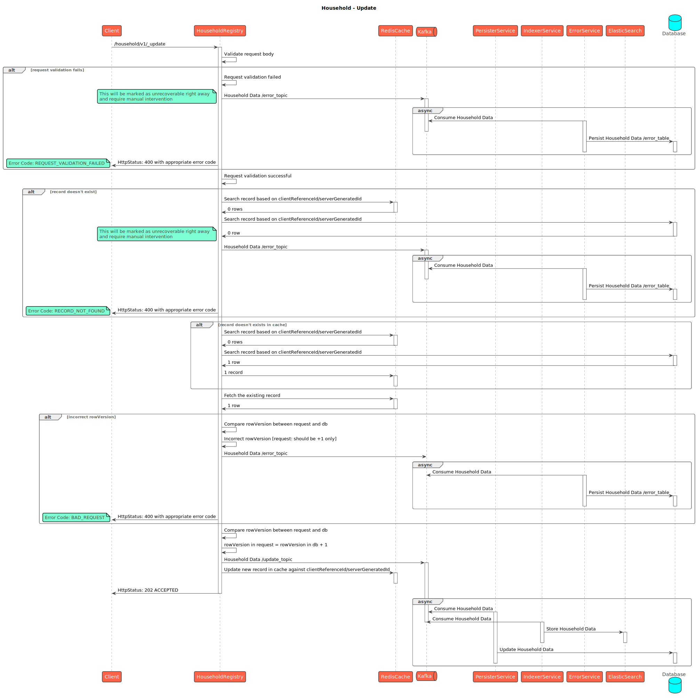
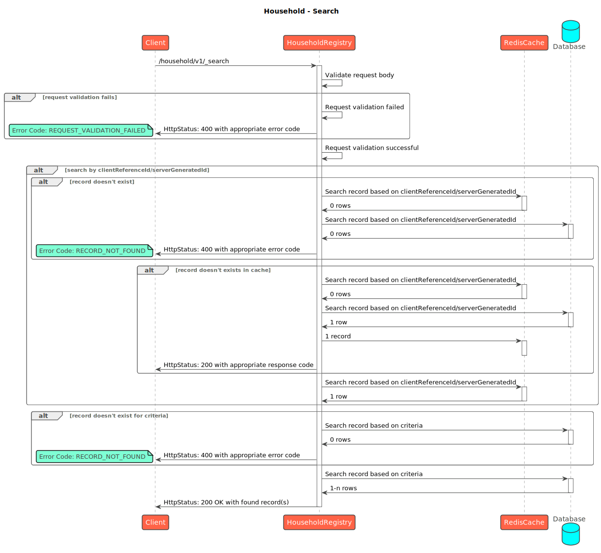
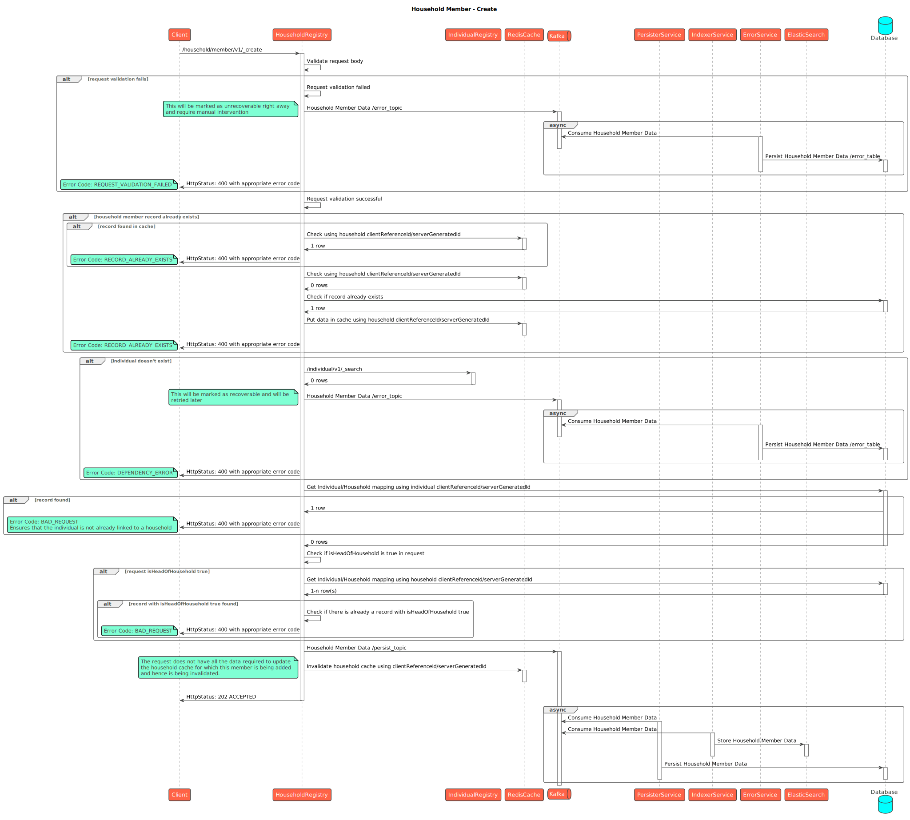
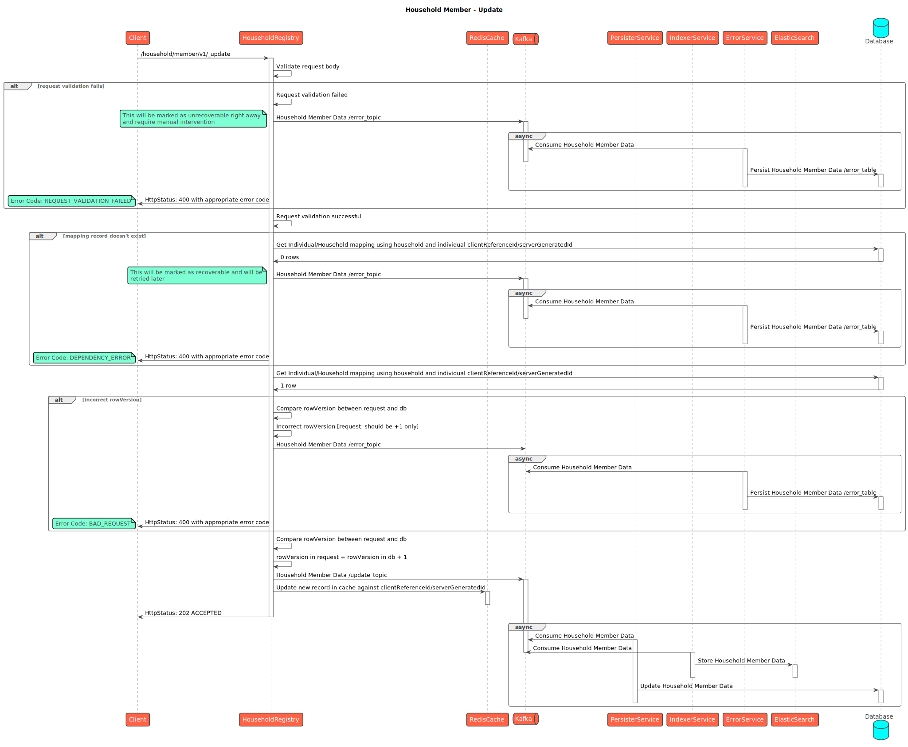
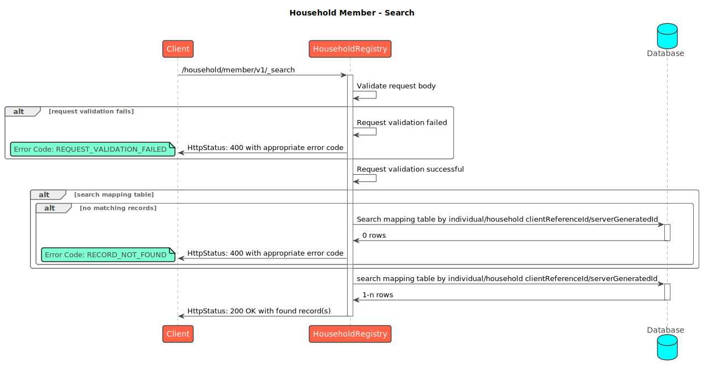

# Household

## API Spec



## Sequence Diagrams



<figure><figcaption>
Household Create
</figcaption></figure>

<figure><figcaption>
Household Update
</figcaption></figure>

<figure><figcaption>
Household Search
</figcaption></figure>



<figure><figcaption>
Household Member - Create
</figcaption></figure>

<figure><figcaption>
Household Member - Update
</figcaption></figure>

<figure><figcaption>
Household Member - Search
</figcaption></figure>



[_​_](http://creativecommons.org/licenses/by/4.0/)_All content on this page by_ [_eGov Foundation_](https://egov.org.in/) _is licensed under a_ [_Creative Commons Attribution 4.0 International License_](http://creativecommons.org/licenses/by/4.0/)_._
