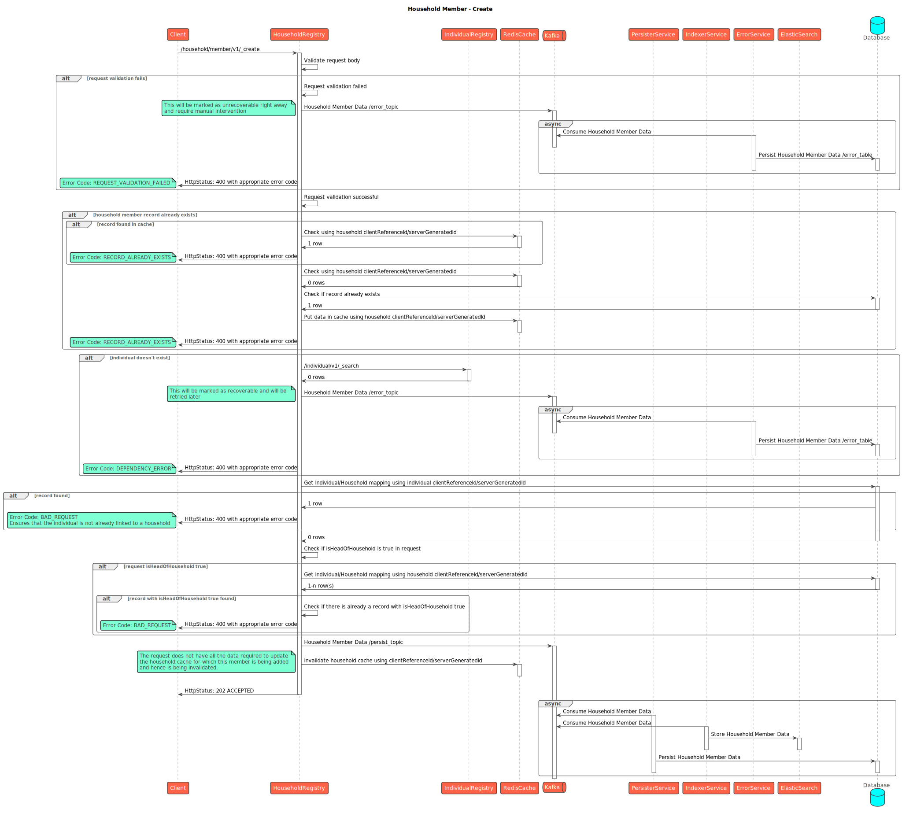
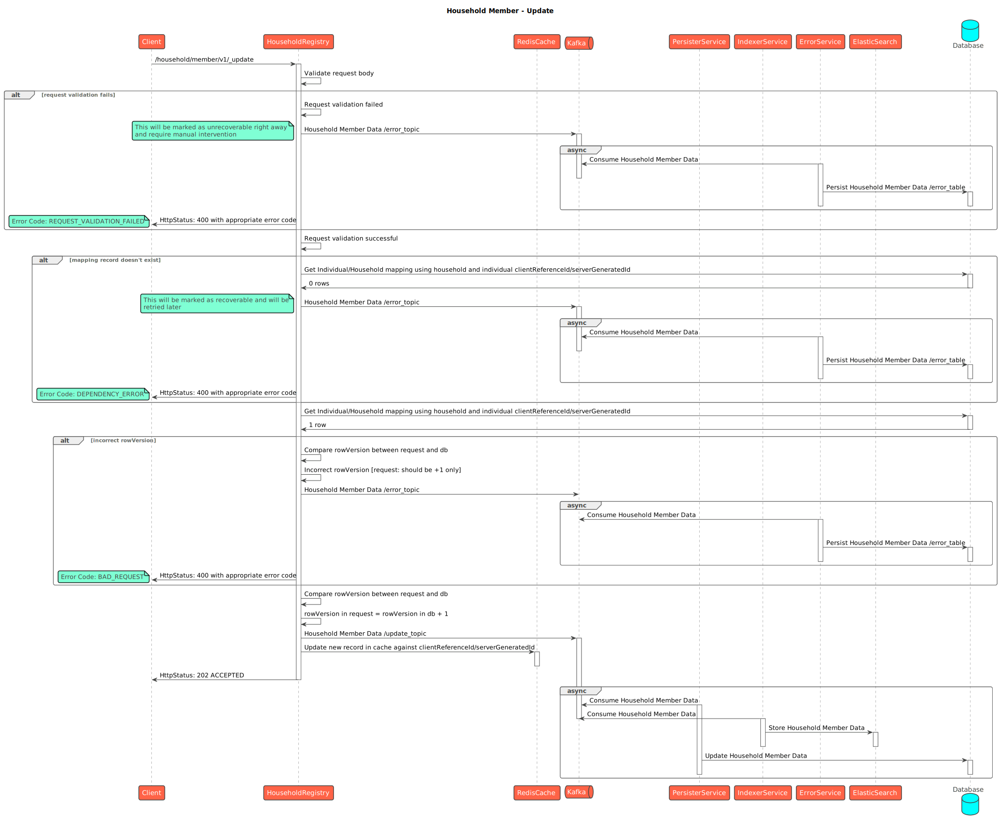

# Household

## API Spec



## Sequence Diagrams



<figure><figcaption>
Household Create
</figcaption></figure>

<figure><figcaption>
Household Bulk create
</figcaption></figure>

<figure><figcaption>
Household Update
</figcaption></figure>

<figure><figcaption>
Household bulk update
</figcaption></figure>

<figure><figcaption>
Household Search
</figcaption></figure>

<figure><figcaption>
Household Delete
</figcaption></figure>

<figure><figcaption>
Household Bulk Delete
</figcaption></figure>



<figure><figcaption>
Household Member - Create
</figcaption></figure>

<figure><figcaption>
Household Member Bulk Create
</figcaption></figure>

<figure><figcaption>
Household Member - Update
</figcaption></figure>

<figure><figcaption>
Household Member Bulk Update
</figcaption></figure>

<figure><figcaption>
Household Member - Search
</figcaption></figure>

<figure><figcaption>
Household Member - Delete
</figcaption></figure>

<figure><figcaption>
Household Member - Bulk Delete
</figcaption></figure>


