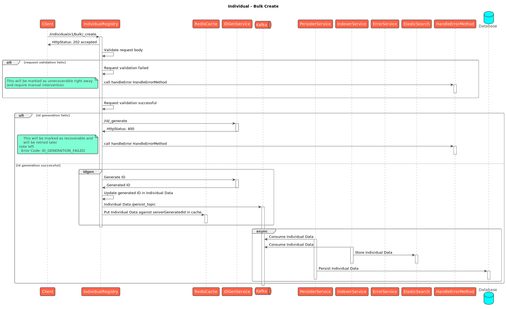
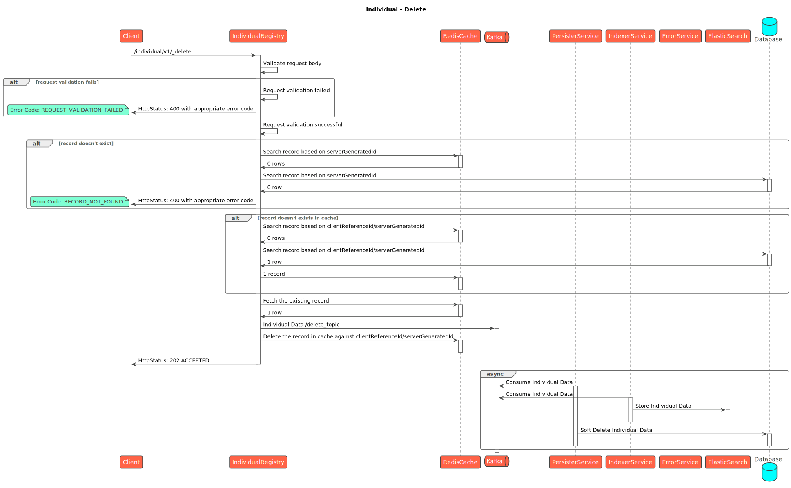
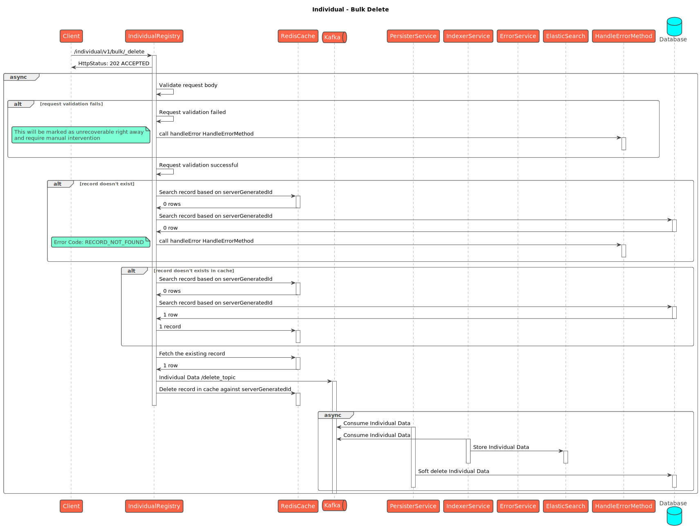

# Individual

## API Spec



## Sequence Diagrams

<figure><figcaption>
Individual - Create
</figcaption></figure>

<figure><figcaption>
Individual - Bulk Create
</figcaption></figure>

<figure><figcaption>
Individual - Update
</figcaption></figure>

<figure><figcaption>
Individual - Bulk Update
</figcaption></figure>

<figure><figcaption>
Individual - Search
</figcaption></figure>

<figure><figcaption>
Individual - Delete
</figcaption></figure>

<figure><figcaption>
Individual - Bulk Delete
</figcaption></figure>
