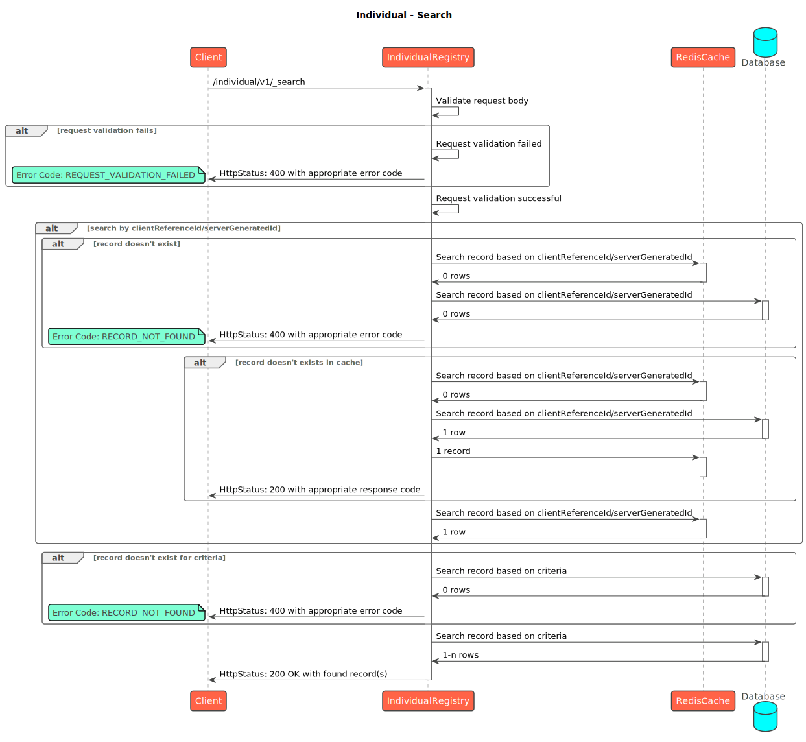

# Individual

## API Spec


Individual


## Sequence Diagrams

<figure><figcaption>
Individual - Create
</figcaption></figure>

<figure><figcaption>
Individual - Update
</figcaption></figure>

<figure><figcaption>
Individual - Search
</figcaption></figure>

[_​_](http://creativecommons.org/licenses/by/4.0/)_All content on this page by_ [_eGov Foundation_](https://egov.org.in/) _is licensed under a_ [_Creative Commons Attribution 4.0 International License_](http://creativecommons.org/licenses/by/4.0/)_._
