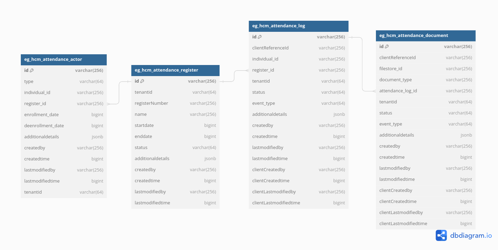

# Attendance

## Overview

The attendance module allows creation of an attendance register, enrolment of staff and attendees and capture of attendance records with entry/exit times. To compute attendance based on the logs, a calculator service should be built with specific business logic.&#x20;

## Pre-requisites

* DIGIT backbone services
* IDGen
* Persister
* Project Service

## Functionalities

* Allows creation/updation/search of an attendance register
* Allows mapping of staff and attendees to a register and enforces permissions.
* Logs entry and exit timestamps in epoch time for a referenced entity

## Setup Details

The source code for [Attendance](https://github.com/egovernments/DIGIT-Works/tree/master/backend/attendance) is present in the DIGIT-Works Git repo. The spring boot application needs the Lombok\* extension added to the IDE to load it. Once the application is up and running, the API requests can be posted to the URL and the IDs can be generated.

\*In the case of IntelliJ, the plugin can be installed directly. For eclipse, the Lombok jar location has to be added in the eclipse.ini file in this format javaagent:lombok.jar.

## API Details

Refer to the Swagger API for YAML file details.&#x20;

Link: [https://github.com/egovernments/DIGIT-Specs/blob/master/Domain%20Services/Health/Attendance-v1.0.0.yaml](https://github.com/egovernments/DIGIT-Specs/blob/master/Domain%20Services/Health/Attendance-v1.0.0.yaml)

Application.properties file information:

Kafka topics persister configs for eGov persister:

```
attendance.register.kafka.create.topic=save-attendance
attendance.register.kafka.update.topic=update-attendance

attendance.staff.kafka.create.topic=save-staff
attendance.staff.kafka.update.topic=update-staff

attendance.attendee.kafka.create.topic=save-attendee
attendance.attendee.kafka.update.topic=update-attendee

attendance.log.kafka.create.topic=save-attendance-log
attendance.log.kafka.update.topic=update-attendance-log
attendance.log.kafka.consumer.bulk.create.topic=save-attendance-log-bulk-health
attendance.log.kafka.consumer.bulk.update.topic=update-attendance-log-bulk-health
```

#### URLs for the external API references:

* eGvo mdms :-> egov.mdms.host =[ https://unified-dev.digit.org](https://dev.digit.org/)/
* eGov -idGen :-> egov.idgen.host =[ https://unified-dev.digit.org](https://dev.digit.org/)/
* localization service :-> egov.localization.host =[ https://unified-dev.digit.org](https://dev.digit.org/)/&#x20;
*   Project Service :->&#x20;

    ```
    egov.project.host=http://unified-dev.digit.org
    ```

## Configuration Details

### Access MDMS Configurations

#### Action test: URL actions adding

[actions-test.json](https://github.com/egovernments/egov-mdms-data/blob/UNIFIED-DEV/data/mz/ACCESSCONTROL-ACTIONS-TEST/actions-test.json)

```
{
  "id": 1696,
  "name": "Create Attendance Register",
  "url": "/attendance/v1/_create",
  "parentModule": "attendance-service",
  "displayName": "Create attendance register",
  "orderNumber": 0,
  "enabled": false,
  "serviceCode": "attendance-service",
  "code": "null",
  "path": ""
},
{
  "id": 1697,
  "name": "Search Attendance Register",
  "url": "/attendance/v1/_search",
  "parentModule": "attendance-service",
  "displayName": "Search attendance register",
  "orderNumber": 0,
  "enabled": false,
  "serviceCode": "attendance-service",
  "code": "null",
  "path": ""
},
{
  "id": 1698,
  "name": "Update Attendance Register",
  "url": "/attendance/v1/_update",
  "parentModule": "attendance-service",
  "displayName": "Update attendance register",
  "orderNumber": 0,
  "enabled": false,
  "serviceCode": "attendance-service",
  "code": "null",
  "path": ""
},
{
  "id": 1699,
  "name": "Create Attendance Register Log",
  "url": "/attendance/log/v1/_create",
  "parentModule": "attendance-service",
  "displayName": "Create attendance register log",
  "orderNumber": 0,
  "enabled": false,
  "serviceCode": "attendance-service",
  "code": "null",
  "path": ""
},
{
  "id": 1700,
  "name": "Search Attendance Register Log",
  "url": "/attendance/log/v1/_search",
  "parentModule": "attendance-service",
  "displayName": "Search attendance register log",
  "orderNumber": 0,
  "enabled": false,
  "serviceCode": "attendance-service",
  "code": "null",
  "path": ""
},
{
  "id": 1701,
  "name": "Update Attendance Register Log",
  "url": "/attendance/log/v1/_update",
  "parentModule": "attendance-service",
  "displayName": "Update attendance register log",
  "orderNumber": 0,
  "enabled": false,
  "serviceCode": "attendance-service",
  "code": "null",
  "path": ""
},
{
  "id": 1702,
  "name": "Create Attendee",
  "url": "/attendance/attendee/v1/_create",
  "parentModule": "attendance-service",
  "displayName": "Create Attendee",
  "orderNumber": 0,
  "enabled": false,
  "serviceCode": "attendance-service",
  "code": "null",
  "path": ""
},
{
  "id": 1703,
  "name": "Delete Attendee",
  "url": "/attendance/attendee/v1/_delete",
  "parentModule": "attendance-service",
  "displayName": "Delete Attendee",
  "orderNumber": 0,
  "enabled": false,
  "serviceCode": "attendance-service",
  "code": "null",
  "path": ""
},
{
  "id": 1704,
  "name": "Create Staff",
  "url": "/attendance/staff/v1/_create",
  "parentModule": "attendance-service",
  "displayName": "Create Staff",
  "orderNumber": 0,
  "enabled": false,
  "serviceCode": "attendance-service",
  "code": "null",
  "path": ""
},
{
  "id": 1705,
  "name": "Delete Staff",
  "url": "/attendance/staff/v1/_delete",
  "parentModule": "attendance-service",
  "displayName": "Delete Staff",
  "orderNumber": 0,
  "enabled": false,
  "serviceCode": "attendance-service",
  "code": "null",
  "path": ""
}
```

#### Access to role-based actions

[roleaction.json](https://github.com/egovernments/egov-mdms-data/blob/UNIFIED-DEV/data/mz/ACCESSCONTROL-ROLEACTIONS/roleactions.json)

```
{
  "rolecode": "SYSTEM_ADMINISTRATOR",
  "actionid": 1696,
  "actioncode": "",
  "tenantId": "mz"
},
{
  "rolecode": "NATIONAL_SUPERVISOR",
  "actionid": 1696,
  "actioncode": "",
  "tenantId": "mz"
},
{
  "rolecode": "PROVINCIAL_SUPERVISOR",
  "actionid": 1696,
  "actioncode": "",
  "tenantId": "mz"
},
{
  "rolecode": "DISTRICT_SUPERVISOR",
  "actionid": 1696,
  "actioncode": "",
  "tenantId": "mz"
},
{
  "rolecode": "SUPERUSER",
  "actionid": 1696,
  "actioncode": "",
  "tenantId": "mz"
},
{
  "rolecode": "SYSTEM_ADMINISTRATOR",
  "actionid": 1697,
  "actioncode": "",
  "tenantId": "mz"
},
{
  "rolecode": "NATIONAL_SUPERVISOR",
  "actionid": 1697,
  "actioncode": "",
  "tenantId": "mz"
},
{
  "rolecode": "PROVINCIAL_SUPERVISOR",
  "actionid": 1697,
  "actioncode": "",
  "tenantId": "mz"
},
{
  "rolecode": "DISTRICT_SUPERVISOR",
  "actionid": 1697,
  "actioncode": "",
  "tenantId": "mz"
},
{
  "rolecode": "SUPERUSER",
  "actionid": 1697,
  "actioncode": "",
  "tenantId": "mz"
},
{
  "rolecode": "SYSTEM_ADMINISTRATOR",
  "actionid": 1698,
  "actioncode": "",
  "tenantId": "mz"
},
{
  "rolecode": "NATIONAL_SUPERVISOR",
  "actionid": 1698,
  "actioncode": "",
  "tenantId": "mz"
},
{
  "rolecode": "PROVINCIAL_SUPERVISOR",
  "actionid": 1698,
  "actioncode": "",
  "tenantId": "mz"
},
{
  "rolecode": "DISTRICT_SUPERVISOR",
  "actionid": 1698,
  "actioncode": "",
  "tenantId": "mz"
},
{
  "rolecode": "SUPERUSER",
  "actionid": 1698,
  "actioncode": "",
  "tenantId": "mz"
},
{
  "rolecode": "SYSTEM_ADMINISTRATOR",
  "actionid": 1699,
  "actioncode": "",
  "tenantId": "mz"
},
{
  "rolecode": "NATIONAL_SUPERVISOR",
  "actionid": 1699,
  "actioncode": "",
  "tenantId": "mz"
},
{
  "rolecode": "PROVINCIAL_SUPERVISOR",
  "actionid": 1699,
  "actioncode": "",
  "tenantId": "mz"
},
{
  "rolecode": "DISTRICT_SUPERVISOR",
  "actionid": 1699,
  "actioncode": "",
  "tenantId": "mz"
},
{
  "rolecode": "SUPERUSER",
  "actionid": 1699,
  "actioncode": "",
  "tenantId": "mz"
},
{
  "rolecode": "SYSTEM_ADMINISTRATOR",
  "actionid": 1700,
  "actioncode": "",
  "tenantId": "mz"
},
{
  "rolecode": "NATIONAL_SUPERVISOR",
  "actionid": 1700,
  "actioncode": "",
  "tenantId": "mz"
},
{
  "rolecode": "PROVINCIAL_SUPERVISOR",
  "actionid": 1700,
  "actioncode": "",
  "tenantId": "mz"
},
{
  "rolecode": "DISTRICT_SUPERVISOR",
  "actionid": 1700,
  "actioncode": "",
  "tenantId": "mz"
},
{
  "rolecode": "SUPERUSER",
  "actionid": 1700,
  "actioncode": "",
  "tenantId": "mz"
},
{
  "rolecode": "SYSTEM_ADMINISTRATOR",
  "actionid": 1701,
  "actioncode": "",
  "tenantId": "mz"
},
{
  "rolecode": "NATIONAL_SUPERVISOR",
  "actionid": 1701,
  "actioncode": "",
  "tenantId": "mz"
},
{
  "rolecode": "PROVINCIAL_SUPERVISOR",
  "actionid": 1701,
  "actioncode": "",
  "tenantId": "mz"
},
{
  "rolecode": "DISTRICT_SUPERVISOR",
  "actionid": 1701,
  "actioncode": "",
  "tenantId": "mz"
},
{
  "rolecode": "SUPERUSER",
  "actionid": 1701,
  "actioncode": "",
  "tenantId": "mz"
},
{
  "rolecode": "SYSTEM_ADMINISTRATOR",
  "actionid": 1702,
  "actioncode": "",
  "tenantId": "mz"
},
{
  "rolecode": "NATIONAL_SUPERVISOR",
  "actionid": 1702,
  "actioncode": "",
  "tenantId": "mz"
},
{
  "rolecode": "PROVINCIAL_SUPERVISOR",
  "actionid": 1702,
  "actioncode": "",
  "tenantId": "mz"
},
{
  "rolecode": "DISTRICT_SUPERVISOR",
  "actionid": 1702,
  "actioncode": "",
  "tenantId": "mz"
},
{
  "rolecode": "SUPERUSER",
  "actionid": 1702,
  "actioncode": "",
  "tenantId": "mz"
},
{
  "rolecode": "SYSTEM_ADMINISTRATOR",
  "actionid": 1703,
  "actioncode": "",
  "tenantId": "mz"
},
{
  "rolecode": "NATIONAL_SUPERVISOR",
  "actionid": 1703,
  "actioncode": "",
  "tenantId": "mz"
},
{
  "rolecode": "PROVINCIAL_SUPERVISOR",
  "actionid": 1703,
  "actioncode": "",
  "tenantId": "mz"
},
{
  "rolecode": "DISTRICT_SUPERVISOR",
  "actionid": 1703,
  "actioncode": "",
  "tenantId": "mz"
},
{
  "rolecode": "SUPERUSER",
  "actionid": 1703,
  "actioncode": "",
  "tenantId": "mz"
},
{
  "rolecode": "SYSTEM_ADMINISTRATOR",
  "actionid": 1704,
  "actioncode": "",
  "tenantId": "mz"
},
{
  "rolecode": "NATIONAL_SUPERVISOR",
  "actionid": 1704,
  "actioncode": "",
  "tenantId": "mz"
},
{
  "rolecode": "PROVINCIAL_SUPERVISOR",
  "actionid": 1704,
  "actioncode": "",
  "tenantId": "mz"
},
{
  "rolecode": "DISTRICT_SUPERVISOR",
  "actionid": 1704,
  "actioncode": "",
  "tenantId": "mz"
},
{
  "rolecode": "SUPERUSER",
  "actionid": 1704,
  "actioncode": "",
  "tenantId": "mz"
},
{
  "rolecode": "SYSTEM_ADMINISTRATOR",
  "actionid": 1705,
  "actioncode": "",
  "tenantId": "mz"
},
{
  "rolecode": "NATIONAL_SUPERVISOR",
  "actionid": 1705,
  "actioncode": "",
  "tenantId": "mz"
},
{
  "rolecode": "PROVINCIAL_SUPERVISOR",
  "actionid": 1705,
  "actioncode": "",
  "tenantId": "mz"
},
{
  "rolecode": "DISTRICT_SUPERVISOR",
  "actionid": 1705,
  "actioncode": "",
  "tenantId": "mz"
},
{
  "rolecode": "SUPERUSER",
  "actionid": 1705,
  "actioncode": "",
  "tenantId": "mz"
}
```

## Persister Configs

[Attendance YAML](https://github.com/egovernments/configs/blob/UNIFIED-UAT/health/egov-persister/attendance-service-persister.yml)

## Indexer Configs

Attendance YAML

## Database Schema

<figure><figcaption></figcaption></figure>

## Postman Collections

[Link](https://api.postman.com/collections/28428162-42a38d4b-9af6-41cc-86ee-ce99fc40d95d?access\_key=PMAT-01HM8EYY8H24BERS02TQ5M2HB9)
