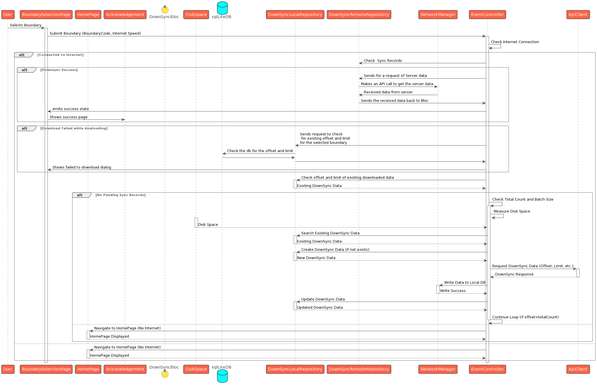

# Referral Registry

## Overview

The referral management registry provides APIs to register side-effects, and referrals for beneficiaries of a health campaign of the DIGIT platform. This document provides the configuration details for setting up the module.

## Pre-requisites

* Knowledge of Java/J2EE (preferably Java 8 version).
* Knowledge of Spring Boot and spring-boot micro-services.
* Knowledge of Git or any version control system.
* Knowledge of RESTful web services.
* Knowledge of the Lombok library is helpful.
* Knowledge of eGov-mdms service, eGov-persister, eGov-idgen, eGov-indexer, and eGov-user will be helpful.
* Knowledge of Project, Household, and Individual modules.

## Functionalities

* Provides APIs to create, update, and delete referrals and side-effects.&#x20;
* Provides APIs to bulk create, update, and delete referrals and side-effects.&#x20;
* Inactivates the status of referrals, and side-effects post deletion.&#x20;
* Provides a search API for referral on unique ID, client reference unique ID, project beneficiary ID, side-effect ID, referrer ID and recipient ID.&#x20;
* Provides a search API for side-effect on unique ID, client reference unique ID, project task ID.

## Setup Details

The source code for an[ ](https://github.com/egovernments/health-campaign-services/tree/v1.1.0/health-services/individual)[referral management](https://github.com/egovernments/health-campaign-services/tree/master/health-services/referralmanagement) is present in the health-campaign-services Git repo. The spring boot application needs the Lombok\* extension added to the IDE to load it. Once the application is up and running, the API requests can be posted to the URL and the IDs can be generated.

\*In the case of IntelliJ, the plugin can be installed directly. For eclipse, the Lombok jar location has to be added in the eclipse.ini file in this format javaagent:lombok.jar.

## API Details

Refer to the Swagger API for YAML file details.&#x20;

Link: [https://github.com/egovernments/health-campaign-services/blob/master/docs/health-api-specs/contracts/referral-management.yml](https://github.com/egovernments/health-campaign-services/blob/master/docs/health-api-specs/contracts/referral-management.yml)

Application.properties file information:

Kafka topics persister configs for eGov persister:

```
referralmanagement.sideeffect.kafka.create.topic=save-side-effect-topic
referralmanagement.sideeffect.kafka.update.topic=update-side-effect-topic
referralmanagement.sideeffect.kafka.delete.topic=delete-side-effect-topic

referralmanagement.sideeffect.consumer.bulk.create.topic=save-side-effect-bulk-topic
referralmanagement.sideeffect.consumer.bulk.update.topic=update-side-effect-bulk-topic
referralmanagement.sideeffect.consumer.bulk.delete.topic=delete-side-effect-bulk-topic

referralmanagement.referral.kafka.create.topic=save-referral-topic
referralmanagement.referral.kafka.update.topic=update-referral-topic
referralmanagement.referral.kafka.delete.topic=delete-referral-topic

referralmanagement.referral.consumer.bulk.create.topic=save-referral-bulk-topic
referralmanagement.referral.consumer.bulk.update.topic=update-referral-bulk-topic
referralmanagement.referral.consumer.bulk.delete.topic=delete-referral-bulk-topic
```

#### URLs for the external API references:

* eGvo mdms :-> egov.mdms.host =[ https://unified-dev.digit.org](https://dev.digit.org/)/
* eGov -idGen :-> egov.idgen.host =[ https://unified-dev.digit.org](https://dev.digit.org/)/
* localization service :-> egov.localization.host =[ https://unified-dev.digit.org](https://dev.digit.org/)/&#x20;

## Configuration Details

### Access MDMS Configurations

#### Action test: URL actions adding

[actions-test.json](https://github.com/egovernments/egov-mdms-data/blob/UNIFIED-DEV/data/mz/ACCESSCONTROL-ACTIONS-TEST/actions-test.json)

```
{
  "id": 1653,
  "name": "Side Effect Create",
  "url": "/referralmanagement/side-effect/v1/_create",
  "displayName": "Side Effect Create",
  "orderNumber": 0,
  "parentModule": "",
  "enabled": false,
  "serviceCode": "referralmanagement",
  "code": "null",
  "path": ""
},
{
  "id": 1654,
  "name": "Side Effect Update",
  "url": "/referralmanagement/side-effect/v1/_update",
  "displayName": "Side Effect Update",
  "orderNumber": 0,
  "parentModule": "",
  "enabled": false,
  "serviceCode": "referralmanagement",
  "code": "null",
  "path": ""
},
{
  "id": 1655,
  "name": "Side Effect Search",
  "url": "/referralmanagement/side-effect/v1/_search",
  "displayName": "Side Effect Search",
  "orderNumber": 0,
  "parentModule": "",
  "enabled": false,
  "serviceCode": "referralmanagement",
  "code": "null",
  "path": ""
},
{
  "id": 1656,
  "name": "Side Effect Bulk Create",
  "url": "/referralmanagement/side-effect/v1/bulk/_create",
  "displayName": "Side Effect Bulk Create",
  "orderNumber": 0,
  "parentModule": "",
  "enabled": false,
  "serviceCode": "referralmanagement",
  "code": "null",
  "path": ""
},
{
  "id": 1657,
  "name": "Side Effect Bulk Update",
  "url": "/referralmanagement/side-effect/v1/bulk/_update",
  "displayName": "Side Effect Bulk Update",
  "orderNumber": 0,
  "parentModule": "",
  "enabled": false,
  "serviceCode": "referralmanagement",
  "code": "null",
  "path": ""
},
{
  "id": 1658,
  "name": "Side Effect Delete",
  "url": "/referralmanagement/side-effect/v1/_delete",
  "displayName": "Side Effect Delete",
  "orderNumber": 0,
  "parentModule": "",
  "enabled": false,
  "serviceCode": "referralmanagement",
  "code": "null",
  "path": ""
},
{
  "id": 1659,
  "name": "Side Effect Bulk Delete",
  "url": "/referralmanagement/side-effect/v1/bulk/_delete",
  "displayName": "Side Effect Bulk Delete",
  "orderNumber": 0,
  "parentModule": "",
  "enabled": false,
  "serviceCode": "referralmanagement",
  "code": "null",
  "path": ""
},
{
  "id": 1660,
  "name": "Referral Create",
  "url": "/referralmanagement/v1/_create",
  "displayName": "Referral Create",
  "orderNumber": 0,
  "parentModule": "",
  "enabled": false,
  "serviceCode": "referralmanagement",
  "code": "null",
  "path": ""
},
{
  "id": 1661,
  "name": "Referral Update",
  "url": "/referralmanagement/v1/_update",
  "displayName": "Referral Update",
  "orderNumber": 0,
  "parentModule": "",
  "enabled": false,
  "serviceCode": "referralmanagement",
  "code": "null",
  "path": ""
},
{
  "id": 1662,
  "name": "Referral Delete",
  "url": "/referralmanagement/v1/_delete",
  "displayName": "Referral Delete",
  "orderNumber": 0,
  "parentModule": "",
  "enabled": false,
  "serviceCode": "referralmanagement",
  "code": "null",
  "path": ""
},
{
  "id": 1663,
  "name": "Referral Search",
  "url": "/referralmanagement/v1/_search",
  "displayName": "Referral Search",
  "orderNumber": 0,
  "parentModule": "",
  "enabled": false,
  "serviceCode": "referralmanagement",
  "code": "null",
  "path": ""
},
{
  "id": 1664,
  "name": "Referral Bulk Create",
  "url": "/referralmanagement/v1/bulk/_create",
  "displayName": "Referral Bulk Create",
  "orderNumber": 0,
  "parentModule": "",
  "enabled": false,
  "serviceCode": "referralmanagement",
  "code": "null",
  "path": ""
},
{
  "id": 1665,
  "name": "Referral Bulk Update",
  "url": "/referralmanagement/v1/bulk/_update",
  "displayName": "Referral Bulk Update",
  "orderNumber": 0,
  "parentModule": "",
  "enabled": false,
  "serviceCode": "referralmanagement",
  "code": "null",
  "path": ""
},
{
  "id": 1666,
  "name": "Referral Bulk Delete",
  "url": "/referralmanagement/v1/bulk/_delete",
  "displayName": "Referral Bulk Delete",
  "orderNumber": 0,
  "parentModule": "",
  "enabled": false,
  "serviceCode": "referralmanagement",
  "code": "null",
  "path": ""
},
{
  "id": 1673,
  "name": "Downsync",
  "url": "/referralmanagement/beneficiary-downsync/v1/_get",
  "displayName": "Downsync",
  "orderNumber": 0,
  "parentModule": "",
  "enabled": false,
  "serviceCode": "referralmanagement",
  "code": "null",
  "path": ""
}
```

#### Access to role-based actions

[roleaction.json](https://github.com/egovernments/egov-mdms-data/blob/UNIFIED-DEV/data/mz/ACCESSCONTROL-ROLEACTIONS/roleactions.json)

```
{
  "rolecode": "SUPERUSER",
  "actionid": 1653,
  "actioncode": "",
  "tenantid": "mz"
},
{
  "rolecode": "DISTRIBUTOR",
  "actionid": 1653,
  "actioncode": "",
  "tenantid": "mz"
},
{
  "rolecode": "SUPERUSER",
  "actionid": 1654,
  "actioncode": "",
  "tenantid": "mz"
},
{
  "rolecode": "DISTRIBUTOR",
  "actionid": 1654,
  "actioncode": "",
  "tenantid": "mz"
},
{
  "rolecode": "SUPERUSER",
  "actionid": 1655,
  "actioncode": "",
  "tenantid": "mz"
},
{
  "rolecode": "DISTRIBUTOR",
  "actionid": 1655,
  "actioncode": "",
  "tenantid": "mz"
},
{
  "rolecode": "SUPERUSER",
  "actionid": 1656,
  "actioncode": "",
  "tenantid": "mz"
},
{
  "rolecode": "DISTRIBUTOR",
  "actionid": 1656,
  "actioncode": "",
  "tenantid": "mz"
},
{
  "rolecode": "SUPERUSER",
  "actionid": 1657,
  "actioncode": "",
  "tenantid": "mz"
},
{
  "rolecode": "DISTRIBUTOR",
  "actionid": 1657,
  "actioncode": "",
  "tenantid": "mz"
},
{
  "rolecode": "SUPERUSER",
  "actionid": 1658,
  "actioncode": "",
  "tenantid": "mz"
},
{
  "rolecode": "DISTRIBUTOR",
  "actionid": 1658,
  "actioncode": "",
  "tenantid": "mz"
},
{
  "rolecode": "SUPERUSER",
  "actionid": 1659,
  "actioncode": "",
  "tenantid": "mz"
},
{
  "rolecode": "DISTRIBUTOR",
  "actionid": 1659,
  "actioncode": "",
  "tenantid": "mz"
},
{
  "rolecode": "SUPERUSER",
  "actionid": 1660,
  "actioncode": "",
  "tenantid": "mz"
},
{
  "rolecode": "DISTRIBUTOR",
  "actionid": 1660,
  "actioncode": "",
  "tenantid": "mz"
},
{
  "rolecode": "SUPERUSER",
  "actionid": 1661,
  "actioncode": "",
  "tenantid": "mz"
},
{
  "rolecode": "DISTRIBUTOR",
  "actionid": 1661,
  "actioncode": "",
  "tenantid": "mz"
},
{
  "rolecode": "SUPERUSER",
  "actionid": 1662,
  "actioncode": "",
  "tenantid": "mz"
},
{
  "rolecode": "DISTRIBUTOR",
  "actionid": 1662,
  "actioncode": "",
  "tenantid": "mz"
},
{
  "rolecode": "SUPERUSER",
  "actionid": 1663,
  "actioncode": "",
  "tenantid": "mz"
},
{
  "rolecode": "DISTRIBUTOR",
  "actionid": 1663,
  "actioncode": "",
  "tenantid": "mz"
},
{
  "rolecode": "SUPERUSER",
  "actionid": 1664,
  "actioncode": "",
  "tenantid": "mz"
},
{
  "rolecode": "DISTRIBUTOR",
  "actionid": 1664,
  "actioncode": "",
  "tenantid": "mz"
},
{
  "rolecode": "SUPERUSER",
  "actionid": 1665,
  "actioncode": "",
  "tenantid": "mz"
},
{
  "rolecode": "DISTRIBUTOR",
  "actionid": 1665,
  "actioncode": "",
  "tenantid": "mz"
},
{
  "rolecode": "SUPERUSER",
  "actionid": 1666,
  "actioncode": "",
  "tenantid": "mz"
},
{
  "rolecode": "DISTRIBUTOR",
  "actionid": 1666,
  "actioncode": "",
  "tenantid": "mz"
},
{
  "rolecode": "DISTRIBUTOR",
  "actionid": 1673,
  "actioncode": "",
  "tenantId": "mz"
},
{
  "rolecode": "SEUPERUSER",
  "actionid": 1673,
  "actioncode": "",
  "tenantId": "mz"
}
```

## Persister Configs

[Referral Management YAML](https://github.com/egovernments/health-campaign-config/blob/v1.2/egov-persister/referral-management-persister.yml)

## Indexer Configs

[Referral Management YAML](https://github.com/egovernments/health-campaign-config/blob/v1.2/egov-indexer/referral-management-indexer.yml)

## Database Schema

<figure><figcaption></figcaption></figure>

## Postman Collections

[https://api.postman.com/collections/28428162-ddba3ccc-6bfd-493d-b08b-43d1363aee82?access\_key=PMAT-01HCW9Z23Y6217QQ5SGASKZN5D](https://api.postman.com/collections/28428162-ddba3ccc-6bfd-493d-b08b-43d1363aee82?access\_key=PMAT-01HCW9Z23Y6217QQ5SGASKZN5D)
