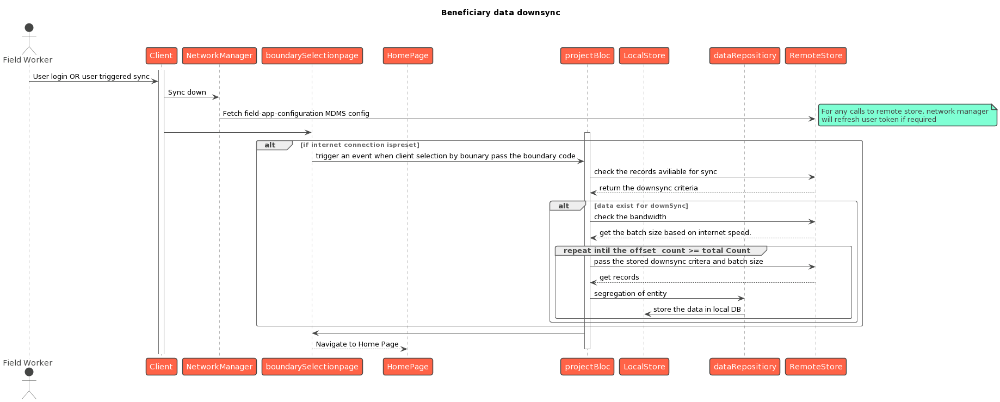

# Beneficiary Registration

## Overview

Beneficiary registration involves the registration of households and individuals using the HCM application. When field, and district supervisors  navigate to the home screen, the beneficiaries button is visible to them.

.png>)

## User actions

On this page, the following actions can be performed:

* A user can register a new household only after attempting a search.
* A user has to click on the "Register New Household" button to register a household.

.png>).png>)

* After the user clicks on "Register New Household", the page navigates to the "Household Location" page.&#x20;
* The "Administrative Area" is the only mandatory field. "Address Line 1", "Address Line 2", 'Landmark' and "Postal Code" are optional fields.&#x20;
* Clicking on the 'Next' button will take the user to the "Household Details" page where the number of members living in the household can be registered.

.png>) .png>)

* Clicking the 'Next' button will take the user the "Individual details" screen.&#x20;
* The first individual added will be the "Head of Household" by default.

.png>)

* The name, ID type, and ID number fields are mandatory. Users can enter the date of birth or their age. The date birth will take precedence over age.&#x20;
* When the user clicks on the submit button, a popup appears asking for confirmation.
* If the user clicks on ‘Submit’, the household is registered and a confirmation screen is displayed.

.png>)\

* The user can click on the "Back to Search" button for editing the household or register new household fields.

.png>)

* Click on the open card to navigate to the detailed page of the household.&#x20;
* There is an "Edit Household" button for editing household details, which navigates the user to the household location screen. The service delivery status is present below the household’s name followed by the administrative area and the number of members.&#x20;
* There are cards for each member, starting from the household head. The card consists of the  ‘Edit’ button for individual-level actions.
* For adding new members to the household, there is the "Add Member" button below the member cards, which navigates the user to the "Individual Details" screen.&#x20;
* At the bottom, the "Deliver Intervention" button is present which navigates the user to the update delivery screen.

## API details

| End Point                             | Request Method | Request Info                                                                                                                                                                                                                                                                                                                                                                                                                                                                                                                                                                                                                  |
| ------------------------------------- | -------------- | ----------------------------------------------------------------------------------------------------------------------------------------------------------------------------------------------------------------------------------------------------------------------------------------------------------------------------------------------------------------------------------------------------------------------------------------------------------------------------------------------------------------------------------------------------------------------------------------------------------------------------- |
| /individual/v1/bulk/\_create          | `POST`         | <pre class="language-json"><code class="lang-json">{
  "RequestInfo": {
    "authToken": "string"
  },
  "Individuals": [
    {
      "tenantId": "tenantA",
      "clientReferenceId": "string",
      "name": {
        "givenName": "string",
        "familyName": "string",
        "otherNames": "string"
      },
      "dateOfBirth": "14/10/2022",
      "gender": "MALE",
      "bloodGroup": "string",
      "mobileNumber": "string",
      "altContactNumber": "string",
      "email": "user@example.com",
      "address": [{}
      ],
      "rowVersion": 0
    }
  ]
}
Parameter content type
</code></pre> |
| /individual/v1/bulk/\_update          | POST           | <pre class="language-json"><code class="lang-json">{
  "RequestInfo": {
    "authToken": "string"
  },
  "Individuals": [
    {
      "tenantId": "tenantA",
      "clientReferenceId": "string",
      "name": {
        "givenName": "string",
        "familyName": "string",
        "otherNames": "string"
      },
      "dateOfBirth": "14/10/2022",
      "gender": "MALE",
      "bloodGroup": "string",
      "mobileNumber": "string",
      "altContactNumber": "string",
      "email": "user@example.com",
      "address": [{}
      ],
      "rowVersion": 0
    }
  ]
}
Parameter content type
</code></pre> |
| /individual/v1/\_search               | POST           | <pre><code>{
  "RequestInfo": {
    "authToken": "string"
  },
  "Individual": {
    "id": [
      "string"
    ],
    "clientReferenceId": [
      "string"
    ],
  }
}
</code></pre>                                                                                                                                                                                                                                                                                                                                                                                                                                       |
| /household/v1/bulk/\_create           | POST           | <pre><code>{
  "RequestInfo": {
    "authToken": "string"
  },
  "Households": [
    {
      "tenantId": "tenantA",
      "clientReferenceId": "string",
      "memberCount": 4,
      "address": {
        }
      },
      "additionalFields": {
      },
      "rowVersion": 0
    }
  ]
}
</code></pre>                                                                                                                                                                                                                                                                                                                   |
| /household/v1/bulk/\_update           | POST           | <pre><code>{
  "RequestInfo": {
    "authToken": "string"
  },
  "Households": [
    {
      "id":"string",
      "tenantId": "tenantA",
      "clientReferenceId": "string",
      "memberCount": 4,
      "address": {
        }
      },
      "additionalFields": {
      },
      "rowVersion": 0
    }
  ]
}
</code></pre>                                                                                                                                                                                                                                                                                              |
| /household/v1/\_search                | POST           | <pre><code>{
  "RequestInfo": {
    "authToken": "string"
  },
  "Household": {
    "id": [
      "string"
    ],
    "clientReferenceId": [
      "string"
    ],
    "boundaryCode": "string"
  }
}
</code></pre>                                                                                                                                                                                                                                                                                                                                                                                                           |
| /household/member/v1/bulk/\_create    | POST           | <pre><code>
  "RequestInfo": {
    "authToken": "string"
  },
  "HouseholdMembers": [
    {
      "householdClientReferenceId": "string",
      "individualClientReferenceId": "string",
      "isHeadOfHousehold": false,
      "tenantId": "tenantA",
      "additionalFields": {
      },
      "rowVersion": 0
    }
  ]
}
</code></pre>                                                                                                                                                                                                                                                                                  |
| /project/beneficiary/v1/bulk/\_create | POST           | <pre><code>{
  "RequestInfo": {
    "authToken": "string"
  },
  "ProjectBeneficiaries": [
    {
      "clientReferenceId": "string",
      "tenantId": "tenantA",
      "projectId": "string",
      "beneficiaryId": "string",
      "beneficiaryClientReferenceId": "string",
      "dateOfRegistration": 1663218161,
      "additionalFields": {
      },
      "rowVersion": 0
    }
  ]
}
</code></pre>                                                                                                                                                                                                                 |

