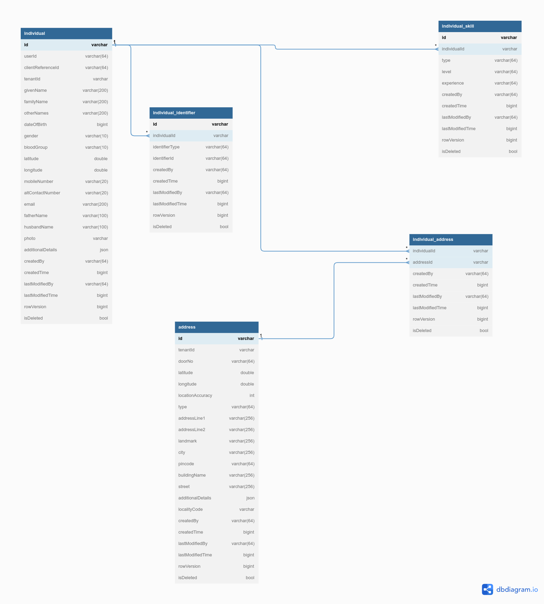

# Individual Registry Setup

## Overview

The individual registry helps and provides APIs to create citizens or users to the DIGIT digit platform. This page provides the configuration details for setting up individuals.

## **Pre-requisites**

* Knowledge of Java/J2EE(preferably Java 8 version)
* Knowledge of Spring Boot and spring-boot microservices.
* Knowledge of Git or any version control system.
* Knowledge of RESTful web services.
* Knowledge of the Lombok library is helpful.
* Knowledge of eGov-mdms service, eGov-persister, eGov-idgen, eGov-indexer, and eGov-user will be helpful.

## **Functionalities**

1. Provides APIs to create, update, and delete individuals.
2. Provides APIs to bulk create, update, and delete individuals.
3. Inactivates the status of an individual post deletion.
4. Provides search API for individuals on name, individual ID, unique ID, and date of birth.&#x20;

**Setup Details**

The source code for an [Individual](https://github.com/egovernments/health-campaign-services/tree/demo/health-services/individual) is present in the health-campaign-services Git repo. The spring boot application needs the **Lombok\*** extension added to the IDE to load it. Once the application is up and running, the API requests can be posted to the URL and the IDs can be generated.&#x20;

* In the case of IntelliJ, the plugin can be installed directly. For eclipse, the Lombok jar location has to be added in the eclipse.ini file in this format javaagent:lombok.jar.

## **API Details** <a href="#api-information" id="api-information"></a>

Refer to the Swagger API for YAML file details. Link -[individual.yaml](https://github.com/egovernments/health-campaign-services/blob/master/docs/health-api-specs/contracts/registries/individual.yml)

**Application.properties file information**_**:**_

kafka topics persister configs for eGov persister

```
individual.consumer.bulk.create.topic=individual-consumer-bulk-create-topic
individual.consumer.bulk.update.topic=individual-consumer-bulk-update-topic
individual.consumer.bulk.delete.topic=individual-consumer-bulk-delete-topic
individual.producer.save.topic=save-individual-topic
individual.producer.update.topic=update-individual-topic
individual.producer.delete.topic=delete-individual-topic
```

**URLs for the external API references:**

* eGvo mdms :-> egov.mdms.host = [https://dev.digit.org](https://dev.digit.org/)/
* eGov -idGen :-> egov.idgen.host = [https://dev.digit.org](https://dev.digit.org/)/
* localization service :-> egov.localization.host = [https://dev.digit.org](https://dev.digit.org/)/
* idGen Id formats :->\
  idgen.individual.id.format=individual.id // eg: IND-\[cy:yyyy-MM-dd]-\[SEQ\_ADDRESS\_IND]

## **Configuration Details**

### **Access MDMS Configurations**

#### **Action test: URL actions adding**

#### ****[**action-test.json**](https://github.com/egovernments/health-campaign-mdms/blob/DEV/data/default/ACCESSCONTROL-ACTIONS-TEST/actions-test.json)****

```
{
      "id": 1549,
      "name": "Individual Create",
      "url": "/individual/v1/_create",
      "displayName": "Individual Create",
      "orderNumber": 0,
      "parentModule": "",
      "enabled": false,
      "serviceCode": "individual",
      "code": "null",
      "path": ""
    },
    {
      "id": 1550,
      "name": "Individual Update",
      "url": "/individual/v1/_update",
      "displayName": "Individual Update",
      "orderNumber": 0,
      "parentModule": "",
      "enabled": false,
      "serviceCode": "individual",
      "code": "null",
      "path": ""
    },
    {
      "id": 1551,
      "name": "Individual Search",
      "url": "/individual/v1/_search",
      "displayName": "Individual Search",
      "orderNumber": 0,
      "parentModule": "",
      "enabled": false,
      "serviceCode": "individual",
      "code": "null",
      "path": ""
    },
    {
      "id": 1561,
      "name": "Individual Bulk Create",
      "url": "/individual/v1/bulk/_create",
      "displayName": "Individual Bulk Create",
      "orderNumber": 0,
      "parentModule": "",
      "enabled": false,
      "serviceCode": "individual",
      "code": "null",
      "path": ""
    },
    {
      "id": 1562,
      "name": "Individual Bulk Update",
      "url": "/individual/v1/bulk/_update",
      "displayName": "Individual Bulk Update",
      "orderNumber": 0,
      "parentModule": "",
      "enabled": false,
      "serviceCode": "individual",
      "code": "null",
      "path": ""
    },
    {
      "id": 1563,
      "name": "Individual Delete",
      "url": "/individual/v1/_delete",
      "displayName": "Individual Delete",
      "orderNumber": 0,
      "parentModule": "",
      "enabled": false,
      "serviceCode": "individual",
      "code": "null",
      "path": ""
    },
    {
      "id": 1564,
      "name": "Individual Bulk Delete",
      "url": "/individual/v1/bulk/_delete",
      "displayName": "Individual Bulk Delete",
      "orderNumber": 0,
      "parentModule": "",
      "enabled": false,
      "serviceCode": "individual",
      "code": "null",
      "path": ""
    }
```

#### **Access to role-based actions**

#### ****[**roleaction.json**](https://github.com/egovernments/health-campaign-mdms/blob/DEV/data/default/ACCESSCONTROL-ROLEACTIONS/roleactions.json)****

```
{
    "rolecode": "SYSTEM_ADMINISTRATOR",
    "actionid": 1549,
    "actioncode": "",
    "tenantId": "default"
},
{
    "rolecode": "REGISTRAR",
    "actionid": 1549,
    "actioncode": "",
    "tenantId": "default"
},
{
    "rolecode": "DISTRIBUTOR",
    "actionid": 1549,
    "actioncode": "",
    "tenantId": "default"
},
{
    "rolecode": "SYSTEM_ADMINISTRATOR",
    "actionid": 1550,
    "actioncode": "",
    "tenantId": "default"
},
{
    "rolecode": "REGISTRAR",
    "actionid": 1550,
    "actioncode": "",
    "tenantId": "default"
},
{
    "rolecode": "DISTRIBUTOR",
    "actionid": 1550,
    "actioncode": "",
    "tenantId": "default"
},
{
    "rolecode": "SYSTEM_ADMINISTRATOR",
    "actionid": 1551,
    "actioncode": "",
    "tenantId": "default"
},
{
    "rolecode": "REGISTRAR",
    "actionid": 1551,
    "actioncode": "",
    "tenantId": "default"
},
{
    "rolecode": "DISTRIBUTOR",
    "actionid": 1551,
    "actioncode": "",
    "tenantId": "default"
},
{
    "rolecode": "SYSTEM_ADMINISTRATOR",
    "actionid": 1561,
    "actioncode": "",
    "tenantId": "default"
},
{
    "rolecode": "REGISTRAR",
    "actionid": 1561,
    "actioncode": "",
    "tenantId": "default"
},
{
    "rolecode": "DISTRIBUTOR",
    "actionid": 1561,
    "actioncode": "",
    "tenantId": "default"
},
{
    "rolecode": "SYSTEM_ADMINISTRATOR",
    "actionid": 1562,
    "actioncode": "",
    "tenantId": "default"
},
{
    "rolecode": "REGISTRAR",
    "actionid": 1562,
    "actioncode": "",
    "tenantId": "default"
},
{
    "rolecode": "DISTRIBUTOR",
    "actionid": 1562,
    "actioncode": "",
    "tenantId": "default"
},
{
    "rolecode": "SYSTEM_ADMINISTRATOR",
    "actionid": 1563,
    "actioncode": "",
    "tenantId": "default"
},
{
    "rolecode": "REGISTRAR",
    "actionid": 1563,
    "actioncode": "",
    "tenantId": "default"
},
{
    "rolecode": "DISTRIBUTOR",
    "actionid": 1563,
    "actioncode": "",
    "tenantId": "default"
},
{
    "rolecode": "SYSTEM_ADMINISTRATOR",
    "actionid": 1564,
    "actioncode": "",
    "tenantId": "default"
},
{
    "rolecode": "REGISTRAR",
    "actionid": 1564,
    "actioncode": "",
    "tenantId": "default"
},
{
    "rolecode": "DISTRIBUTOR",
    "actionid": 1564,
    "actioncode": "",
    "tenantId": "default"
},
```

#### **Persister configuration**

[Individual Persister Yaml](https://github.com/egovernments/health-campaign-config/blob/DEMO/egov-persister/individual-persister.yml)

#### Indexer configuration

[Individual Indexer Yaml](https://github.com/egovernments/health-campaign-config/blob/DEMO/egov-indexer/individual-indexer.yml)

#### Database schema

<figure><figcaption></figcaption></figure>

#### Postman collection

[https://www.postman.com/lunar-resonance-126497/workspace/hcm/collection/24751924-8dbf724a-ae3b-4bff-a07c-c314101594ce](https://www.postman.com/lunar-resonance-126497/workspace/hcm/collection/24751924-8dbf724a-ae3b-4bff-a07c-c314101594ce?ctx=documentation)

#### [ ](https://github.com/egovernments/health-campaign-services/blob/demo/health-services/individual/src/main/resources/individual-persister.yml)[_​_](http://creativecommons.org/licenses/by/4.0/)_All content on this page by_ [_eGov Foundation_](https://egov.org.in/) _is licensed under a_ [_Creative Commons Attribution 4.0 International License_](http://creativecommons.org/licenses/by/4.0/)_._
