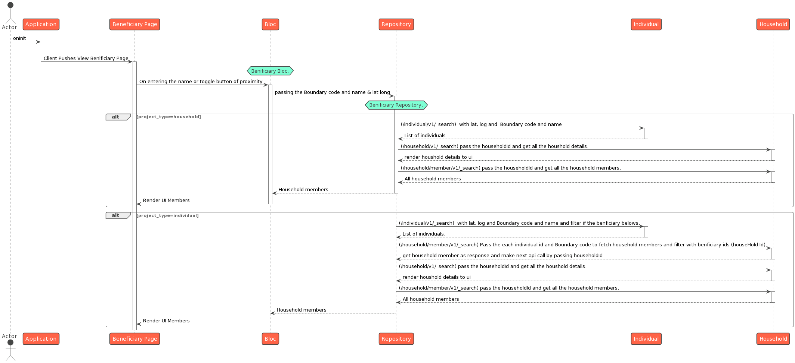

# Field App Architecture

## Field App Architecture

### Tech Stack/Core dependencies

[Flutter](https://flutter.dev/) - Framework to build multi-platform apps

[SQLite](https://www.sqlite.org/) - SQL offline db

[ISAR](https://pub.dev/packages/isar) - NoSQL offline db

[Dio](https://pub.dev/packages/dio) - HTTP Client

### Codebase

[https://github.com/egovernments/health-campaign-field-worker-app](https://github.com/egovernments/health-campaign-field-worker-app)

### Design

#### Design Considerations for Field App

1. Needs to work in low/no network coverage areas
2. Needs to have a high level of configurability
3. Needs to work on android
4. Users of the app have low-tech literacy

### Design Features

**Sync**

Since the app is expected to be configurable, there is a need to receive these configurations from the server. Data already on the server might need to be retrieved by the app as well.

Since the app is expected to work while users are offline, there is the need to send data that has been collected while the user has been offline to the server.

These functionalities are collectively called sync. The retrieval of configuration and data is referred to as sync down while the sending of data collected using the app is called sync up. Login and sync can only be done while the user is online.

When a user logs in, a sync down is performed to fetch the required configuration and data for the field app to run. After collecting data using the app, the user can perform a sync which will perform a sync up (to send all data collected) followed by a sync down (to retrieve any fresh configuration). Syncing of data down is not required for the initial implementation and can be turned off.

**Configurability**

Configurations for the field app are managed as master data in the MDMS service. These configurations are used to manage various aspects of how the app functions. The important ones are:

1. If the app has to run in an offline first mode or in an online mode.
2. The backend interfaces for the app include localization, MDMS and various services. This also includes the URLs for the various services and endpoints so that a fresh app build is not required if there is a new version of an API.
3. How long the client can use each configuration that has been previously fetched before requesting data from the server (to optimise the time taken for sync).
4. Values/Options that need to be displayed in various fields in the app.
5. Additional fields are to be captured for any of the entities if any.
6. Supported languages

**Op Log**

Any action to create or update data performed by the field user while the app is configured to run in the offline first mode is written to an op log. When the user performs a sync, the sync-up action reads from this op log to send the data to the server.

**Permission (Role-Action)-Based Access and Sync**

Sync is optimised to fetch configuration only relevant to the logged-in user so that only the configuration/data for the actions permissible to the user within the projects that they are assigned to are fetched.

**Network Manager**

The network manager component in the app acts as an interface between the rest of the app and the backend. As a result, the other components in the app do not have to change their behaviour based on whether the app is online or offline and rely on the network manager to handle this complexity i.e. the network manager makes an API call directly if the app is offline or saves to the local database and the op log if the device is offline whereas the other components just make a call to the network manager to read/write data.

### Diagrams

**Class Diagram**

## **Sequence Diagrams**

**Init App**

\

**Login**

**Sync Down**

### Delivery Resource

### Proximity Based Search

