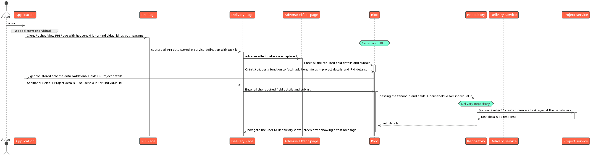
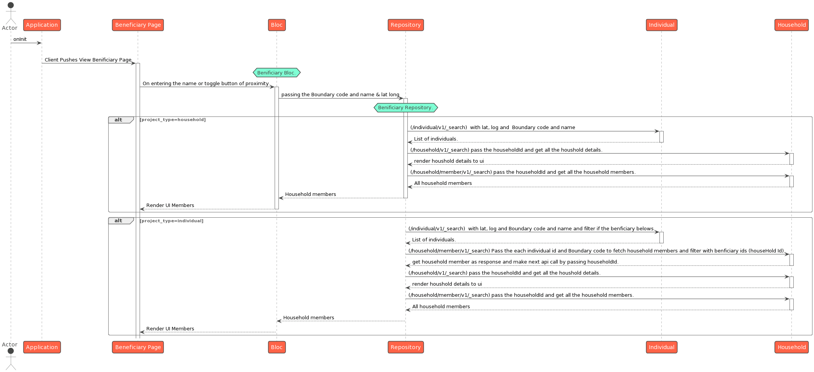

# Field App Architecture

## Tech Stack/Core dependencies

[Flutter](https://flutter.dev/): Framework to build multi-platform apps

[SQLite](https://www.sqlite.org/): SQL offline db

[ISAR](https://pub.dev/packages/isar): NoSQL offline db

[Dio](https://pub.dev/packages/dio): HTTP Client

## Codebase

[https://github.com/egovernments/health-campaign-field-worker-app](https://github.com/egovernments/health-campaign-field-worker-app)

## Design

#### Design Considerations for Field App

1. Needs to work in low/no network coverage areas
2. Needs to have a high level of configurability
3. Needs to work on android
4. Users of the app have low-tech literacy

### Design Features

**Sync**

Since the app is expected to be configurable, there is a need to receive these configurations from the server. Data already on the server might need to be retrieved by the app as well.

Since the app is expected to work while users are offline, there is the need to send data that has been collected while the user has been offline to the server.

These functionalities are collectively called sync. The retrieval of configuration and data is referred to as sync down while the sending of data collected using the app is called sync up. Login and sync can only be done while the user is online.

When a user logs in, a sync down is performed to fetch the required configuration and data for the field app to run. After collecting data using the app, the user can perform a sync which will perform a sync up (to send all data collected) followed by a sync down (to retrieve any fresh configuration). Syncing of data down is not required for the initial implementation and can be turned off.

**Configurability**

Configurations for the field app are managed as master data in the MDMS service. These configurations are used to manage various aspects of how the app functions. The important ones are:

1. If the app has to run in an offline first mode or in an online mode.
2. The backend interfaces for the app include localisation, MDMS and various services. This also includes the URLs for the various services and endpoints so that a fresh app build is not required if there is a new version of an API.
3. How long the client can use each configuration that has been previously fetched before requesting data from the server (to optimise the time taken for sync).
4. Values/options that need to be displayed in various fields in the app.
5. Additional fields are to be captured for any of the entities, if any.
6. Supported languages.

**Op Log**

Any action to create or update the data performed by the field user while the app is configured to run in the offline first mode is written to an op log. When the user performs a sync, the sync-up action reads from this op log to send the data to the server.

**Permission (role-action) based access and sync**

Sync is optimised to fetch configuration only relevant to the logged-in user so that only the configuration/data for the actions permissible to the user within the projects that they are assigned to are fetched.

**Network Manager**

The network manager component in the app acts as an interface between the rest of the app and the backend. As a result, the other components in the app do not have to change their behaviour based on whether the app is online or offline and rely on the network manager to handle this complexity i.e. the network manager makes an API call directly if the app is offline or saves to the local database and the op log if the device is offline whereas the other components just make a call to the network manager to read/write data.

**Down Sync of Beneficiaries**

The down sync of beneficiaries feature is designed to optimise data synchronisation between the local device and the server, specifically focusing on the beneficiary records. This process helps prevent duplicate record creation by different users within the same boundary.

The down sync initiates by sending a request to the server, providing the boundary code along with offset and limit parameters.

The server validates the provided parameters and responds with the total count of beneficiary records within the specified boundary.

Based on the total count received, the down sync retrieves beneficiary records from the server in batches.

The batch size is dynamically adjusted according to the device's internet speed to optimize data transfer.

The response from the server, containing beneficiary records, is written to the local entities tables on the device.

This ensures that the local database stays updated with the most recent beneficiary information.

**Key Features**

* Utilises offset and limit parameters for efficient pagination of data retrieval from the server.
* Adapts the batch size based on the internet speed to enhance the overall synchronisation performance.
* Essential for avoiding the creation of duplicate beneficiary records by different users within the same boundary.

**Use Case**

The down sync of beneficiaries is particularly crucial in scenarios where multiple users operate within the same geographical boundary.

It ensures that each user has access to the latest beneficiary data while minimising redundant record creation.

**Multi-Round Campaign**

The multi-round campaign streamlines beneficiary registration and delivery processes, ensuring efficient tracking of eligibility and delivery statuses across multiple cycles.

The system fetches the projectType configuration from MDMS for the selected project.

Eligibility checks are dynamically performed based on the retrieved projectType configuration.

* Minimum and maximum age criteria are evaluated to determine the beneficiary's eligibility for the current cycle.
* Recorded side effects for the beneficiary in the current cycle.
* There is no cycle defined in the MDMS configuration for the selected project on the current date.

**Status Tracking**

1. "Not Eligible":&#x20;

* Minimum and maximum age criteria are evaluated to determine the beneficiary's eligibility for the current cycle.
* Recorded side effects for the beneficiary in the current cycle.
* There is no cycle defined in the MDMS configuration for the selected project on the current date.

2. 'Beneficiary Refused’: Indicates that the beneficiary refused to accept the delivery in the current cycle.
3. 'Beneficiary Referred': Indicates that the beneficiary was referred to a health facility during the current cycle.
4. 'Visited': Indicates that a delivery was successfully made for the beneficiary in the current cycle.
5. 'Not Visited': Indicates that no delivery was made for the beneficiary in the current cycle.

Beneficiary Refused, Beneficiary Referred, and Not Eligible status except the age eligibility will target reseted every new cycle.

## Diagrams

### **Class Diagram**

<figure><figcaption></figcaption></figure>

### **Sequence Diagrams**

**Init App**

<figure><figcaption></figcaption></figure>

**Login**

<figure><figcaption></figcaption></figure>

**Sync Down**

<figure><figcaption></figcaption></figure>

### Delivery Resource

### Proximity Based Search

### Beneficiary Data Down Sync

<figure><figcaption></figcaption></figure>

### Multi-Round Support

<figure><figcaption></figcaption></figure>
