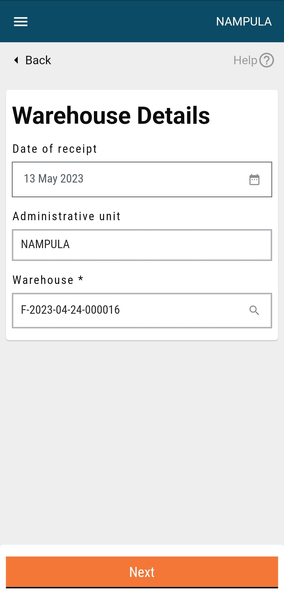
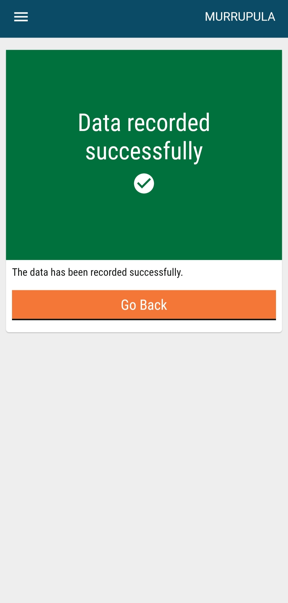

# Inventory Management

## Table of Contents

Background

Target Audience

Objectives (of this release)

Assumptions and Validations&#x20;

Process flow

Design

Success Criteria

## Background

This document describes the need and scope of a digital platform for health campaigns, explaining the product’s features, specifications, purpose, and functionality.

The module focuses on the design and features of the user interface of HCM for beneficiary registration and service delivery. It provides a detailed description of the elements and the process flow of the application along with a wireframe model for easier comprehension. The module aims to reduce the risks of data redundancy., besides providing better service delivery tracking and visibility into the services provided for maximum area coverage, and in the quickest time possible.

## Target Audience

This document is intended for the engineering and platform (tech teams), product management, and implementation teams to agree on requirements for the Health Campaign Management (HCM) Platform.

## Objectives (of this release)

1\. To enable actors with a digital system to manage and implement health campaign activities.&#x20;

a. Facilitate FLWs, supervisors, district officers, and other actors to collect and analyse data accurately, along with monitoring the tasks from registration to service delivery. Regular progress checks can be performed at any time and a comparative analysis can be derived at the district levels for different teams.&#x20;

b. Facilitate better diagnostics with improved access to healthcare interventions for the general public.

2\. To increase the adoption of the HCM platform for multiple health campaigns by providing flexibility in the UI and UX, as well as product specifications.

a. Emphasis on adopting digital systems by collaborating with several healthcare initiatives.

b. Provide scope for future changes and improvements in the application.

## Assumptions and Validations

<table><thead><tr><th width="260">Assumption</th><th width="392">Validation</th></tr></thead><tbody><tr><td>Customer persona</td><td></td></tr><tr><td>Device and services</td><td></td></tr><tr><td>Contact numbers</td><td></td></tr><tr><td>Product details</td><td>Multiple product details cannot be captured within the same form in any transaction. A user needs to fill separate forms for each product.</td></tr><tr><td>Dropdown fields</td><td>
If the dropdown consists of only one value, then the field must be auto-populated. In the warehouse details screen, there is a search field that must contain only those values which are assigned to the project.

In the received stock details screen, the list must contain all the warehouses along with ‘N/A’ value.
</td></tr><tr><td>Additional/Non-mandatory fields</td><td>All the additional and non-mandatory fields across all the flows must be taken care of during implementation.</td></tr></tbody></table>

## Process flow

<figure><figcaption></figcaption></figure>

Specifications

<table><thead><tr><th width="170">Field</th><th width="153">Data type</th><th width="151">Data validation</th><th width="157">Required (Y/N)</th><th width="291">Comments</th></tr></thead><tbody><tr><td>Latitude/ Longitude</td><td>Numeric</td><td>NA</td><td>Y</td><td>The geographical coordinates of the house/household. It is captured by the system at the backend.</td></tr><tr><td>Warehouse name/ID</td><td>Search text</td><td>NA</td><td>Y</td><td>The warehouse name/ID where the transaction is taking place. The search field must contain the values assigned to the project.</td></tr><tr><td>Date of receipt</td><td>Date</td><td>Cannot be in the future</td><td>Y</td><td>The date when a receipt was created. It is system-generated and non-editable.</td></tr><tr><td>Administrative unit</td><td>String</td><td>NA</td><td>Y</td><td>The area boundary assigned to a specific user. It is captured from the location picker and is non-editable.</td></tr><tr><td>Select product</td><td>Dropdown</td><td>NA</td><td>Y</td><td>This describes the type of resources needed.</td></tr><tr><td>Received from</td><td>Search text</td><td>NA</td><td>Y</td><td>The warehouse name from where the stock is received. The list must consist of all the warehouses, irrespective of the boundary and the distribution team value on top. This applies to every transaction.</td></tr><tr><td>Waybill number</td><td>Numeric</td><td>NA</td><td>N</td><td>The unique packing slip number.</td></tr><tr><td>Number of nets indicated on the waybill</td><td>Numeric</td><td>NA</td><td>N</td><td>The total number of bed net counts indicated on the waybill.</td></tr><tr><td>Quantity received</td><td>Numeric</td><td>NA </td><td>Y</td><td>The total number of bed nets received.</td></tr><tr><td>Type of transport</td><td>Dropdown </td><td>NA</td><td>N</td><td>The type of transport which is used for delivery.</td></tr><tr><td>Comments</td><td>String</td><td>NA</td><td>N</td><td>Additional comments for the transaction.</td></tr><tr><td>Vehicle number</td><td>String</td><td>NA</td><td>N</td><td>Vehicle number</td></tr><tr><td>Date of issue</td><td>Date</td><td>Cannot be in the future</td><td>Y</td><td>The date when the stock is being issued. It is system-generated and non-editable.Search text</td></tr><tr><td>Destination</td><td>Search text</td><td>NA</td><td>Y</td><td>The warehouse name where the stock is being sent.</td></tr><tr><td>Quantity sent</td><td>Numeric </td><td>NA</td><td>Y</td><td>The total number of bed nets sent.</td></tr><tr><td>Return date</td><td>Date </td><td>Cannot be in the future</td><td>Y</td><td>The date when the stock is being returned. It is system-generated and non-editable.</td></tr><tr><td>Returned from</td><td>Search text </td><td>NA</td><td>Y</td><td>The warehouse from where the stock is being returned.</td></tr><tr><td>Quantity returned</td><td>Numeric</td><td>NA</td><td>Y</td><td>The date of filing the damage. It is auto-captured by the system.</td></tr><tr><td>Damage date</td><td>Date</td><td>Cannot be in the future</td><td>Y</td><td>The date of filing the damage. It is auto-captured by the system.</td></tr><tr><td>Damaged during</td><td>Dropdown</td><td>NA</td><td>Y</td><td>Select from the dropdown when the stock was damaged.</td></tr><tr><td>Received from</td><td>Search text</td><td>NA</td><td>Y</td><td>The warehouse from where the stock was received. If the stock is damaged in the same warehouse (storage), then select ‘NA’.</td></tr><tr><td>Quantity damaged</td><td>Numeric</td><td>NA</td><td>Y</td><td>The quantity of stock that has been damaged.</td></tr><tr><td>Loss date</td><td>Date</td><td>Cannot be in the future</td><td>Y</td><td>The date of filing the loss. It is auto-captured by the system.</td></tr><tr><td>Lost during</td><td>Dropdown</td><td>NA</td><td>Y</td><td>Select from the dropdown when the stock was lost.</td></tr><tr><td>Received from</td><td>Search text</td><td>NA</td><td>Y</td><td>The warehouse from where the stock was received. If the stock is lost in the same warehouse (storage), then select ‘NA’.</td></tr><tr><td>Quantity lost</td><td>Numeric</td><td>NA</td><td>Y</td><td>The count of stock lost.</td></tr><tr><td>Warehouse</td><td>Dropdown</td><td>NA</td><td>Y</td><td>Select the warehouse for reconciliation.</td></tr><tr><td>Select product</td><td>Dropdown</td><td>NA</td><td>Y</td><td>Select the product for reconciliation.</td></tr><tr><td>Manual stock count</td><td>Numeric</td><td>NA</td><td>Y</td><td>Manual count of the stock.</td></tr><tr><td>Comments</td><td>String</td><td>NA</td><td>N</td><td>If needed, comments can be manually added.</td></tr></tbody></table>

## Design

Find the mockups below:

### Home Screen

After successful login, a user lands on the home screen of inventory management which consists of the following actions and elements:

* Manage Stock
* Stock Reconciliation
* View Reports
* Sync Data
* Call Supervisor
* File Complaint

There is a location picker on the top right that displays the assigned boundary for the user. The help button provides a walkthrough of the screen to the user. The hamburger button on the top left consists of a few quick actions. The location picker, help button, and hamburger buttons are available on every screen for a user’s convenience.

<figure><figcaption></figcaption></figure>

### Hamburger Button

After clicking on the hamburger button, a list of actions appears on the user screen. On top, it displays the user name and contact number, followed by other options such as the home button, language select, edit profile, projects, and logout. The “Edit Profile” option is not in scope for V1; it needs to be taken in V1.1 If the user clicks on the hamburger button again, it collapses the hamburger menu. The button is available on all screens of the application.

<figure><figcaption></figcaption></figure>

### Manage Stocks

This screen consists of different types of transactions that take place for the inventory. These include:

* Stock Receipt
* Stock Issued
* Stock Returned
* Stock Damaged
* Stock Loss

Every transaction has a separate card with an arrow button, an icon, and a brief description below the title. Clicking on the arrow button will navigate the user to the warehouse details screen. The back button is located below the hamburger button, which takes the user to the previous screen (In this case, it is the home screen).

<figure><figcaption></figcaption></figure>

### Error Popup

If the user is not assigned any warehouse, then an error popup must appear over the warehouse details screen, asking the user to contact the system administrator to assign a warehouse. The user must be able to close the popup and change the administrative area on the warehouse details screen to check if he/she is assigned any warehouse in any other boundary. This must force the screen to load again and check for the warehouse.

<figure><figcaption></figcaption></figure>

### Warehouse Details (Stock Receipt)

When the user clicks on record stock receipt, the warehouse details screen will appear. The latitude/longitude captures the Geo-location of the warehouse which can be fetched with the help of the location icon within the field. It is a mandatory field denoted by \*. The warehouse name/ID is a dropdown field which contains the list of warehouses assigned to the project for a particular user. If there is only one warehouse, the field must be auto-populated by the system.

The date of receipt field captures the date of transaction which can be fetched with the help of a calendar icon placed inside the box. The field must be validated, where the date cannot be in the future. If the user puts a future value, it must show an error message stating “date cannot be in future”. The user must select the administrative unit from the dropdown of the administrative unit field. The next button navigates the user to the stock receipt details screen.

<figure><figcaption></figcaption></figure>

### Received Stock Details

The user must provide details of the stock received. The select product field has a dropdown that consists of all the products under a campaign. The user can select from the list the desired product that he has received. The type of transaction is provided to specify whether the stock is being received, issued, or returned.

In the ‘received from’ section, the user needs to select from the dropdown the warehouse from which the stock is being received. The dropdown must contain the list of all the warehouses that are part of the campaign, that is, the list must be of the warehouse assigned to the root project. The list is taken from the facility registry and must be the same for all the transactions. The quantity received field collects the information for how much quantity of stock is being received.

<figure><figcaption></figcaption></figure>

For a pack of a certain number of nets, there is a packing slip attached to the packet which indicates the number of nets within that pack. The user needs to mention the value in the number of nets field.

The total number of packing slips must be mentioned in the following field. The user can add any comments/remarks in the additional comments field. The following - select product, type of transaction, received from, and quantity received fields - are mandatory for this screen. When the user has entered all the details, he must click on the submit button which leads to the confirmation screen whether the record has been created successfully or there are some errors.

### Confirmation Screen

When the user clicks on the submit button, he/she lands on this page with the confirmation message “Record created Successfully”. Users can go back to the home screen by clicking on the “Back To Home” button. This screen must appear for every other transaction (issued, returned, damaged, lost, reconciliation).

<figure><figcaption></figcaption></figure>

### Warehouse Details (Stock Issued)

When the user clicks on record stock issued, the warehouse details screen will appear. The screen is similar to the stock receipt one. The only difference is that instead of the date of receipt, the field is the date of issue. The next button navigates the user to the stock issued details screen.

<figure><figcaption></figcaption></figure>

### Issued Stock Details

The user needs to provide details for the stock issued. The select product field acts the same as that for stock receipt. In the destination field, the user needs to select the warehouse where the stock is being sent.  The quantity sent field collects the information on how much quantity of stock is being sent. When the user has entered all the details, he must click on the submit button which leads to the confirmation screen whether the record has been created successfully or there are some errors.

<figure><figcaption></figcaption></figure>

### Warehouse Details (Stock Returned)

When the user clicks on stock returned, the warehouse details screen appears. The fields are similar to that for stock receipt; only the date of receipt label is changed to the date of return. The next button navigates the user to the stock returned details screen.

<figure><figcaption></figcaption></figure>

### Stock Returned Details

The user needs to provide details for the stock returned. The “Select product” field acts the same as that for stock receipt. In the “Returned from” field, the user needs to select the warehouse from where the stock has been returned.  The “Quantity returned” field collects the information for how much quantity of stock has been returned. When the user has entered all the details, he/she must click on the submit button which leads to the confirmation screen that confirms whether the record has been created successfully or there are some errors.

<figure><figcaption></figcaption></figure>

### Warehouse Details (Stock Damaged)

For the damaged stock, the user must provide the details asked on the screen.

<figure><figcaption></figcaption></figure>

### Damaged Stock Details

The user needs to provide the details for the damaged stock. There can be two cases for the damaged stock:

1. If the stock is damaged during transit, then the user must select the warehouse name from where the stock was received.
2. If the stock is damaged during storage, then the user must select N/A from the dropdown.

<figure><figcaption></figcaption></figure>

### Warehouse Details (Stock Loss)&#x20;

The user needs to provide the details for the lost stock.

<figure><figcaption></figcaption></figure>

### Lost Stock Details

The user must provide the details for the stock loss.

<figure><figcaption></figcaption></figure>

Stock Reconciliation

When the user clicks on the stock reconciliation button on the home screen, they are navigated to this screen where they need to verify whether the physical count and calculated stock values are the same or not. In the select product field, the user needs to select a product from the dropdown. There are warehouse name and administrative area fields as well, all of which are mandatory. The following details are there:

* Date of Reconciliation
* Received Stock&#x20;
* Issued Stock
* Returned Stock
* Damaged Stock
* Stock Lost
* Stock on Hand- The stock on hand is calculated as incoming stock minus outgoing stock. There is a hint icon for how the stock on hand is calculated. The received and returned stocks will be considered incoming stocks. The issued, damaged and lost stocks will be considered outgoing stocks.

The date of reconciliation is system-generated and non-editable. Other values are calculated based on the data recorded in stock receipts, stock issued, and the stock returned screens. In the manual stock count, the user needs to enter the value for manually counted inventory. If the stock on hand does not match the physical count, then the latter must take precedence, provided the user has submitted the form with a proper reason. In the comments field, the user can add remarks and comments.

<figure><figcaption></figcaption></figure>

### View Reports (Scope for v1.1)

When a user clicks on the view reports button on the home screen, he/she is navigated to this page where he/she has the provision to view the following reports:

* Stock Received
* Stock Issued
* Stock Returned
* Stock Reconciliation

Users can click on the arrow button placed next to every transaction to open the respective report. The back button will navigate them back to the home screen.

<figure><figcaption></figcaption></figure>

### Report (Stock Received)

When the user clicks on the “Stock Received” button, the report for stock received appears which provides a tabular representation of the data. The table is scrollable, both vertically and horizontally, to cater to multiple values and columns. The date column is kept frozen and other columns are scrollable. The first column is for the date of the receipt, followed by units received in the second column, and received from (warehouse name) in the third column. The “Back To Home” button is placed at the bottom of the screen which navigates the user back to the home screen.

<figure><figcaption></figcaption></figure>

### Report (Stock Reconciliation)

For the stock reconciliation report, the table consists of the date in the first column and other columns. The “Back To Home” button will navigate users to the home screen.

<figure><figcaption></figcaption></figure>

<figure><figcaption></figcaption></figure>

## Success Criteria

1. Various actors involved in the process will be able to collect, track, and analyse the data for beneficiaries registered as well as services delivered to them using a bug-free platform.
2. The supervisors, district officers, and program managers will be able to monitor the team’s performance which will help them understand the problems and challenges faced by the teams.
3. This will facilitate the warehouse managers to optimise the inventory management of interventions which will further improve the supply chain and prevent surplus or deficit of stock. This includes stock receipts, issues, returns, and lateral movements of the stock.&#x20;
4. Digital records will result in maximum coverage with fewer chances of households being missed during a certain campaign.
