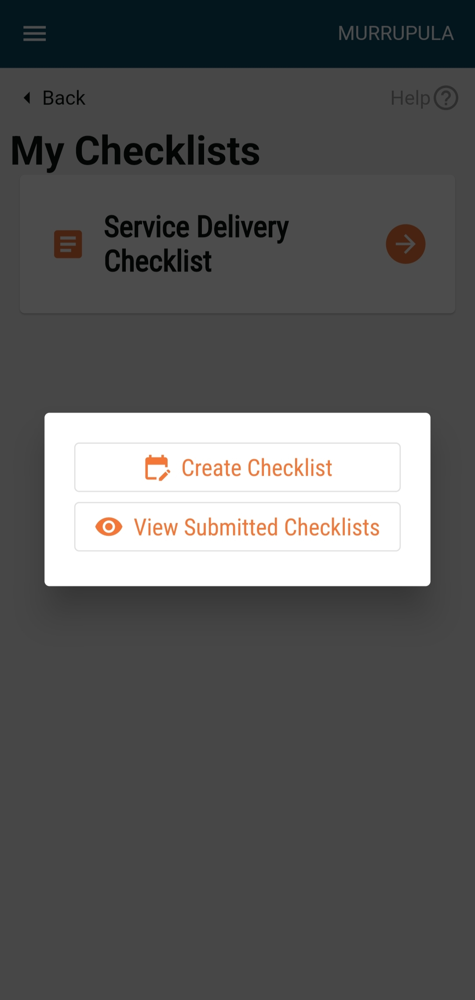

# Supervision Flow

Find the mock-ups below:

HCM Homescreen

After logging into the application, the user lands on this screen which displays daily performance (number of households registered). The progress bar must reset daily at 00:00 hours and start from 0 registrations. The action buttons related to the beneficiary are present  which include:

* Beneficiaries
* View Reports
* Sync Data
* Call Supervisor
* File Complaint

At the bottom, there is a card that shows how many records are unsynced for the user’s convenience to sync data. If all the records are synced, then the card must say, “All records are synced.”

The help button is on every screen of the application, and by clicking on it a user can get the walkthrough of the elements on that screen.

On the top right, the administrative area assigned to the user is displayed which will be based on the level of hierarchy. The hamburger button on the top left corner covers some other actions mentioned further.

.png>)

### View My Checklists

\
\

<figure><figcaption></figcaption></figure>

### Filling a Checklist

&#x20;

\
\

### Confirmation Screen

### Acknowledgement Screen

